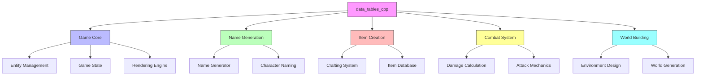
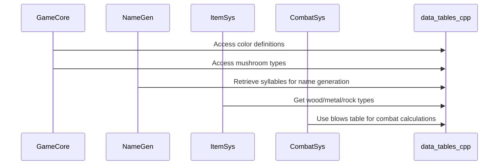

# Data Tables C++ Module Documentation

## Introduction

The `data_tables_cpp` module serves as a foundational data repository for the game system, providing predefined arrays of strings and numerical values that represent various game elements such as colors, mushrooms, woods, metals, rocks, amulets, syllables, and game mechanics tables. This module acts as a centralized data source that other components can reference to maintain consistency and reduce code duplication across the application.

## Module Overview

This module contains several global constant arrays and tables that define the core vocabulary and mechanics of the game world:

- **Color definitions**: 50 different color names used throughout the game
- **Mushroom types**: 21 mushroom varieties with distinct characteristics
- **Wood types**: 26 different wood materials for crafting and building
- **Metal types**: 25 base metals plus 10 plated variants
- **Rock types**: 32 precious stones and minerals
- **Amulet materials**: 11 different amulet materials
- **Syllable library**: 130 syllables for name generation
- **Blows table**: 7x6 matrix defining attack mechanics
- **Normal table**: 100-element array for probability calculations

## Architecture and Component Relationships

## Data Flow and Usage Patterns

## Detailed Component Analysis

### Color Definitions (colors)
The `colors` array provides 50 distinct color names that can be used for item descriptions, character appearances, or environmental elements. These are defined as `const char*` strings for efficient memory usage.

### Mushroom Types (mushrooms)
The `mushrooms` array contains 21 different mushroom varieties, each with unique properties that may affect gameplay mechanics such as healing, poison, or magical effects.

### Wood Types (woods)
The `woods` array defines 26 different wood materials, which are likely used in crafting weapons, tools, or building structures with varying durability and properties.

### Metal Types (metals)
The `metals` array includes 25 base metals along with 10 plated variants, providing a comprehensive set of metallic materials for item creation and weapon enhancement.

### Rock Types (rocks)
The `rocks` array contains 32 precious stones and minerals, which could be used for jewelry, magical components, or decorative elements in the game world.

### Amulet Materials (amulets)
The `amulets` array provides 11 different amulet materials, each potentially offering unique magical properties or bonuses to players.

### Syllable Library (syllables)
The `syllables` array contains 130 syllables that form the foundation for random name generation, allowing for diverse and consistent naming conventions throughout the game.

### Blows Table (blows_table)
The `blows_table` is a 7x6 matrix that defines how many blows (attacks) a character can make based on their level and skill. This table is crucial for combat balance and progression systems.

### Normal Table (normal_table)
The `normal_table` is a 100-element array of `uint16_t` values used primarily for probability distributions and statistical calculations in various game mechanics.

## Integration Points

This module integrates with several other system components:

- **[name_generation.md](name_generation.md)**: Uses the syllables array for generating character and item names
- **[item_creation.md](item_creation.md)**: References wood, metal, and rock arrays for material-based item creation
- **[combat_system.md](combat_system.md)**: Utilizes the blows table for determining attack frequency and damage calculations
- **[world_building.md](world_building.md)**: Accesses color and mushroom arrays for environmental storytelling

## Memory and Performance Considerations

All data in this module is stored as `const` arrays, ensuring that:
- Data cannot be modified at runtime
- Memory is allocated once during program initialization
- Arrays are stored in read-only memory sections
- No dynamic allocation is required for these data structures

The use of `const char*` for string data minimizes memory overhead while maintaining fast access times through direct array indexing.

## Dependencies

This module has no external dependencies beyond standard C++ headers (`headers.h`) and is designed to be self-contained. It provides data that other modules depend upon rather than being dependent on other modules.

## Future Extensibility

The modular design allows for easy expansion by:
- Adding new entries to existing arrays
- Creating additional lookup tables for specific game mechanics
- Implementing data loading from external files while maintaining the same interface
- Extending the data structures to include additional metadata alongside the basic arrays

This module forms a critical foundation for the game's data-driven design approach, enabling consistent and maintainable implementation of game elements across the entire system.
