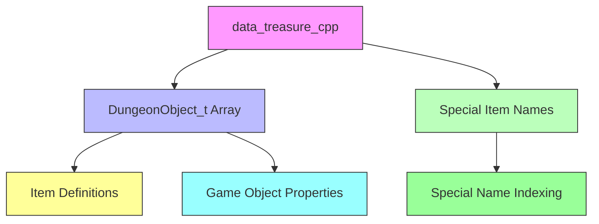
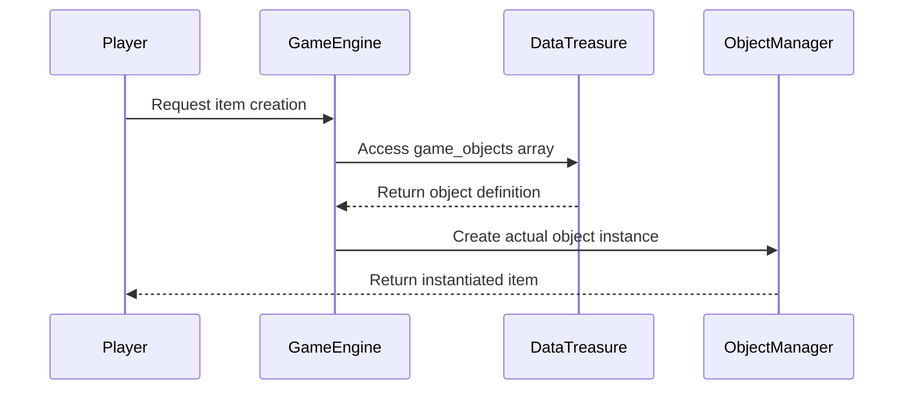

# data_treasure_cpp Module Documentation

## Introduction

The `data_treasure_cpp` module serves as the core data repository for dungeon treasure and object definitions in the game. This module contains the fundamental data structures and initialization of all game objects including items, weapons, armor, scrolls, potions, and other dungeon elements. It provides the foundational data that drives item generation, identification, and gameplay mechanics throughout the dungeon exploration experience.

## Architecture Overview



## Core Components

### DungeonObject_t Array

The primary data structure in this module is the `DungeonObject_t` array named `game_objects`. This array contains over 500 predefined game objects with detailed properties:

```cpp
DungeonObject_t game_objects[MAX_OBJECTS_IN_GAME] = {
    // ... hundreds of object definitions
};
```

Each `DungeonObject_t` entry includes:
- **Name**: Display name of the object
- **Flags**: Bitmask of object properties and behaviors
- **Type**: Category classification (TV_FOOD, TV_SWORD, etc.)
- **Symbol**: Character representation on dungeon map
- **Value**: Monetary value of the item
- **Weight**: Weight in game units
- **Graphics**: Visual representation details
- **StackSize**: Maximum stack size
- **MinLevel**: Minimum level required for use
- **MaxLevel**: Maximum level allowed for use
- **PotionEffect**: Effect when consumed
- **DamageRange**: Attack damage range
- **BonusValues**: Stat bonuses
- **SpecialProperties**: Unique item characteristics

### Special Item Names

The module also defines special item naming conventions through the `special_item_names` array:

```cpp
const char *special_item_names[SpecialNameIds::SN_ARRAY_SIZE] = {
    CNIL,                "(R)",              "(RA)",
    "(RF)",              "(RC)",             "(RL)",
    // ... additional special names
};
```

This array maps special name identifiers to their string representations used in item naming and display.

## Data Flow and Usage



## Component Interactions

The `data_treasure_cpp` module interacts with several other system components:

1. **[object_manager.md](object_manager.md)**: Uses the object definitions to create actual game instances
2. **[item_identification.md](item_identification.md)**: Leverages object flags and properties for identification systems
3. **[inventory_system.md](inventory_system.md)**: Utilizes weight and stack size properties for inventory management
4. **[magic_system.md](magic_system.md)**: References scroll and potion effects for spell casting

## Module Dependencies

This module depends on:
- `headers.h`: Contains necessary type definitions and constants
- [object_manager.md](object_manager.md): For runtime object instantiation
- [item_identification.md](item_identification.md): For property-based identification logic

## Implementation Details

The module implements a comprehensive database of game objects organized by type categories:
- Food items (`TV_FOOD`)
- Weapons (`TV_SWORD`, `TV_HAFTED`, `TV_POLEARM`, `TV_BOW`)
- Armor (`TV_SOFT_ARMOR`, `TV_HARD_ARMOR`, `TV_SHIELD`, etc.)
- Rings and amulets (`TV_RING`, `TV_AMULET`)
- Scrolls (`TV_SCROLL1`, `TV_SCROLL2`)
- Potions (`TV_POTION1`, `TV_POTION2`)
- Wands and staffs (`TV_WAND`, `TV_STAFF`)
- Books (`TV_MAGIC_BOOK`, `TV_PRAYER_BOOK`)
- Containers (`TV_CHEST`)
- Miscellaneous items (`TV_MISC`, `TV_GOLD`)

## Key Features

1. **Comprehensive Object Database**: Over 500 predefined game objects covering all major categories
2. **Detailed Property System**: Each object has extensive properties for gameplay mechanics
3. **Type Safety**: Strong typing through `DungeonObject_t` structure
4. **Extensible Design**: Easy to add new objects while maintaining compatibility
5. **Performance Optimized**: Pre-computed arrays for fast access during gameplay

## Integration Points

This module serves as the foundation for:
- **Item Generation**: Random item creation based on predefined templates
- **Object Spawning**: Dungeon object placement and generation
- **Game Balance**: Value and power calculations for all game items
- **UI Display**: Item name and description rendering
- **Save/Load Systems**: Persistent object state management

The `data_treasure_cpp` module is essential for maintaining consistency across all aspects of game object behavior and ensures that the game world maintains its rich variety of treasures and challenges.
