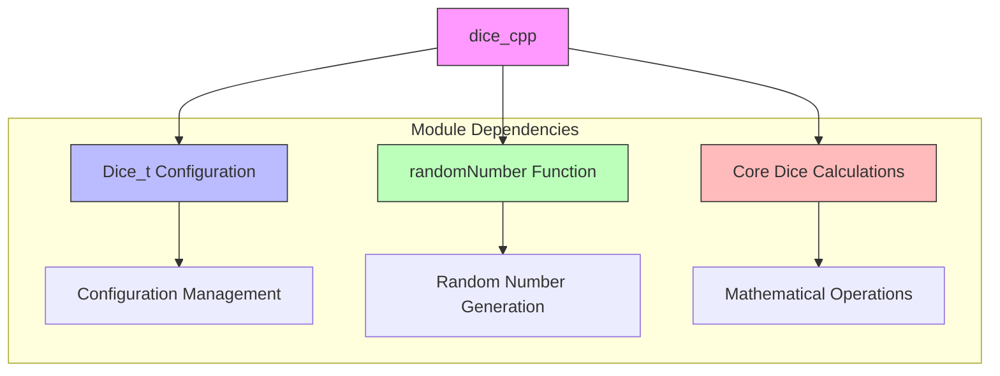
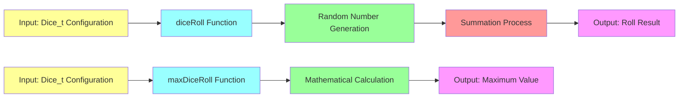

# dice_cpp Module Documentation

## Brief Introduction

The `dice_cpp` module provides core functionality for dice rolling operations within the application. This module handles the mathematical computation of dice rolls based on specified dice configurations and provides utility functions for calculating maximum possible outcomes. The module is designed to be lightweight and focused on dice-related calculations.

## Core Components

### dice.cpp

The main implementation file containing the core dice rolling logic and related calculations.

#### Functions

##### `int diceRoll(Dice_t const &dice)`
- **Purpose**: Calculates a random dice roll based on the provided dice configuration
- **Parameters**: 
  - `Dice_t const &dice`: Reference to a dice configuration structure containing number of dice and sides
- **Returns**: Integer representing the sum of all dice rolls
- **Implementation Details**:
  - Iterates through the specified number of dice
  - For each die, generates a random number between 1 and the number of sides
  - Returns the sum of all generated values

##### `int maxDiceRoll(Dice_t const &dice)`
- **Purpose**: Calculates the maximum possible dice roll value for a given configuration
- **Parameters**: 
  - `Dice_t const &dice`: Reference to a dice configuration structure
- **Returns**: Integer representing the maximum possible sum (all dice showing maximum value)
- **Implementation Details**:
  - Multiplies the number of dice by the number of sides per die
  - Provides theoretical maximum value for comparison purposes

## Architecture and Component Relationships



## Data Flow



## Integration Points

This module integrates with several other system components:

- **[random_number](random_number.md)**: Depends on the `randomNumber` function for generating individual die values
- **[configuration](configuration.md)**: Uses the `Dice_t` structure for dice configuration management
- **[game_logic](game_logic.md)**: Likely consumes the dice roll results for game mechanics

## Usage Examples

```cpp
// Example usage of dice_cpp functionality
Dice_t myDice = {2, 6}; // Two 6-sided dice

int rollResult = diceRoll(myDice);     // Random roll result
int maxValue = maxDiceRoll(myDice);    // Maximum possible value (12)
```

## Design Considerations

The module follows a functional approach with pure calculation functions that depend only on their inputs. This design promotes testability and reusability across different parts of the application. The separation of concerns between actual dice rolling and maximum value calculation allows for flexible use cases while maintaining clear interfaces.

## Performance Characteristics

- **Time Complexity**: O(n) where n is the number of dice
- **Space Complexity**: O(1) - constant space usage
- **Scalability**: Efficient for typical dice configurations used in games

## Related Modules

For complete system understanding, see:
- [random_number](random_number.md) - Provides the underlying random number generation
- [configuration](configuration.md) - Defines the Dice_t data structure
- [game_logic](game_logic.md) - Consumes dice roll results for gameplay
