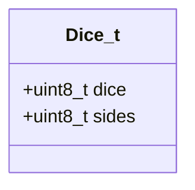
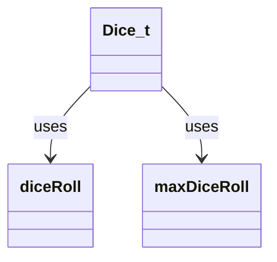
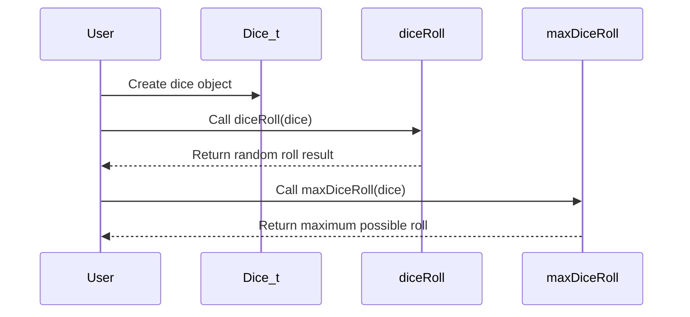

# dice_h Module Documentation

## Brief Introduction

The `dice_h` module provides a simple interface for working with dice in gaming applications. It defines a basic data structure for representing dice and declares functions for rolling dice and calculating maximum possible rolls. This module serves as a foundational component for any game system that requires random dice generation.

## Module Overview

The `dice_h` module consists of a single header file that defines the `Dice_t` structure and declares two essential functions for dice operations:

- `diceRoll()` - generates a random roll for a given dice
- `maxDiceRoll()` - calculates the maximum possible value for a given dice

## Architecture and Component Relationships

### Data Structure Definition



The `Dice_t` structure represents a dice with two fundamental properties:
- `dice`: Number of dice to roll
- `sides`: Number of sides on each die

### Function Interface



The module exposes two functions that operate on the `Dice_t` structure:
- `diceRoll()` - performs actual dice rolling operation
- `maxDiceRoll()` - calculates theoretical maximum value

## Component Interaction



## Usage Examples

### Basic Dice Creation and Rolling

```c
// Create a 2d6 dice (two six-sided dice)
Dice_t myDice = {2, 6};

// Roll the dice
int result = diceRoll(myDice);

// Calculate maximum possible roll
int maxResult = maxDiceRoll(myDice);
```

## Integration with Other Modules

This module works closely with:
- [game_logic](game_logic.md) - for implementing game rules that require dice rolls
- [random_generator](random_generator.md) - for providing the underlying random number generation
- [ui_components](ui_components.md) - for displaying dice results in user interfaces

## Implementation Notes

The module follows a minimal design approach, focusing only on the essential dice functionality. All operations are designed to be lightweight and efficient, making it suitable for real-time gaming applications where performance is critical.

## Dependencies

This module has no external dependencies beyond standard C libraries. It relies on the `uint8_t` type which should be available through standard headers like `<stdint.h>`.

## Future Considerations

Potential enhancements could include:
- Support for different dice types (e.g., weighted dice)
- Additional statistical functions (mean, variance)
- Integration with more complex game mechanics

## See Also

- [random_generator](random_generator.md) - For underlying random number generation implementation
- [game_logic](game_logic.md) - For examples of how dice are used in gameplay
- [ui_components](ui_components.md) - For display implementations of dice results
