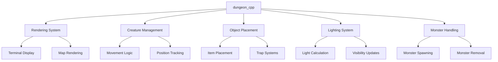
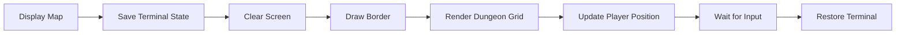
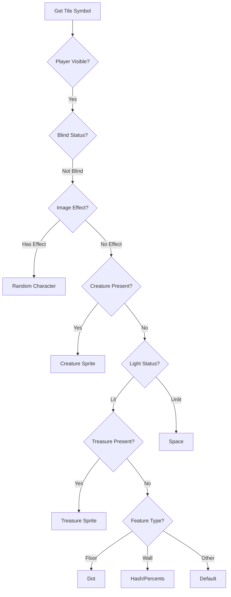
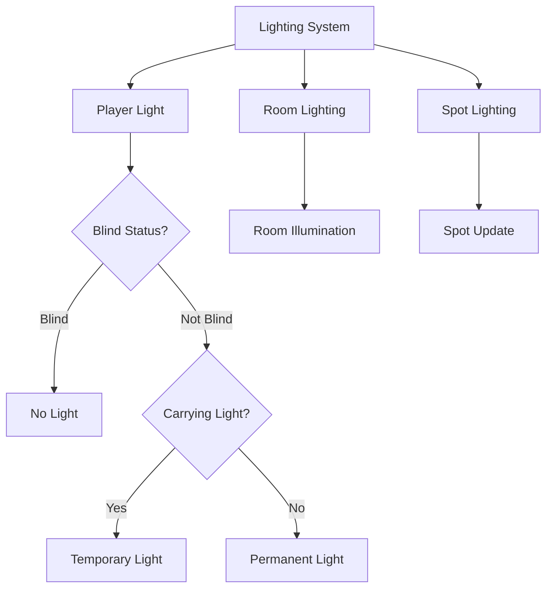
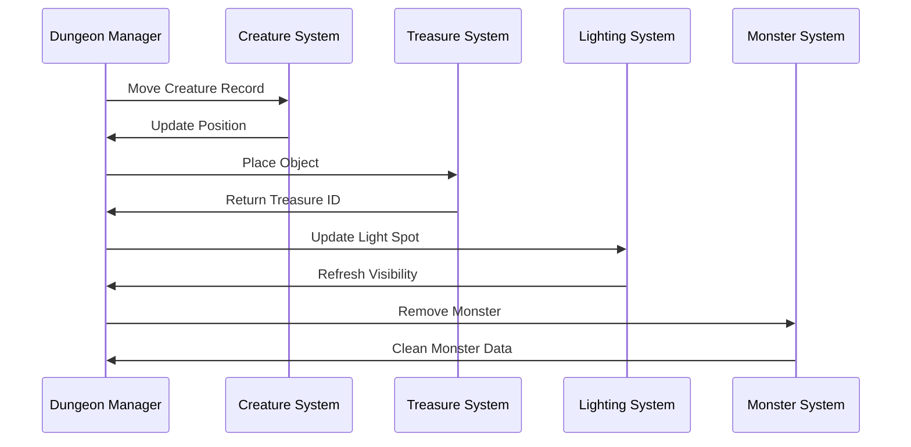

# dungeon_cpp Module Documentation

## Introduction

The `dungeon_cpp` module provides core dungeon management functionality for the game. It handles dungeon rendering, creature movement, object placement, lighting systems, and monster management. This module serves as a central component for dungeon-related operations and interacts with various other game systems through shared data structures and interfaces.

## Architecture Overview

## Core Components

### Data Structures

The module defines several key data structures:

- **Dungeon_t**: Main dungeon structure containing floor layout, dimensions, and game state
- **Coord_t**: Coordinate system for positioning elements within the dungeon
- **Tile_t**: Individual dungeon tile representation with features, treasures, and creatures
- **Monster_t**: Monster data structure including position, stats, and behavior flags

### Key Functions

#### Dungeon Display and Rendering

The `dungeonDisplayMap()` function creates the visual representation of the dungeon:

#### Coordinate Operations

The module provides essential coordinate utilities:

- `coordInBounds()`: Validates coordinates against dungeon boundaries
- `coordDistanceBetween()`: Calculates distance between two points
- `coordWallsNextTo()`: Counts walls adjacent to a coordinate
- `coordCorridorWallsNextTo()`: Counts corridor walls in vicinity

#### Cave and Tile Management

The `caveGetTileSymbol()` function determines what character to display for each tile based on visibility conditions:

#### Object Placement and Management

The module handles various object placements:

- `dungeonSetTrap()`: Places traps at specified coordinates
- `dungeonPlaceRubble()`: Places rubble obstacles
- `dungeonPlaceGold()`: Places gold piles
- `dungeonPlaceRandomObjectAt()`: Places random items
- `dungeonAllocateAndPlaceObject()`: Bulk object placement
- `dungeonPlaceRandomObjectNear()`: Places objects near specified locations

#### Lighting System

The lighting system manages both permanent and temporary light sources:

#### Monster Management

The monster handling system includes:

- `dungeonDeleteMonster()`: Complete monster removal
- `dungeonRemoveMonsterFromLevel()`: Removes monster from level grid
- `dungeonDeleteMonsterRecord()`: Deletes monster record from memory
- `dungeonSummonObject()`: Summons objects around a location

## Component Interactions

## Integration Points

This module integrates with several other systems:

- **[game_state.md](game_state.md)**: Accesses global game state variables like `py` (player) and `game`
- **[input_system.md](input_system.md)**: Uses input handling functions like `getKeyInput()`
- **[rendering.md](rendering.md)**: Interfaces with terminal rendering via `terminalSaveScreen()` and `putString()`
- **[monster_system.md](monster_system.md)**: Manages monster creation, deletion, and movement
- **[inventory_system.md](inventory_system.md)**: Handles treasure and object placement through inventory functions

## Dependencies

The module depends on:
- `headers.h`: Contains necessary type definitions and function declarations
- Global game state structures (`py`, `game`, `monsters`)
- Configuration constants from various configuration modules
- Random number generation functions
- Terminal I/O functions for display operations

## Usage Patterns

The dungeon module follows these usage patterns:

1. **Initialization**: Sets up the global `Dungeon_t` instance `dg`
2. **Rendering**: Calls `dungeonDisplayMap()` for screen updates
3. **Coordinate Operations**: Uses coordinate validation and distance calculations throughout
4. **Object Management**: Places and removes objects using dedicated functions
5. **Lighting Updates**: Maintains light visibility through movement and object interactions
6. **Monster Handling**: Manages monster lifecycle through creation and deletion functions

This module forms the foundation for dungeon exploration and provides the core mechanics needed for player movement, combat, and interaction with the game world.
