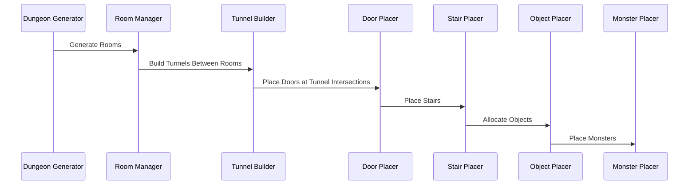

# dungeon_generate_cpp Module Documentation

## Introduction

The `dungeon_generate_cpp` module is responsible for generating dungeon layouts and managing the procedural generation of cave systems, rooms, corridors, and various dungeon features. This module handles both the generation of regular dungeon levels and the town level, including placement of doors, stairs, treasures, monsters, and special dungeon elements.

## Architecture Overview

```mermaid
graph TD
    A[dungeon_generate.cpp] --> B[Dungeon Generation]
    A --> C[Town Generation]
    A --> D[Room Building]
    A --> E[Corridor Building]
    A --> F[Feature Placement]
    A --> G[Object/Item Placement]
    A --> H[Monster Placement]

    B --> B1[Dungeon Generation Main Loop]
    B --> B2[Room Placement]
    B --> B3[Tunnel Building]
    B --> B4[Door Placement]
    B --> B5[Stair Placement]
    B --> B6[Object Allocation]

    C --> C1[Store Building]
    C --> C2[Lighting System]
    C --> C3[Monster Placement]

    D --> D1[Basic Room]
    D --> D2[Overlapping Rectangles]
    D --> D3[Inner Rooms]
    D --> D4[Cross-Shaped Rooms]

    E --> E1[Tunnel Algorithm]
    E --> E2[Direction Handling]
    E --> E3[Wall Conversion]

    F --> F1[Door Types]
    F --> F2[Stairs]
    F --> F3[Secret Doors]
    F --> F4[Traps]
    F --> F5[Gold Placement]

    G --> G1[Object Allocation]
    G --> G2[Gold/Gem Distribution]
    G --> G3[Random Object Placement]

    H --> H1[Monster Allocation]
    H --> H2[Winning Monster]
```

## Component Relationships

### Core Functions and Their Interactions

## Data Flow and Processing

```mermaid
flowchart LR
    A[Input: Level Parameters] --> B[Dungeon Generation Logic]
    B --> C[Room Placement]
    C --> D[Tunnel Construction]
    D --> E[Door Placement]
    E --> F[Stair Placement]
    F --> G[Object Allocation]
    G --> H[Monster Placement]
    H --> I[Final Dungeon State]
    
    style A fill:#e1f5fe
    style B fill:#f3e5f5
    style C fill:#e8f5e9
    style D fill:#fff3e0
    style E fill:#fce4ec
    style F fill:#f1f8e9
    style G fill:#fff8e1
    style H fill:#e0f2f1
    style I fill:#f3e5f5
```

## Detailed Component Descriptions

### Dungeon Generation Process

The main dungeon generation process follows these steps:

1. **Initialization**: Sets up dungeon parameters and clears existing dungeon state
2. **Room Generation**: Creates rooms using different room types (basic, overlapping rectangles, inner rooms, cross-shaped)
3. **Tunnel Building**: Connects rooms with corridors using a sophisticated tunnel algorithm
4. **Feature Placement**: Places doors, stairs, and other dungeon features
5. **Object Allocation**: Distributes treasures, gold, and other objects throughout the dungeon
6. **Monster Placement**: Places monsters according to level difficulty

### Room Building Strategies

The module implements several room building strategies:

- **Basic Rooms**: Simple rectangular rooms with walls
- **Overlapping Rectangles**: Multiple overlapping rooms for complex layouts
- **Inner Rooms**: Rooms with internal structures like pillars or mazes
- **Cross-Shaped Rooms**: Large central areas with perpendicular corridors

### Door System

The door placement system supports multiple door types:
- Open doors
- Broken doors
- Closed doors
- Locked doors (with key requirements)
- Stuck doors (difficult to open)
- Secret doors (hidden until discovered)

### Object and Treasure Placement

Objects are distributed across the dungeon using three categories:
1. **Room objects**: Distributed within rooms
2. **Corridor objects**: Distributed along corridors  
3. **Floor objects**: Distributed across all walkable floors

### Monster Placement

Monsters are placed based on:
- Current dungeon level
- Available space
- Difficulty scaling
- Special win conditions for endgame levels

## Integration Points

This module integrates with several other system components:

- [inventory](inventory.md): For treasure and object management
- [monsters](monsters.md): For monster placement and spawning
- [config](config.md): Configuration parameters for dungeon generation
- [game_state](game_state.md): Game state management during generation
- [seed_system](seed_system.md): Random number generation seeding

## Key Algorithms

### Tunnel Building Algorithm

The tunnel building algorithm uses a directional approach with:
- Direction preference based on target coordinates
- Random direction changes for natural-looking paths
- Wall conversion logic for proper corridor connections
- Door placement at intersection points

### Room Placement Algorithm

Room placement uses a grid-based approach:
- Divides dungeon into a grid of potential room locations
- Randomly selects rooms to place based on level difficulty
- Applies different room types based on level progression
- Ensures proper spacing and connection between rooms

### Object Allocation System

Objects are allocated using a weighted distribution system:
- Different allocation rules for rooms, corridors, and floors
- Normal distribution for object density calculations
- Level-based scaling for object quantities

## Configuration Dependencies

This module relies on configuration values from the config system, particularly:
- Dungeon size parameters
- Room generation probabilities
- Object distribution rates
- Monster placement thresholds
- Door and trap generation frequencies

## Performance Considerations

The dungeon generation process is optimized for:
- Memory usage through static arrays for temporary storage
- Efficient coordinate checking and bounds validation
- Early termination conditions for algorithms
- Batch processing of similar operations

## Error Handling and Validation

The module includes debug assertions for:
- Coordinate boundary checking
- Pointer validity verification
- Feature ID range validation
- Consistency checks for generated dungeon features

## Usage Patterns

The primary entry point is `generateCave()` which:
1. Initializes dungeon parameters
2. Selects between town and dungeon generation based on current level
3. Calls appropriate generation functions
4. Handles final dungeon state setup

The module is designed to be called once per dungeon level generation, making it suitable for procedural dungeon generation in roguelike games.
