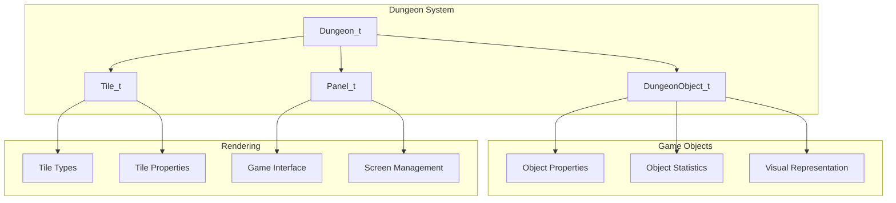
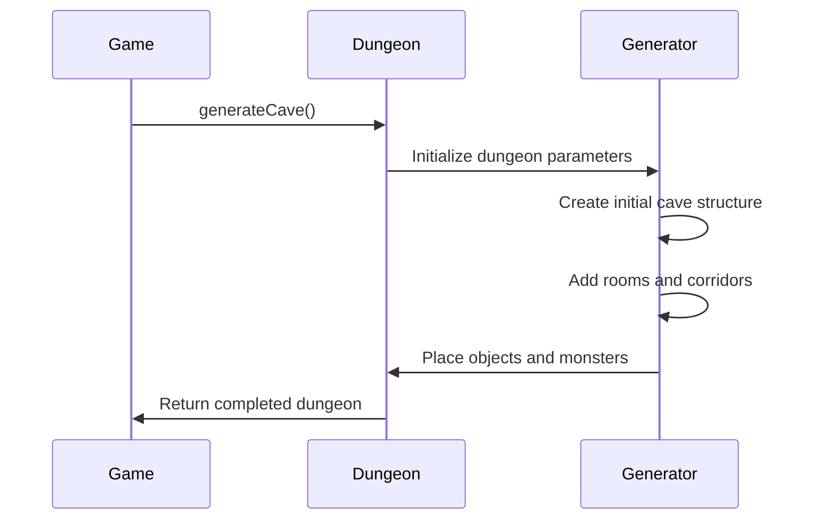
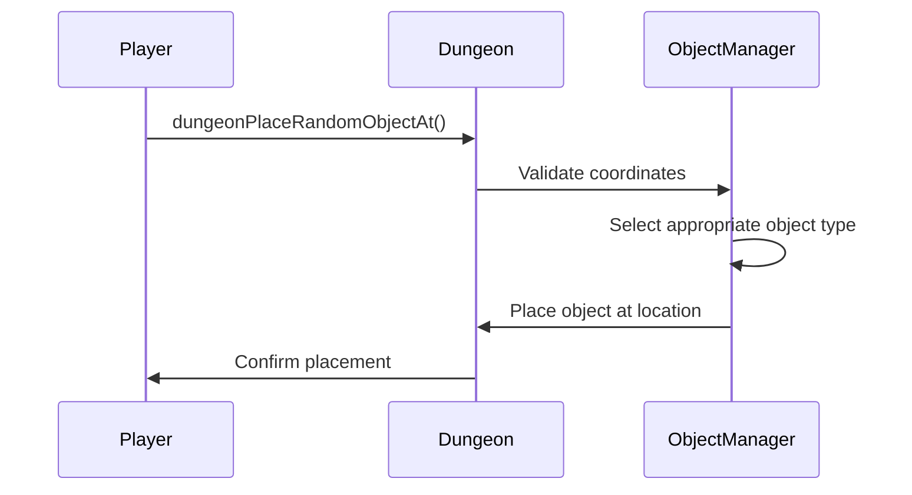
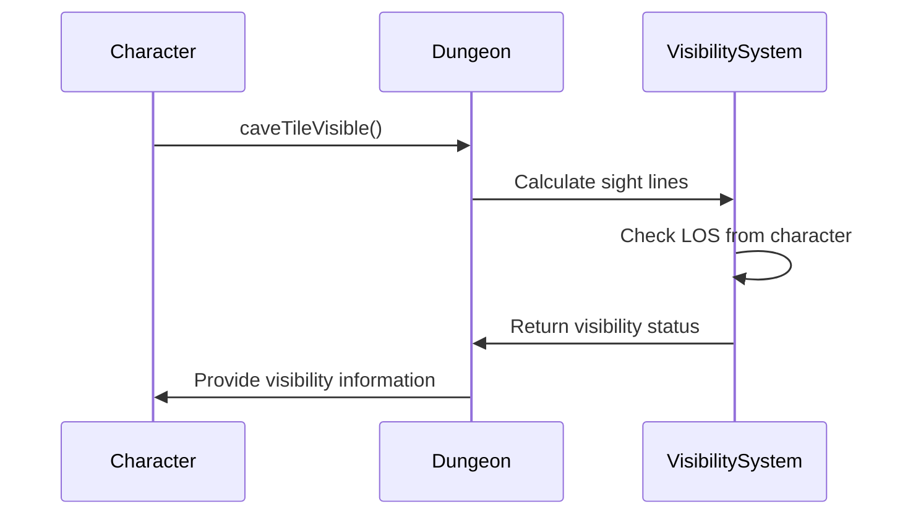

# dungeon_h Module Documentation

## Brief Introduction

The `dungeon_h` module defines the core data structures and function declarations for the dungeon management system in the game. This module provides the foundation for dungeon generation, object placement, creature movement, and visibility calculations that form the backbone of the game's dungeon exploration mechanics.

## Detailed Documentation

### Data Structures

#### DungeonObject_t
This structure represents an object within the dungeon environment:

```c
typedef struct {
    const char *name;
    uint32_t flags;
    uint8_t category_id;
    uint8_t sprite;
    int16_t misc_use;
    int32_t cost;
    uint8_t sub_category_id;
    uint8_t items_count;
    uint16_t weight;
    int16_t to_hit;
    int16_t to_damage;
    int16_t ac;
    int16_t to_ac;
    Dice_t damage;
    uint8_t depth_first_found;
} DungeonObject_t;
```

This structure contains all metadata about game objects including their properties, statistics, and visual representation.

#### Dungeon_t
The main dungeon structure that holds the entire dungeon state:

```c
typedef struct {
    int16_t height;
    int16_t width;

    Panel_t panel;

    int32_t game_turn;

    int16_t current_level;

    bool generate_new_level;

    Tile_t floor[MAX_HEIGHT][MAX_WIDTH];
} Dungeon_t;
```

This structure maintains the dungeon dimensions, game state, and the actual tile grid representing the dungeon layout.

### Constants

The module defines several important constants for dungeon sizing and configuration:

- `RATIO`: 3 - Used for various scaling calculations
- `MAX_HEIGHT`: 66 - Maximum dungeon height in tiles
- `MAX_WIDTH`: 198 - Maximum dungeon width in tiles
- `SCREEN_HEIGHT`: 22 - Visible screen height in tiles
- `SCREEN_WIDTH`: 66 - Visible screen width in tiles
- `QUART_HEIGHT`: SCREEN_HEIGHT/4 - One quarter of screen height
- `QUART_WIDTH`: SCREEN_WIDTH/4 - One quarter of screen width

### Function Declarations

#### Display and Visibility Functions
```c
void dungeonDisplayMap();
bool coordInBounds(Coord_t const &coord);
int coordDistanceBetween(Coord_t const &from, Coord_t const &to);
int coordWallsNextTo(Coord_t const &coord);
int coordCorridorWallsNextTo(Coord_t const &coord);
char caveGetTileSymbol(Coord_t const &coord);
bool caveTileVisible(Coord_t const &coord);
```

These functions handle map display, coordinate validation, distance calculations, and visibility determination for dungeon tiles.

#### Trap and Object Management
```c
void dungeonSetTrap(Coord_t const &coord, int sub_type_id);
void trapChangeVisibility(Coord_t const &coord);

void dungeonPlaceRubble(Coord_t const &coord);
void dungeonPlaceGold(Coord_t const &coord);

void dungeonPlaceRandomObjectAt(Coord_t const &coord, bool must_be_small);
void dungeonAllocateAndPlaceObject(bool (*set_function)(int), int object_type, int number);
void dungeonPlaceRandomObjectNear(Coord_t coord, int tries);
```

Functions for managing traps, rubble, gold placement, and random object generation throughout the dungeon.

#### Creature and Monster Management
```c
void dungeonMoveCreatureRecord(Coord_t const &from, Coord_t const &to);
void dungeonLightRoom(Coord_t const &coord);
void dungeonLiteSpot(Coord_t const &coord);
void dungeonMoveCharacterLight(Coord_t const &from, Coord_t const &to);

void dungeonDeleteMonster(int id);
void dungeonRemoveMonsterFromLevel(int id);
void dungeonDeleteMonsterRecord(int id);
int dungeonSummonObject(Coord_t coord, int amount, int object_type);
bool dungeonDeleteObject(Coord_t const &coord);
```

These functions handle monster movement, lighting effects, and object removal operations.

#### Generation and Pathfinding
```c
void generateCave();
bool los(Coord_t from, Coord_t to);
void look();
```

Dungeon generation functions and line-of-sight calculations for gameplay mechanics.

### Component Relationships



### Dependencies

This module depends on several other core modules:

- [coord_h](coord_h.md) - For coordinate handling and spatial calculations
- [tile_h](tile_h.md) - For tile definitions and properties
- [panel_h](panel_h.md) - For interface panel management
- [dice_h](dice_h.md) - For damage calculation dice systems

### Data Flow

```mermaid
flowchart LR
    A[Game Loop] --> B[dungeonDisplayMap]
    B --> C[coordInBounds]
    C --> D[los Calculation]
    D --> E[Visibility Check]
    E --> F[Render Tiles]
    
    A --> G[generateCave]
    G --> H[Tile Generation]
    H --> I[Object Placement]
    I --> J[dungeonPlaceRandomObject]
    
    A --> K[dungeonMoveCreatureRecord]
    K --> L[Coordinate Validation]
    L --> M[Lighting Updates]
    M --> N[Character Movement]
    
    A --> O[look() Function]
    O --> P[Line of Sight]
    P --> Q[Object Detection]
```

### Process Flows

#### Dungeon Generation Process


#### Object Placement Process


#### Visibility Calculation Process


### Integration Points

The dungeon system integrates with several other modules:

1. **[coord_h](coord_h.md)** - Provides coordinate-based operations essential for all dungeon positioning
2. **[tile_h](tile_h.md)** - Defines the underlying tile system that forms the dungeon structure
3. **[panel_h](panel_h.md)** - Manages the display panel where dungeon information is rendered
4. **[creature_h](creature_h.md)** - Handles monster and player movement within the dungeon
5. **[object_h](object_h.md)** - Manages object interactions and inventory systems

This module serves as the central hub for all dungeon-related operations, making it critical for the game's core mechanics and player experience.
