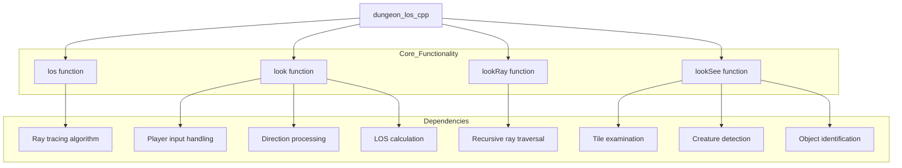
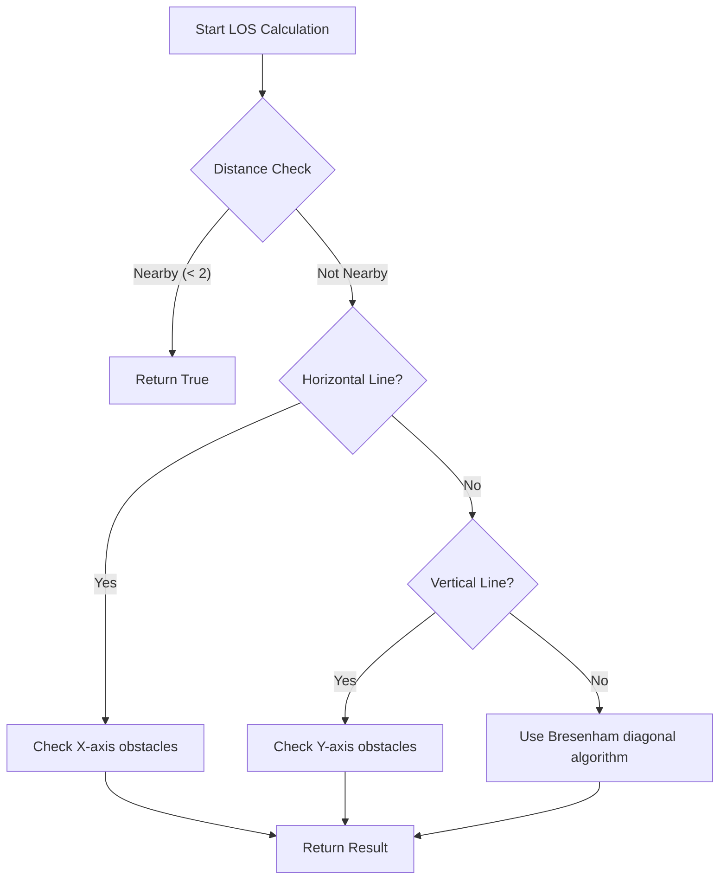
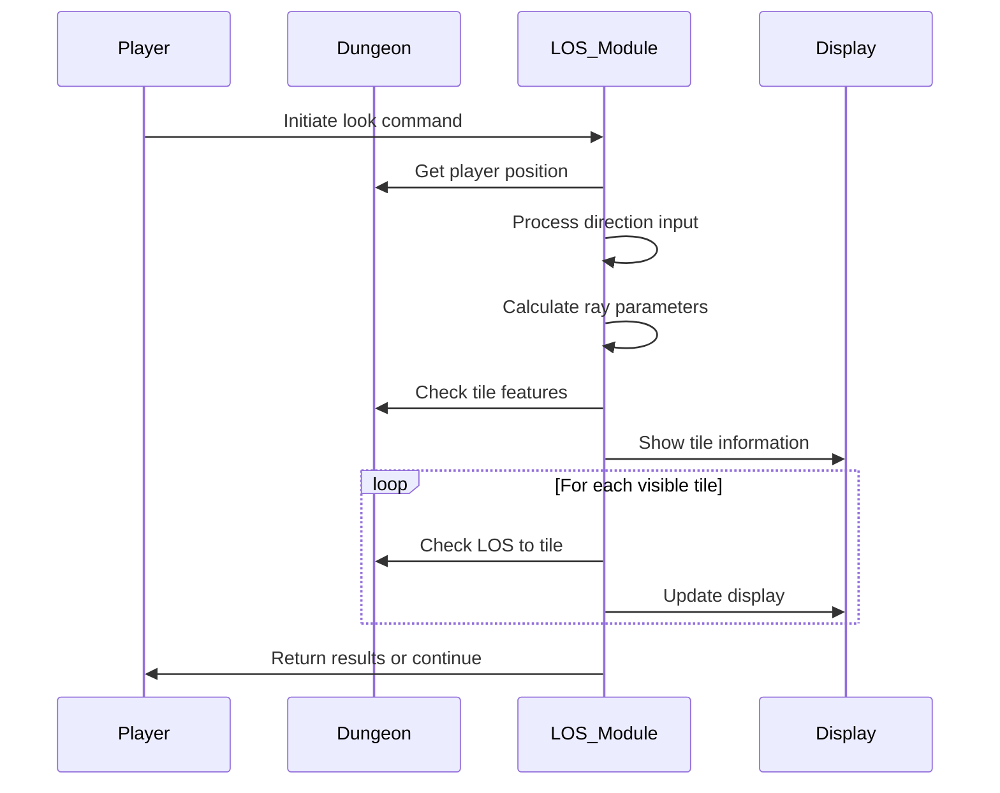
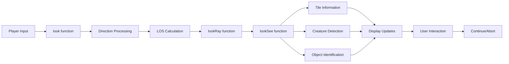

# dungeon_los_cpp Module Documentation

## Introduction

The `dungeon_los_cpp` module implements line-of-sight (LOS) algorithms and the look command functionality for the dungeon exploration system. This module provides core functionality for determining visibility between points in the dungeon and enabling players to examine their surroundings through the look command.

## Architecture Overview

## Core Components

### Line-of-Sight Algorithm (`los` function)

The primary LOS implementation uses a modified Bresenham's algorithm optimized for dungeon environments. It handles three main cases:

1. **Nearby points** (within 2 tiles): Returns `true` immediately
2. **Horizontal lines**: Checks for obstacles along the X-axis
3. **Vertical lines**: Checks for obstacles along the Y-axis
4. **Diagonal lines**: Uses a sophisticated Bresenham-style algorithm with proper slope handling

### Look Command Implementation (`look` function)

The look command allows players to examine their surroundings in specific directions. It processes player input and coordinates the visual exploration:

1. Handles blindness and hallucination states
2. Processes directional input
3. Manages recursive ray tracing for field of view
4. Controls display and user interaction

### Recursive Ray Traversal (`lookRay` function)

Implements the recursive algorithm for exploring the field of view:

1. Calculates bounds for current ray segment
2. Handles transparency and obstacle detection
3. Recursively explores adjacent rays
4. Manages coordinate transformations

### Tile Examination (`lookSee` function)

Handles individual tile examination and user interaction:

1. Validates coordinate boundaries
2. Determines tile transparency
3. Identifies creatures and objects
4. Manages display messages and user input
5. Handles special cases like secret doors and treasure

## Data Flow

## Component Interactions

## Key Constants and Variables

### Static Variables
- `los_fxx`, `los_fxy`, `los_fyx`, `los_fyy`: Direction vectors for coordinate transformation
- `los_num_places_seen`: Counter for discovered items
- `los_hack_no_query`: Flag for special query handling
- `los_rocks_and_objects`: Object counter for display logic

### Direction Arrays
- `los_dir_set_*`: Direction vector sets for different movement patterns
- `los_map_diagonals1/2`: Mapping arrays for diagonal direction handling

## Integration Points

This module integrates with several other system components:

- **[dungeon](dungeon.md)**: Accesses dungeon floor data through `dg.floor`
- **[player](player.md)**: Uses player position and status flags
- **[monsters](monsters.md)**: Interacts with monster data for creature detection
- **[treasure](treasure.md)**: Accesses treasure information for object identification
- **[display](display.md)**: Uses display functions for user interface

## System Dependencies

The module depends on:
- `headers.h`: Standard headers and definitions
- `dg.floor`: Dungeon floor data structure
- `py`: Player state information
- `monsters[]`: Monster database
- `game.treasure.list[]`: Treasure database
- `config::options::highlight_seams`: Configuration options
- `config::monsters::MON_MAX_SIGHT`: Monster sight range configuration

## Error Handling

The module includes basic error checking:
- Coordinate boundary validation
- Illegal parameter detection
- Proper handling of edge cases in ray tracing
- Graceful degradation when encountering invalid states

## Performance Considerations

The implementation optimizes for:
- Early termination when obstacles are detected
- Efficient coordinate transformations
- Minimal redundant calculations
- Proper use of integer arithmetic over floating-point operations

## Usage Examples

The module is primarily used through:
1. **Player look command**: `look()` function entry point
2. **LOS queries**: `los()` function for visibility checks
3. **Field of view calculations**: Recursive ray tracing algorithms

This module forms a critical part of the dungeon exploration system, enabling both gameplay mechanics and player interaction with the game world.
