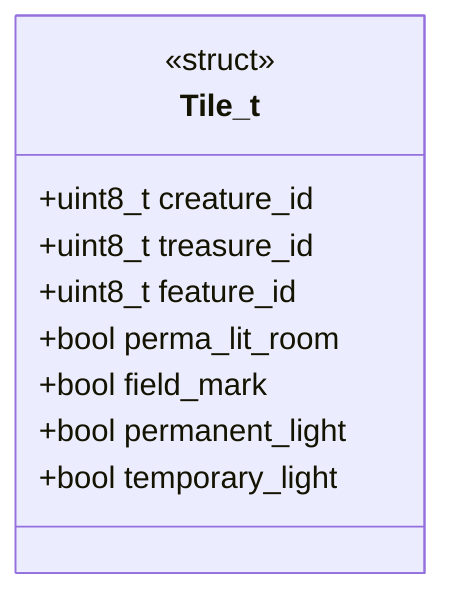
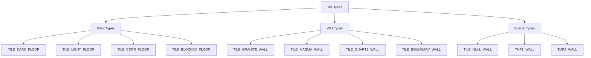
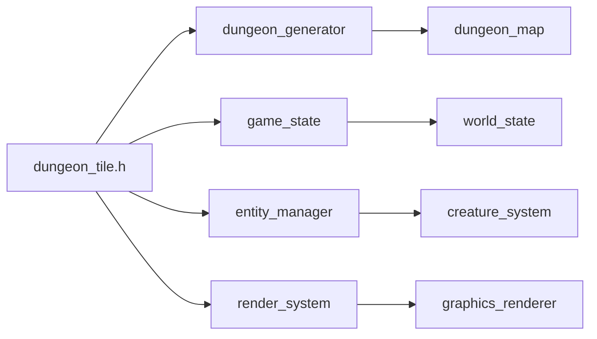

# Dungeon Tile Header Documentation

## Brief Introduction

The `dungeon_tile.h` module defines the fundamental data structures and constants used to represent individual tiles within the dungeon environment. This header file serves as a cornerstone for dungeon generation and management systems, providing standardized representations for different tile types and their properties.

## Comprehensive Documentation

This module provides the essential building blocks for dungeon tile representation through the `Tile_t` structure and various tile type constants. It forms the foundation for dungeon generation algorithms and game state management.

### Data Structures

The `Tile_t` structure represents a single dungeon tile with the following key attributes:

- **creature_id**: Identifier for any creature occupying the tile
- **treasure_id**: Identifier for treasure items present on the tile
- **feature_id**: Identifier for special dungeon features (doors, stairs, etc.)
- **perma_lit_room**: Indicates if the room is permanently lit
- **field_mark**: Marks special areas or zones
- **permanent_light**: Indicates permanent light sources
- **temporary_light**: Indicates temporary light sources

### Tile Type Constants

The module defines several categories of tile types through constants:

#### Floor Types (1-4)
- `TILE_DARK_FLOOR` (1): Standard dark floor
- `TILE_LIGHT_FLOOR` (2): Lighted floor
- `TILE_CORR_FLOOR` (3): Corridor floor
- `TILE_BLOCKED_FLOOR` (4): Blocked/obstructed floor

#### Wall Types (12+)
- `TILE_GRANITE_WALL` (12): Granite wall type
- `TILE_MAGMA_WALL` (13): Magma wall type
- `TILE_QUARTZ_WALL` (14): Quartz wall type
- `TILE_BOUNDARY_WALL` (15): Boundary wall type

#### Special Types
- `TILE_NULL_WALL` (0): Null wall representation
- `TMP1_WALL` (8): Temporary wall type 1
- `TMP2_WALL` (9): Temporary wall type 2

### Usage Context

This module integrates with dungeon generation systems and game state management components. The tile structure is typically used in conjunction with [dungeon_generator](dungeon_generator.md) and [game_state](game_state.md) modules to manage dungeon layout and entity positioning.

### Relationship with Other Modules

The `dungeon_tile.h` module serves as a common interface between:
- **Dungeon Generator** ([dungeon_generator.md]): For creating and managing dungeon layouts
- **Game State** ([game_state.md]): For maintaining persistent dungeon information
- **Entity Manager** ([entity_manager.md]): For tracking creatures and items on tiles
- **Render System** ([render_system.md]): For visual representation of dungeon tiles

### Implementation Notes

The use of bit fields in `Tile_t` allows for efficient memory usage while maintaining clear semantic meaning for lighting and marking properties. The constant definitions provide a standardized way to reference different tile types throughout the game engine, ensuring consistency across various dungeon-related systems.

The module's design supports both procedural dungeon generation and static map loading scenarios, making it flexible for different game modes and difficulty levels.
