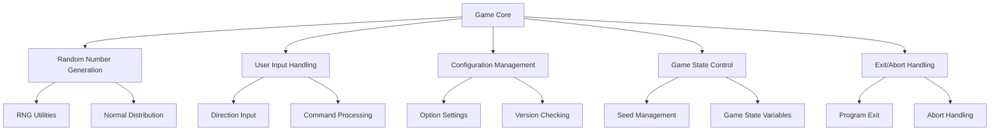
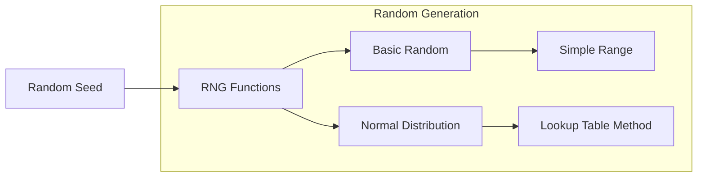
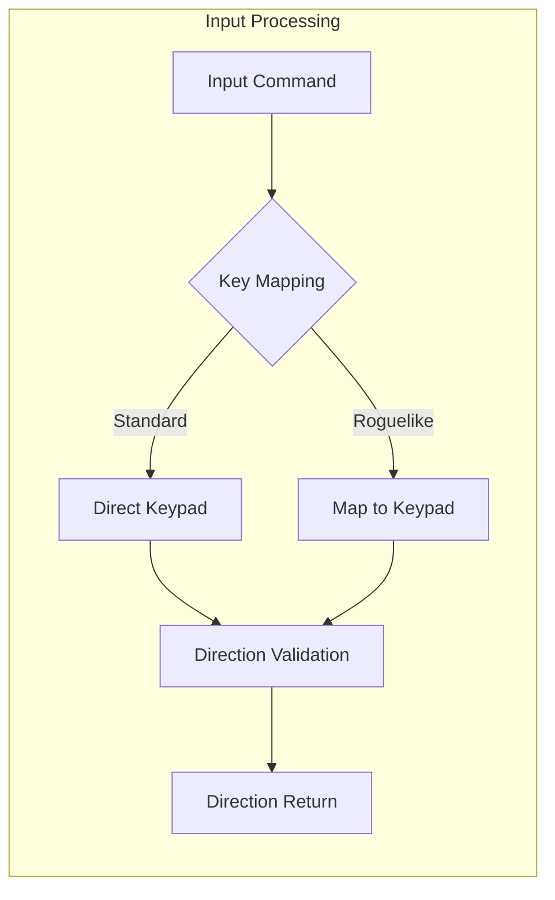
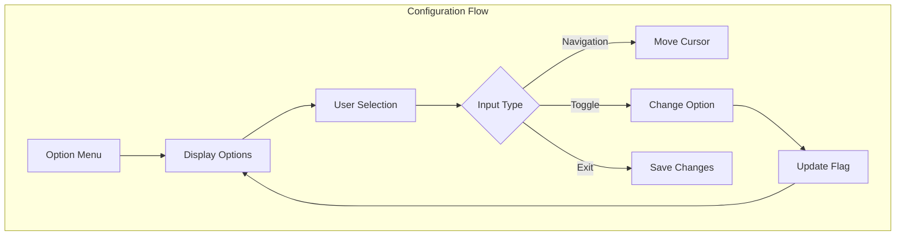
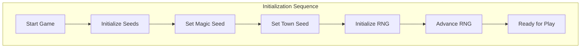
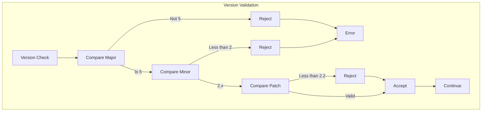

# Game C++ Module Documentation

## Introduction

The `game_cpp` module serves as the central control hub for the game's core functionality, managing game state, random number generation, user input handling, and configuration options. This module coordinates various game systems and provides essential utilities for game operations.

## Architecture Overview

## Component Relationships

### Core Game State Management

The `game` variable represents the main game state structure that holds critical game information including:

- **Magic seed**: Primary seed for game generation
- **Town seed**: Seed for town generation  
- **Random number generator state**: Manages pseudo-random sequences
- **Game configuration flags**: Various gameplay options

### Random Number Generation System

The module implements sophisticated random number generation with multiple distributions:

### Input Handling and Direction Management

The module handles both standard and roguelike key mappings for directional input:

### Configuration Options System

The game options system allows users to customize gameplay behavior through a menu interface:

## Data Flow and Process Flows

### Game Initialization Process

### Version Validation Process

## Key Components and Interfaces

### Seed Management Functions

The seed management system handles initialization and temporary seed switching:

- `seedsInitialize()`: Sets up game seeds from provided seed or current time
- `seedSet()`: Temporarily changes the random seed
- `seedResetToOldSeed()`: Restores previous random seed

### Random Number Generation

The module provides two primary random number functions:

- `randomNumber(max)`: Returns integer in range [1, max]
- `randomNumberNormalDistribution(mean, standard)`: Returns normally distributed values using lookup table method

### Input Handling

Directional input processing with support for both standard and roguelike key layouts:

- `getDirectionWithMemory()`: Gets direction with last direction memory
- `getAllDirections()`: Gets any valid direction input

### Configuration Management

The game options system allows runtime configuration:

- `setGameOptions()`: Interactive menu for setting game options
- `validGameVersion()`: Validates version compatibility
- `isCurrentGameVersion()`: Checks if version matches current

### Exit and Error Handling

- `exitProgram()`: Graceful program termination
- `abortProgram(msg)`: Forced program termination with error message

## Integration Points

This module integrates with several other system components:

- **[headers.h](headers.md)**: Provides core system definitions and includes
- **[version.h](version.md)**: Contains version information and constants
- **[config](config.md)**: Configuration management system
- **[terminal](terminal.md)**: Terminal I/O operations
- **[input](input.md)**: Input handling utilities
- **[rng](rng.md)**: Random number generation system

## Dependencies

The module depends on:
- Standard C/C++ libraries for basic operations
- System-specific headers for time and memory management
- Configuration system for option management
- Terminal interface for user interaction
- Input handling system for command processing

## Usage Patterns

The module follows these usage patterns:

1. **Initialization**: Seeds are initialized at game start
2. **Runtime Operations**: Random numbers and directions are generated during gameplay
3. **Configuration**: Options are managed through interactive menus
4. **Termination**: Controlled exits and error handling are performed through this module

## Performance Considerations

The module is designed for minimal overhead during normal gameplay operations. The random number generation uses lookup tables for performance optimization, and input handling is optimized for real-time responsiveness.
