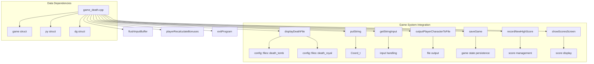
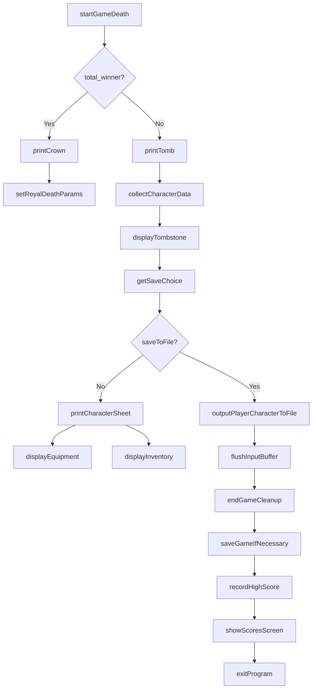

# Game Death C++ Module Documentation

## Brief Introduction

The `game_death_cpp` module handles the game's death sequence and character finalization processes. This module manages the display of tombstone information, royal death sequences, and character record saving when a player character dies. It integrates with the broader game system to ensure proper cleanup and scoring procedures upon character death.

## Module Overview

This module contains the core logic for handling character death scenarios in the game. It provides functions for displaying death-related information, managing special royal death sequences, and ensuring proper game state cleanup and persistence.

### Key Functions

- `printTomb()` - Displays the tombstone with character information
- `printCrown()` - Shows royal death message for total winners
- `kingly()` - Implements special royal death treatment
- `endGame()` - Main entry point for game termination sequence

## Architecture and Component Relationships

## Data Flow and Process Flow

## Component Interactions

The `game_death_cpp` module interacts with several core game systems:

1. **Display System** - Uses `displayDeathFile`, `putString`, and coordinate-based output functions
2. **Input/Output System** - Handles user input through `flushInputBuffer` and `getStringInput`
3. **Game State Management** - Accesses global game structures (`game`, `py`, `dg`) for character data
4. **File I/O System** - Manages character record saving via `outputPlayerCharacterToFile`
5. **Save System** - Integrates with `saveGame()` for persistent game state
6. **Scoring System** - Works with `recordNewHighScore()` and `showScoresScreen()`

## Detailed Function Documentation

### `printTomb()`

Displays the standard tombstone information including:
- Character name
- Rank title (normal or "Magnificent" for total winners)
- Class title (or royal titles for total winners)
- Level, experience, gold, and dungeon level
- Cause of death
- Date of death

Provides options for saving character records to file or viewing character sheet.

### `printCrown()`

Displays the royal death message for total winners, showing a special crown message and waiting for user confirmation.

### `kingly()`

Implements special treatment for total winners who die, including:
- Setting current level to 0
- Setting cause of death to "Ripe Old Age"
- Restoring player levels
- Awarding bonus levels, gold, and experience points
- Displaying the royal death sequence

### `endGame()`

Main game termination function that:
1. Handles death sequence display
2. Saves game state if necessary
3. Records high scores
4. Shows score screen
5. Exits the program

## Integration Points

This module depends on several other system components:

- [headers.h](headers.h.md) - Provides core game definitions and includes
- [config::files](config_files.md) - Configuration for death-related file paths
- [display system](display_system.md) - For file display and string output
- [input system](input_system.md) - For user interaction handling
- [save system](save_system.md) - For game state persistence
- [score system](score_system.md) - For high score management

## External Dependencies

The module requires access to:
- Global game state variables (`game`, `py`, `dg`)
- Configuration constants for death file paths
- Display and input/output functions
- File I/O operations for character recording
- Score management functions

## Error Handling

The module implements basic error recovery for file operations:
- Retry mechanism when character file output fails
- Graceful handling of user input validation

## Performance Considerations

The module is designed for minimal performance impact during death sequences, focusing on:
- Efficient string operations
- Minimal memory allocation
- Direct access to global game state
- Streamlined user interaction flow

## Security Considerations

The module handles user-provided filenames for character records with:
- Input validation
- Proper buffer management
- Safe string operations

## Future Enhancements

Potential improvements could include:
- Enhanced character record formatting options
- Additional death scenario types
- Improved error reporting for file operations
- More sophisticated save/load mechanisms
