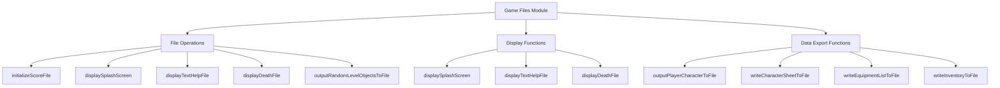
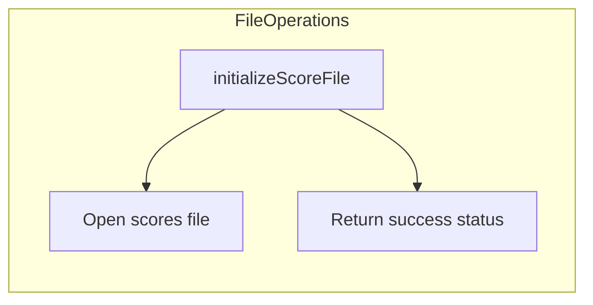
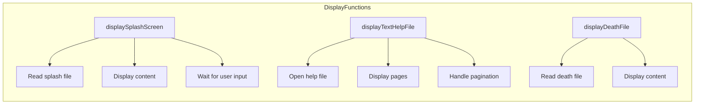
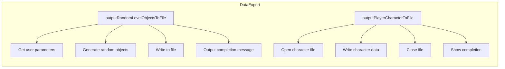
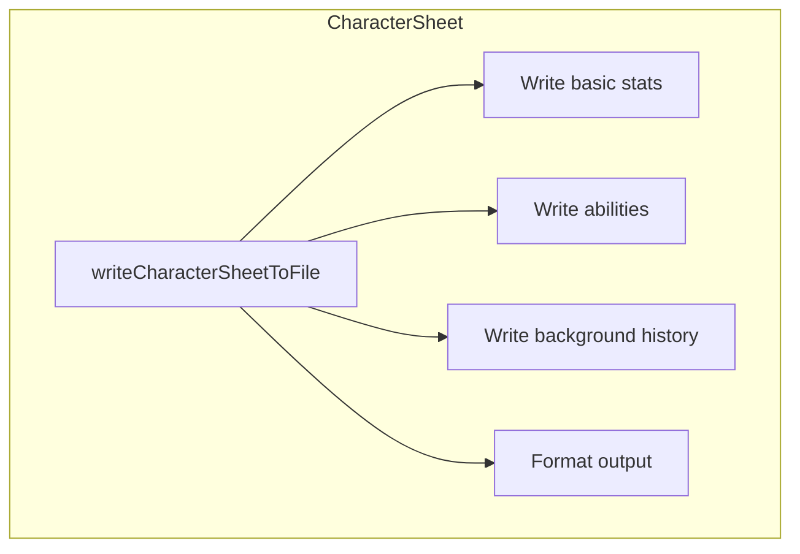
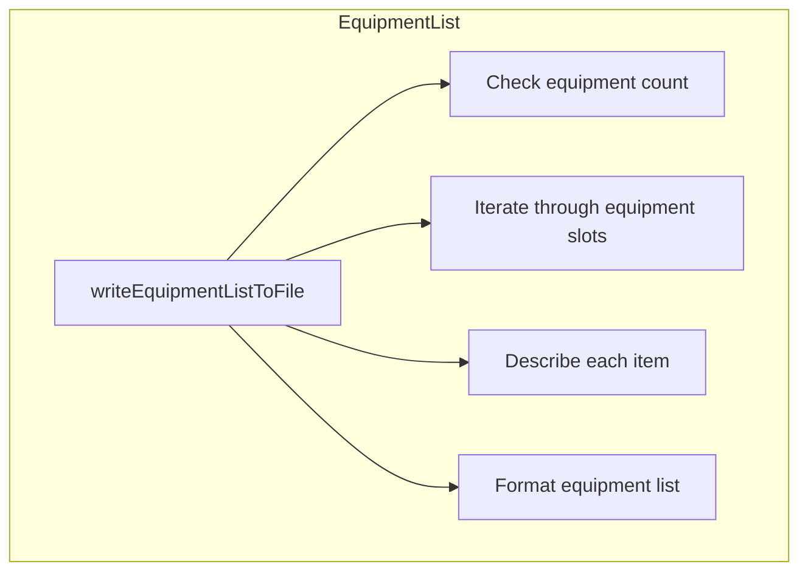
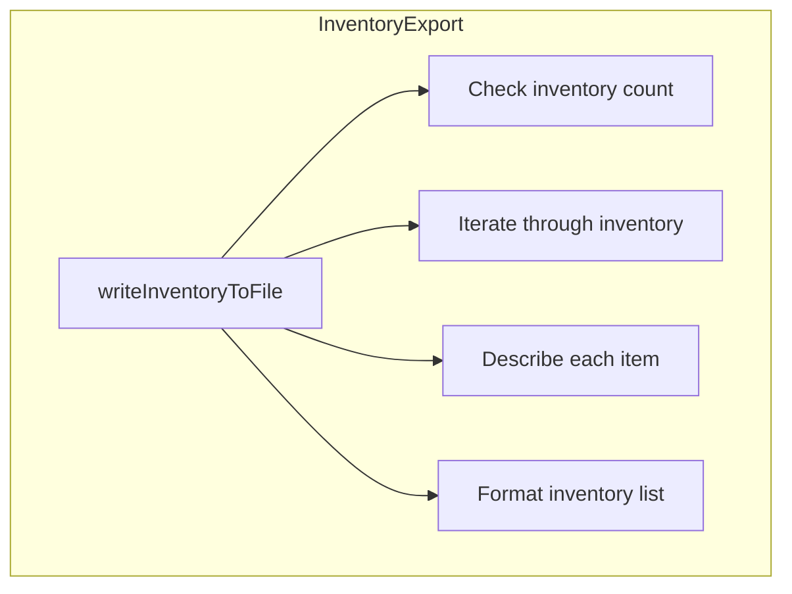

# Game Files C++ Module Documentation

## Introduction

The `game_files_cpp` module provides essential file I/O operations for the Moria game system. This module handles various file-related functionalities including score file initialization, splash screen display, help file viewing, death screen display, random object generation, and character sheet output to files. The module serves as a bridge between the game's internal data structures and persistent storage mechanisms.

## Architecture Overview



## Component Details

### Core Functions

#### File Initialization and Management



The `initializeScoreFile()` function attempts to open the high score file for reading and writing. It returns a boolean indicating whether the operation was successful.

#### Display Functions



The display functions handle various text-based file displays:
- `displaySplashScreen()`: Shows the game's splash screen from a file
- `displayTextHelpFile()`: Displays help files with pagination support
- `displayDeathFile()`: Shows death screen messages from files

#### Data Generation and Export



The data export functions provide mechanisms for generating and saving game data:
- `outputRandomLevelObjectsToFile()`: Generates random objects for specific levels and saves them to files
- `outputPlayerCharacterToFile()`: Exports complete character information to text files

### Helper Functions

#### Character Sheet Writing



The `writeCharacterSheetToFile()` function formats and writes comprehensive character information including:
- Basic character details (name, race, class, etc.)
- Physical attributes and statistics
- Combat abilities and skills
- Character background history

#### Equipment Listing



The `writeEquipmentListToFile()` function creates formatted lists of all currently equipped items, showing their placement positions and descriptions.

#### Inventory Export



The `writeInventoryToFile()` function exports the entire character inventory with item descriptions.

## Data Flow


The module follows a standard data flow pattern where user requests trigger file operations, which then process data through various formatting stages before writing to output files.

## Integration Points

This module integrates with several other system components:

- **Configuration System**: Uses `config::files` namespace for file paths
- **Display System**: Relies on `putString`, `clearScreen`, and `waitForContinueKey` functions
- **Input System**: Utilizes `getStringInput`, `getKeyInput`, and `getInputConfirmation`
- **Game State**: Accesses global `py` structure for character data
- **Object Management**: Uses `itemGetRandomObjectId` and related inventory functions

## Dependencies

The module depends on:
- [headers.h](headers.md): Core system headers and definitions
- [config](config.md): Configuration management for file paths
- [display](display.md): Screen display functions
- [input](input.md): User input handling
- [objects](objects.md): Object generation and management
- [player](player.md): Character state and data structures

## Error Handling

All file operations include proper error checking:
- File opening failures are handled gracefully
- User confirmation prompts for overwriting existing files
- Input validation for numeric parameters
- Clear error messages displayed to users

## Usage Examples

### Displaying Help Files
```cpp
displayTextHelpFile("help/intro.txt");
```

### Generating Random Objects
```cpp
outputRandomLevelObjectsToFile();
```

### Exporting Character Sheets
```cpp
outputPlayerCharacterToFile("character_sheet.txt");
```

## Performance Considerations

- File I/O operations are optimized for minimal overhead
- Memory usage is kept constant regardless of file size
- Text formatting uses pre-allocated buffers for efficiency
- Large data sets are processed in chunks when appropriate

## Security Notes

- File operations validate user input to prevent path traversal attacks
- File permissions are properly set during creation
- Overwrite confirmation is required for existing files
- All file operations use safe string handling functions
