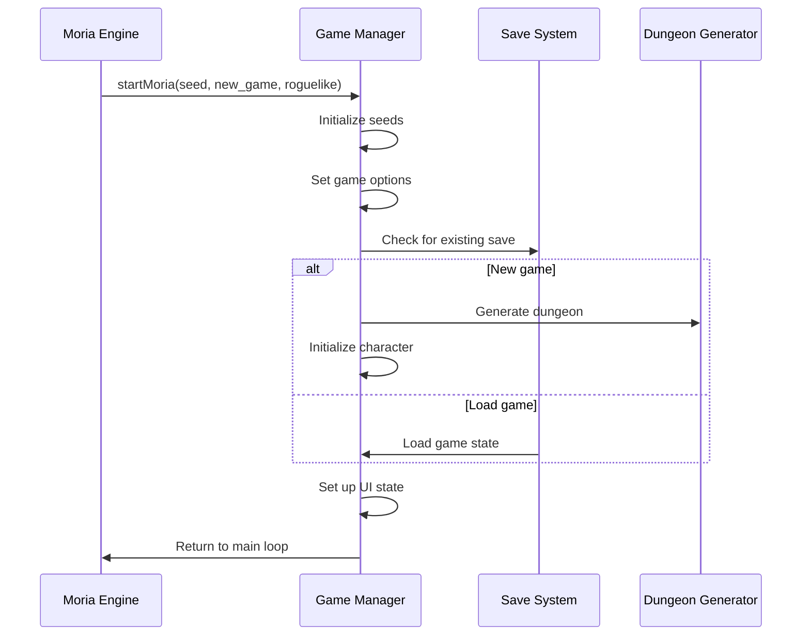
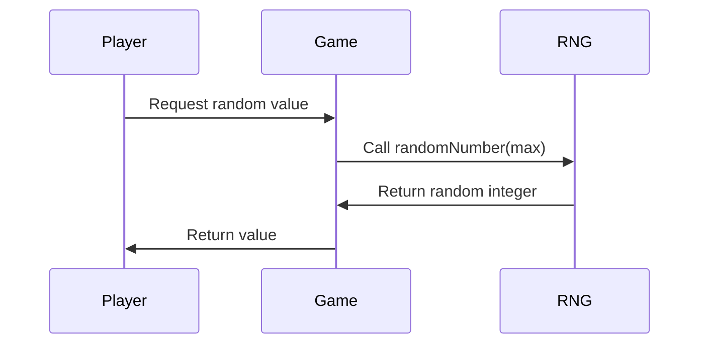
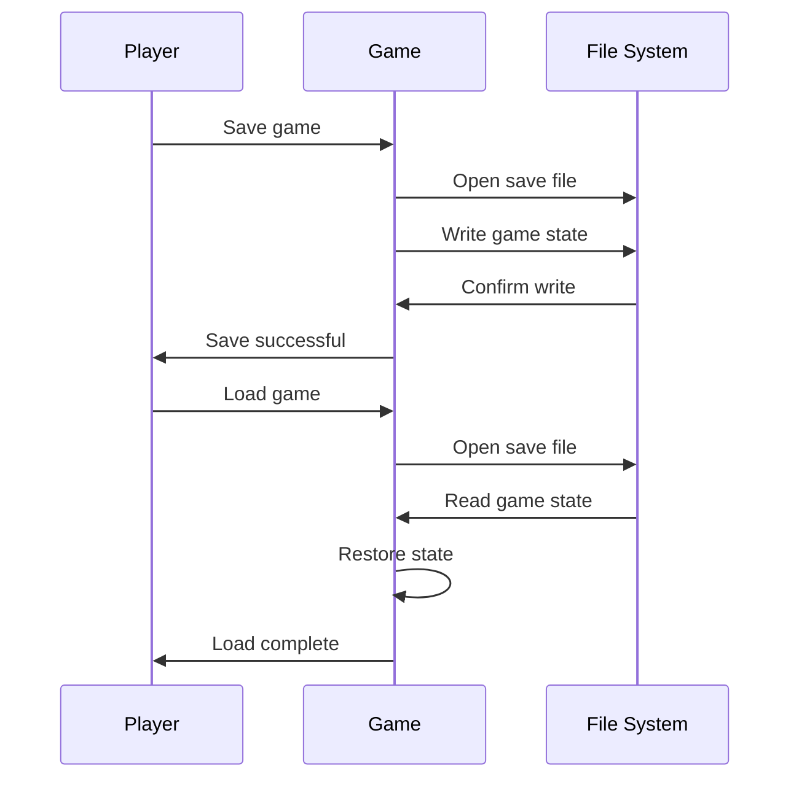

# game_h Module Documentation

## Brief Introduction

The `game_h` module serves as the central hub for game state management and core game operations in the Moria engine. It defines the primary game structure, manages game seeds and random number generation, handles user interface screens, and provides essential game lifecycle functions. This module coordinates with other core systems like inventory management, dungeon generation, and save/load functionality.

## Comprehensive Documentation

### Game State Management

The `Game_t` structure represents the entire game state, containing critical variables that track the game's progress, player status, and UI state. It includes:

- **Seeds**: Magic and town seeds for deterministic random number generation
- **Character Status**: Flags indicating character generation, death, and win conditions
- **Game Mechanics**: Teleportation, free turns, wizard mode, and scoring flags
- **Input Tracking**: Command history and direction memory
- **Treasure Management**: Inventory tracking with maximum object limits
- **Screen Management**: UI screen state and positioning information

### Random Number Generation

The module implements sophisticated random number generation including:
- Basic random number generation within specified ranges
- Normal distribution random numbers for more natural game effects
- Directional randomization for movement and combat
- Seed management for reproducible game sessions

### Game Lifecycle Functions

Key functions manage the game's operational flow:
- `startMoria()`: Initializes the game with specified parameters
- `saveGame()`/`loadGame()`: Persistent storage management
- `endGame()`: Cleanup and termination procedures
- `exitProgram()`/`abortProgram()`: Graceful shutdown handling

### UI and Display Management

The module coordinates user interface elements through:
- Screen enumeration (`Screen` enum) for different game views
- Screen position tracking for proper layout rendering
- Help file display functionality
- Splash screen presentation

### Data Structures and Constants

#### Core Constants
```cpp
constexpr uint8_t TREASURE_MAX_LEVELS = 50;
constexpr uint16_t MAX_OBJECTS_IN_GAME = 420;
constexpr uint16_t MAX_DUNGEON_OBJECTS = 344;
constexpr uint16_t OBJECT_IDENT_SIZE = 448;
constexpr uint8_t LEVEL_MAX_OBJECTS = 175;
constexpr uint16_t NORMAL_TABLE_SIZE = 256;
constexpr uint8_t NORMAL_TABLE_SD = 64;
```

#### Global Variables
- `game`: Main game state instance
- `sorted_objects[]`: Dungeon object sorting array
- `normal_table[]`: Normal distribution lookup table
- `treasure_levels[]`: Treasure level mapping

## Architecture and Component Relationships

```mermaid
graph TD
    A[Game State Manager] --> B[Game_t Structure]
    A --> C[Random Number Generation]
    A --> D[Game Lifecycle]
    A --> E[UI Management]
    A --> F[Save/Load System]
    
    B --> G[Character Status]
    B --> H[Game Mechanics]
    B --> I[Treasure Management]
    B --> J[Screen Management]
    
    C --> K[Basic Random]
    C --> L[Normal Distribution]
    C --> M[Direction Generation]
    
    D --> N[Start Game]
    D --> O[End Game]
    D --> P[Exit Handling]
    
    E --> Q[Screen Enum]
    E --> R[Display Functions]
    
    F --> S[Save Game]
    F --> T[Load Game]
    F --> U[File Operations]

    subgraph "Core Systems"
        B
        C
        D
        E
        F
    end
    
    subgraph "Dependencies"
        A --> |references| [inventory_h.md]
        A --> |references| [dungeon_h.md]
        A --> |references| [save_h.md]
        A --> |references| [ui_h.md]
    end
```

## Data Flow and Process Flows

### Game Initialization Process


### Random Number Generation Flow


### Game Save/Load Process


## Integration Points

This module integrates with several other core modules:

- **[inventory_h.md](inventory_h.md)**: Manages treasure inventory through `treasure` field
- **[dungeon_h.md](dungeon_h.md)**: Uses dungeon object constants and random generation
- **[save_h.md](save_h.md)**: Provides save/load functionality and file operations
- **[ui_h.md](ui_h.md)**: Controls screen management and display logic
- **[character_h.md](character_h.md)**: Interacts with character status flags
- **[random_h.md](random_h.md)**: Implements core random number generation algorithms

## External Dependencies

The module relies on:
- Standard C++ libraries for string and file operations
- Memory management for global arrays
- Platform-specific input/output functions for user interaction
- File system APIs for save/load operations

## Performance Considerations

The module is designed for efficient memory usage with fixed-size arrays and precomputed tables. The normal distribution table (`normal_table`) provides fast access to random values while maintaining statistical accuracy. All global variables are carefully sized to balance functionality with memory constraints typical of retro-style games.

## Security and Error Handling

The module implements robust error handling through:
- Input validation for game version checking
- Graceful program termination functions
- Memory-safe random number generation
- Proper resource cleanup during exit sequences

## Version Compatibility

The module includes version checking functions:
- `validGameVersion()`: Validates compatibility with target versions
- `isCurrentGameVersion()`: Checks if current version matches expected

These functions ensure backward compatibility and prevent corruption from incompatible save files or game versions.
