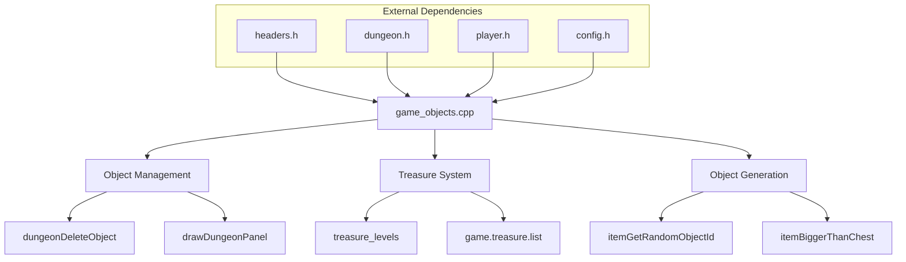
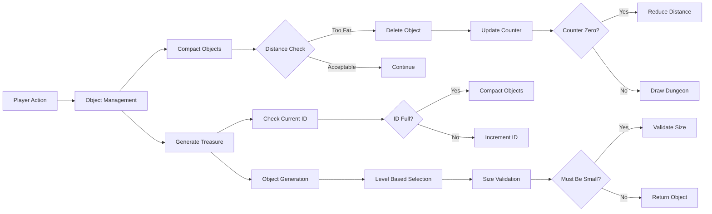

# Game Objects C++ Module Documentation

## Brief Introduction

The `game_objects_cpp` module handles the management and generation of game objects within the dungeon environment. This module is responsible for object compaction, treasure management, and random object generation based on difficulty levels. It works closely with the dungeon rendering and object handling systems to maintain game state and provide appropriate items for player interaction.

## Module Overview

This module provides core functionality for managing dungeon objects including:
- Object compaction to optimize memory usage
- Treasure list management
- Random object generation based on depth levels
- Object size validation for container fitting

## Architecture and Component Relationships

## Data Flow and Processing

## Detailed Component Analysis

### Core Functions

#### `compactObjects()` - Object Compaction
This function manages the removal of distant objects from the dungeon to optimize performance and memory usage. It operates by:

1. Iterating through dungeon coordinates
2. Checking if objects are beyond a certain distance threshold
3. Applying different deletion probabilities based on object category
4. Removing qualifying objects when random chance permits
5. Redrawing the dungeon panel when changes occur

The compaction algorithm uses a progressive distance reduction approach, starting at 66 units and decreasing by 6 units until objects are successfully removed or the minimum distance is reached.

#### `popt()` - Treasure Management
This function handles treasure list management by:
- Checking if the current treasure list is full
- Triggering object compaction when necessary
- Incrementing the current treasure ID counter
- Returning the new treasure ID

#### `pusht()` - Treasure Restoration
This function restores objects to the treasure list by:
- Moving objects between positions in the treasure array
- Updating dungeon floor references to maintain consistency
- Copying the restored item to the inventory

#### `itemBiggerThanChest()` - Object Size Validation
This utility function determines whether an object is too large to fit in standard containers:
- Returns true for chests, weapons, armor, and staffs
- Applies weight-based checks for hafted weapons and swords
- Returns false for small items

#### `itemGetRandomObjectId()` - Random Object Generation
This complex function generates random object IDs based on:
- Depth level considerations
- Special item probability calculations
- Object size constraints
- Difficulty scaling mechanisms

The algorithm includes multiple fallback strategies for object selection and ensures proper depth-based distribution.

## Integration Points

This module integrates with several other core systems:

- **Dungeon System** ([dungeon.md](dungeon.md)): Directly interacts with dungeon floor data structures and object placement
- **Player System** ([player.md](player.md)): Uses player position for distance calculations
- **Configuration System** ([config.md](config.md)): References configuration values for treasure probabilities and limits
- **Inventory System** ([inventory.md](inventory.md)): Manages object transfers to player inventory

## Process Flows

### Object Compaction Process
1. Initialize distance threshold at 66 units
2. Iterate through all dungeon coordinates
3. For each treasure object:
   - Check if it's beyond current distance threshold
   - Apply category-specific deletion probability
   - Delete object if random chance succeeds
4. If no objects deleted, reduce distance threshold
5. Redraw dungeon if any objects were removed

### Treasure Generation Process
1. Check if treasure list is full
2. Compact objects if necessary
3. Increment treasure ID counter
4. Return new object ID for use

### Random Object Selection
1. Handle special cases for level 0 and maximum levels
2. Apply great item probability modifiers
3. Select object ID through randomized selection process
4. Validate against size constraints if required
5. Return final object ID

## Configuration Dependencies

This module relies on several configuration parameters defined in the config system:
- `TREASURE_MAX_LEVELS`: Maximum treasure level definitions
- `TREASURE_CHANCE_OF_GREAT_ITEM`: Probability of generating exceptional items
- Object category definitions for treasure types
- Dungeon dimensions and object limits

## Performance Considerations

The module implements several optimization strategies:
- Progressive distance checking to minimize unnecessary iterations
- Early termination conditions for compaction operations
- Efficient object ID management to prevent memory fragmentation
- Conditional drawing updates to reduce screen refresh overhead

## Error Handling

The module follows these error handling principles:
- Bounds checking for array accesses
- Graceful degradation when object compaction fails
- Validation of object categories before processing
- Safe handling of edge cases in random number generation

## Memory Management

Key memory management aspects include:
- Static arrays for object tracking (`sorted_objects`, `treasure_levels`)
- Efficient object ID reuse through the treasure list system
- Temporary storage during object movement operations
- Consistent memory layout for dungeon floor objects

This module forms a critical part of the game's object management infrastructure, ensuring proper game balance and performance across different dungeon depths and player actions.
