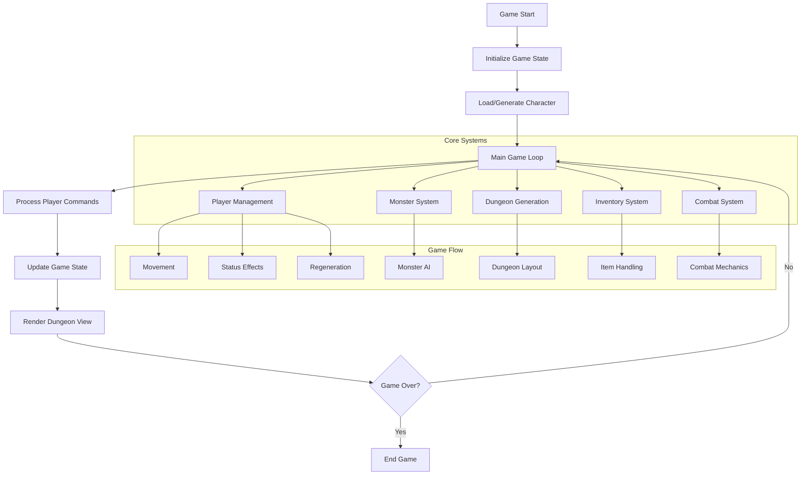
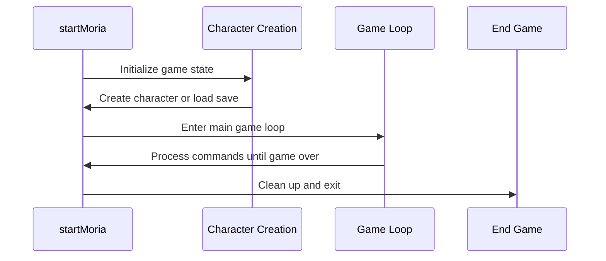
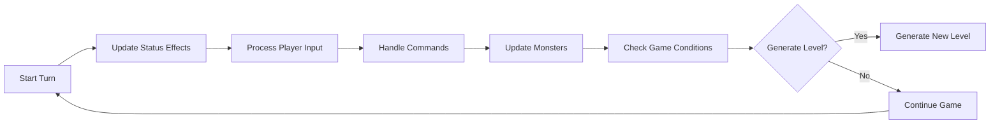
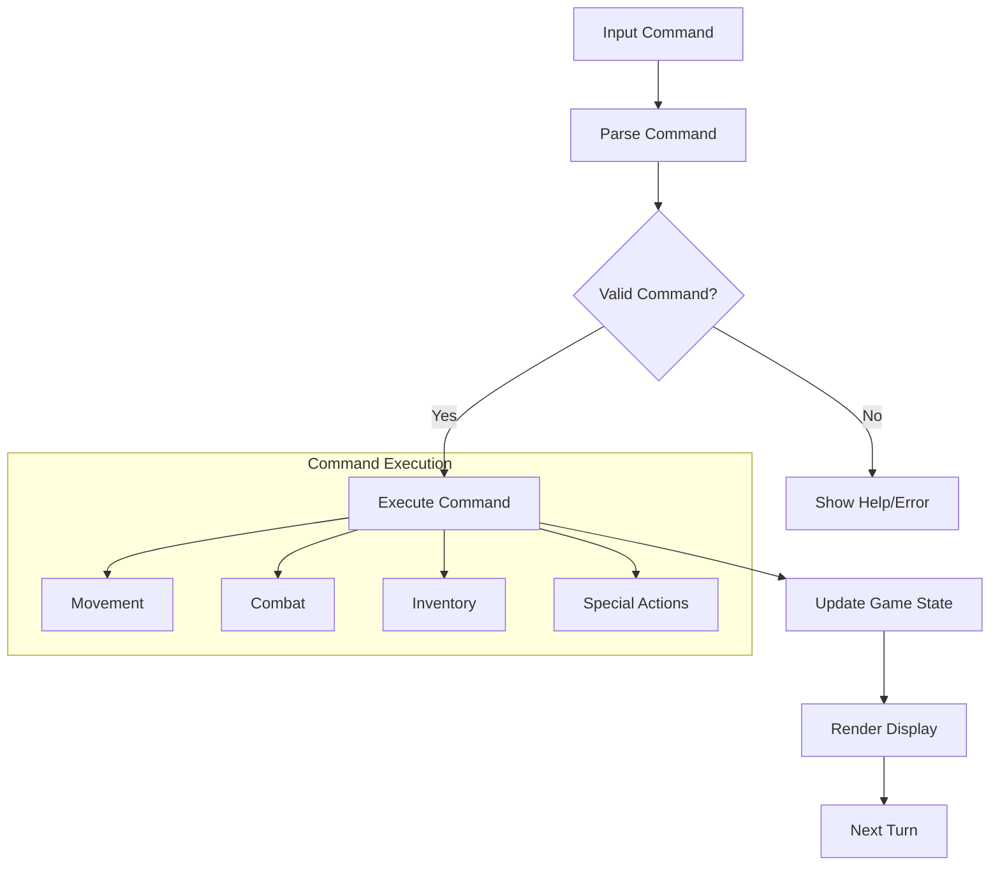
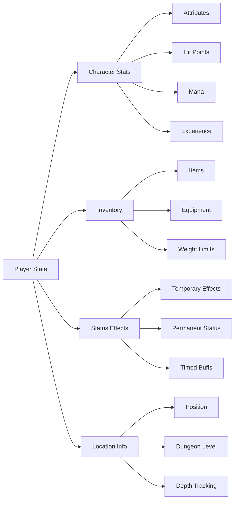
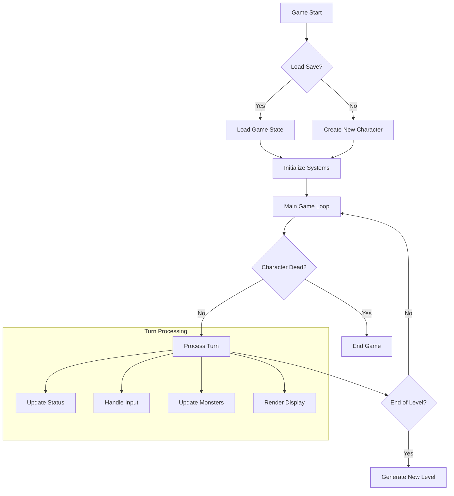

# Game Run C++ Module Documentation

## Introduction

The `game_run_cpp` module serves as the core gameplay engine for the Moria game, managing the main game loop, player actions, dungeon navigation, and game state management. This module coordinates all major game systems including player movement, combat, inventory management, monster behavior, and dungeon generation.

## Architecture Overview

## Component Relationships

### Main Entry Point
The `startMoria` function serves as the primary entry point for the game, orchestrating the entire game lifecycle:

### Game Loop Structure
The main game loop (`playDungeon`) manages the continuous gameplay experience:

## Data Flow and Processing

### Player Command Processing

### Game State Management
The module maintains complex game state through several key structures:

## Key Functions and Their Roles

### Game Initialization
The initialization functions prepare the game world:

- `initializeCharacterInventory()` - Sets up starting equipment
- `initializeMonsterLevels()` - Configures monster spawning levels
- `initializeTreasureLevels()` - Sets up treasure distribution
- `priceAdjust()` - Applies cost adjustments to items

### Player Management
Core player functionality includes:

- **Status Updates**: `playerUpdateBlindness()`, `playerUpdateConfusion()`, etc.
- **Regeneration**: `playerRegenerateHitPoints()`, `playerFoodConsumption()`
- **Light Management**: `playerUpdateLightStatus()`, `playerInitializePlayerLight()`
- **Movement**: `playerMove()`, `playerRunAndFind()`, `playerTunnel()`

### Combat and Interaction
Combat and interaction systems:

- **Combat Actions**: `playerBash()`, `playerThrowItem()`, `playerTeleport()`
- **Item Handling**: `inventoryExecuteCommand()`, `inventoryCarryItem()`
- **Spell System**: `getAndCastMagicSpell()`, `spellIdentifyItem()`
- **Dungeon Navigation**: `dungeonGoUpLevel()`, `dungeonGoDownLevel()`

### Game Loop Components
The main game loop processes:

1. **Turn Management**: `playDungeon()` controls the game turn sequence
2. **Command Processing**: `executeInputCommands()` handles user input
3. **State Updates**: All status effects and conditions are updated each turn
4. **Monster AI**: `updateMonsters()` manages enemy behavior
5. **Dungeon Generation**: `generateCave()` creates new dungeon levels

## Integration with Other Modules

This module integrates with several other core systems:

- **[character](character.md)**: Manages character creation and stats
- **[dungeon](dungeon.md)**: Handles dungeon generation and layout
- **[monster](monster.md)**: Controls monster placement and behavior
- **[inventory](inventory.md)**: Manages player inventory and items
- **[combat](combat.md)**: Processes combat mechanics and damage calculation
- **[magic](magic.md)**: Handles spell casting and magical effects
- **[store](store.md)**: Manages shop interactions and pricing

## Game Flow Control

The module implements sophisticated game flow control:

## Error Handling and Safety

The module implements robust error handling:

- **Input Validation**: `validCountCommand()` validates command sequences
- **Boundary Checks**: Coordinate validation prevents out-of-bounds access
- **State Consistency**: Multiple safety checks ensure game state integrity
- **Resource Management**: Proper cleanup during game termination

## Performance Considerations

The module is designed for efficient performance:

- **Turn-based Processing**: Only processes necessary updates each turn
- **Efficient State Updates**: Batch processing of similar status effects
- **Memory Management**: Careful handling of game objects and arrays
- **Conditional Processing**: Only executes expensive operations when needed

## Configuration Dependencies

The module relies on several configuration settings:

- `config::options::use_roguelike_keys` - Controls key binding schemes
- `COST_ADJUSTMENT` - Modifies item prices
- Various constants from `config::player`, `config::monsters`, and `config::treasure`

This module forms the central nervous system of the Moria game, coordinating all gameplay elements and maintaining the game state throughout the player's adventure.
