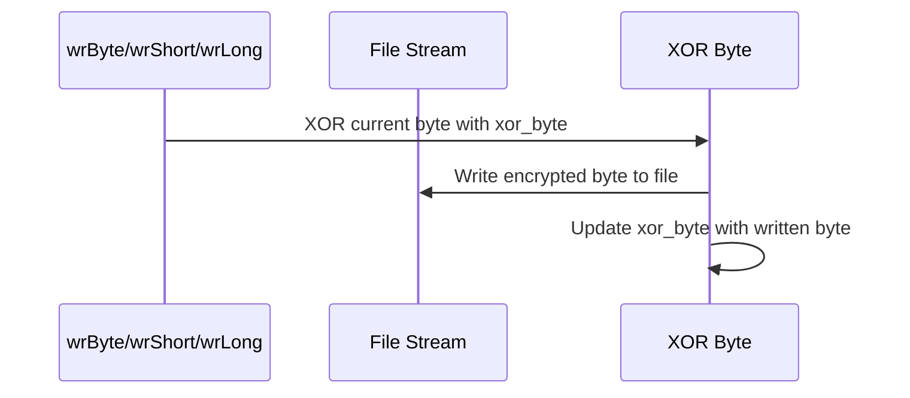
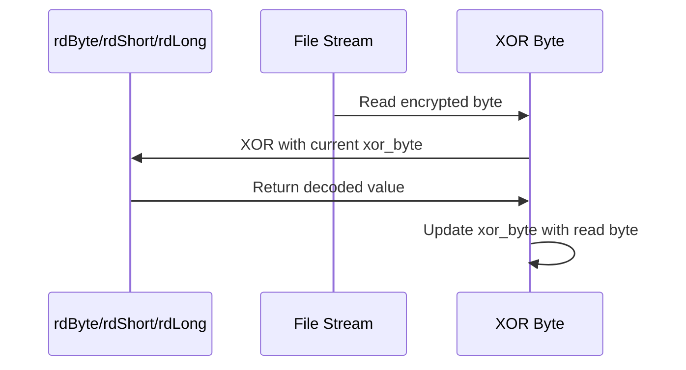

# Game Save C++ Module Documentation

## Introduction

The `game_save_cpp` module provides core functionality for saving and loading game state in the Moria roguelike game. This module handles serialization and deserialization of player characters, dungeon maps, monsters, items, and game configuration data to persistent storage files. It also manages high score saving and loading operations.

## Architecture Overview

```mermaid
graph TD
    A[Game Save Module] --> B[Save Game Functionality]
    A --> C[Load Game Functionality]
    A --> D[High Score Management]
    A --> E[Data Serialization]
    
    B --> B1[saveGame()]
    B --> B2[saveChar()]
    B --> B3[svWrite()]
    
    C --> C1[loadGame()]
    C --> C2[Data Deserialization]
    
    D --> D1[saveHighScore()]
    D --> D2[readHighScore()]
    
    E --> E1[wr* Functions]
    E --> E2[rd* Functions]
    E --> E3[XOR Encryption]
```

## Core Components

### Main Save Functions

#### `saveGame()` - Main Save Interface
The primary entry point for initiating game saves. This function handles user interaction for save file selection and validation, including conflict resolution when save files already exist.

**Key Features:**
- User interface for save file naming
- Conflict detection and resolution
- File permission management
- Error handling and user feedback

#### `saveChar()` - Character Save Implementation
Handles the actual file I/O operations for saving character data to disk.

**Key Features:**
- File creation and management
- XOR encryption of saved data
- Version stamping for compatibility checking
- Error recovery and cleanup

#### `svWrite()` - Data Serialization Engine
Serializes all game state data to the save file using a custom binary format with XOR encryption.

**Data Sections:**
1. Creature recall information
2. Player character attributes and stats
3. Inventory and equipment data
4. Dungeon map state
5. Monster positions and properties
6. Game configuration flags
7. High score tracking data

### Load Functions

#### `loadGame()` - Game State Restoration
Restores game state from a previously saved file, including character data, dungeon layout, and monster positions.

**Key Features:**
- Version compatibility checking
- Error recovery and graceful degradation
- Resurrection handling for dead characters
- Memory allocation and validation

### Data Serialization Functions

#### Writer Functions (`wr*`)
All serialization functions use XOR encryption for data protection:



#### Reader Functions (`rd*`)
Decodes data using reverse XOR operation:



### High Score Management

#### `saveHighScore()` and `readHighScore()`
Handle persistence of high scores with XOR encryption similar to game save data.

## Data Flow

```mermaid
flowchart LR
    A[User Input] --> B[saveGame()]
    B --> C[saveChar()]
    C --> D[svWrite()]
    D --> E[Data Serialization]
    E --> F[File I/O]
    
    G[File Load] --> H[loadGame()]
    H --> I[Data Deserialization]
    I --> J[Game State Restoration]
```

## Component Interactions

### Save Process Flow
1. `saveGame()` prompts user for save file name
2. `saveChar()` opens file and initializes XOR encryption
3. `svWrite()` serializes all game data sections
4. Data is written through `wr*` functions with XOR encryption
5. Final file integrity check and closure

### Load Process Flow
1. `loadGame()` validates save file existence
2. File opened for reading with XOR decryption
3. Version compatibility checked
4. Data deserialized through `rd*` functions
5. Game state reconstructed and validated

## Dependencies

This module depends on several other system components:

- **[headers.h](headers.md)** - Core system headers and definitions
- **[version.h](version.md)** - Version control and compatibility checks
- **[config](config.md)** - Configuration management for file paths and options
- **[player](player.md)** - Player character data structures
- **[monsters](monsters.md)** - Monster data structures and management
- **[treasure](treasure.md)** - Item and treasure data structures
- **[dungeon](dungeon.md)** - Dungeon map and tile data structures
- **[stores](stores.md)** - Shop and store data management

## Security Considerations

The module implements XOR-based encryption for save files to prevent casual data modification. While not cryptographically secure, this provides basic protection against simple tampering.

## Performance Characteristics

- **Serialization**: Linear time complexity O(n) where n is the amount of data serialized
- **Deserialization**: Linear time complexity O(n) for data reconstruction
- **Memory Usage**: Minimal overhead, primarily stack-based operations
- **I/O Operations**: Sequential file access patterns for optimal performance

## Error Handling

The module implements comprehensive error handling:
- File I/O error detection and reporting
- Data corruption detection through XOR verification
- Graceful degradation for incompatible save files
- Automatic cleanup of failed save operations
- User-friendly error messages and recovery options

## Version Compatibility

The save system includes version checking to ensure compatibility between different game versions. When loading save files, the system verifies that the save file version matches or is compatible with the current game version.

## Data Structures Used

The module works with several key data structures:
- `Inventory_t` - Player inventory items
- `Monster_t` - Monster data and positioning
- `Recall_t` - Creature memory tracking
- `HighScore_t` - High score record structure
- `Tile_t` - Dungeon tile information
- Various configuration and flag structures

## Integration Points

This module integrates with:
- **[main](main.md)** - Game loop and initialization
- **[input](input.md)** - User interaction for save/load operations
- **[ui](ui.md)** - Display updates during save/load operations
- **[scores](scores.md)** - High score management system

The game_save_cpp module serves as the critical persistence layer for the Moria game, ensuring players can save their progress and resume games across sessions while maintaining data integrity and security.
