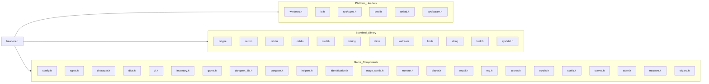
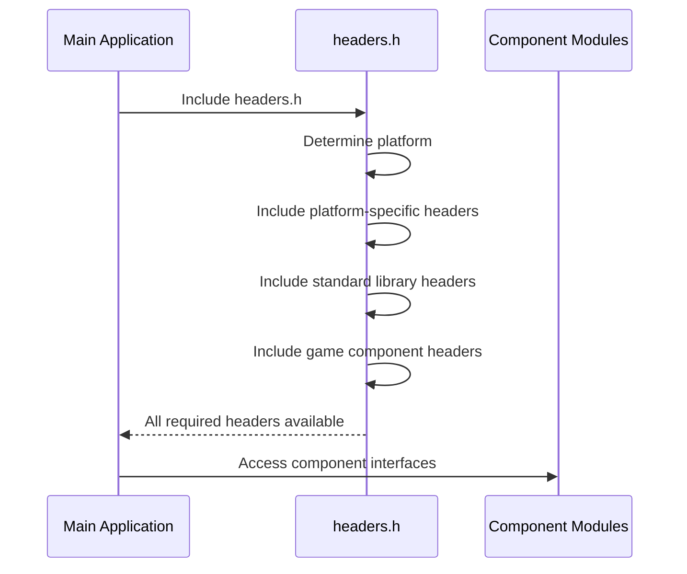

# headers_h Module Documentation

## Brief Introduction

The `headers_h` module serves as the central header inclusion point for the entire game system. It provides a unified interface for including all necessary system headers while handling platform-specific compilation directives. This module acts as a gateway that ensures consistent header inclusion across different operating systems and manages the dependency chain for all core game components.

## Comprehensive Documentation

This module implements a cross-platform header management system that automatically includes appropriate system headers based on the target operating system while also incorporating all game-specific headers. The module uses preprocessor directives to handle platform-specific requirements and ensures that all necessary standard library headers and game components are available throughout the codebase.

### Architecture Overview

```mermaid
graph TD
    A[headers.h] --> B[Platform-Specific Headers]
    A --> C[Standard Library Headers]
    A --> D[Game Component Headers]
    B --> E[Windows Headers]
    B --> F[Unix-like Headers]
    D --> G[config.h]
    D --> H[types.h]
    D --> I[character.h]
    D --> J[dice.h]
    D --> K[ui.h]
    D --> L[inventory.h]
    D --> M[game.h]
    D --> N[dungeon_tile.h]
    D --> O[dungeon.h]
    D --> P[helpers.h]
    D --> Q[identification.h]
    D --> R[mage_spells.h]
    D --> S[monster.h]
    D --> T[player.h]
    D --> U[recall.h]
    D --> V[rng.h]
    D --> W[scores.h]
    D --> X[scrolls.h]
    D --> Y[spells.h]
    D --> Z[staves.h]
    D --> AA[store.h]
    D --> AB[treasure.h]
    D --> AC[wizard.h]
```

### Platform-Specific Dependencies

The module handles three primary platform categories:

1. **Windows Platform**: Includes Windows-specific headers and defines necessary macros for compatibility
2. **Unix-like Systems**: Includes POSIX-compliant headers for Unix, Linux, macOS, and NetBSD systems
3. **Error Handling**: Provides compile-time error for unsupported platforms

### Data Flow and Component Relationships

### Component Interaction Patterns

The `headers.h` module establishes the foundation for all other modules by providing consistent access to:

- **System-level functionality** through platform-specific headers
- **Standard library utilities** for common operations
- **Game-specific interfaces** that enable modular development
- **Cross-platform compatibility** through conditional compilation

### Process Flow

## Integration Points

This module integrates with all other modules in the system through its comprehensive header inclusion strategy. Each game component that needs to access system functionality or other components must include `headers.h` to ensure proper compilation and access to all necessary dependencies.

## References

For detailed information about specific component implementations, please refer to:
- [config](config.md)
- [types](types.md)
- [character](character.md)
- [dice](dice.md)
- [ui](ui.md)
- [inventory](inventory.md)
- [game](game.md)
- [dungeon_tile](dungeon_tile.md)
- [dungeon](dungeon.md)
- [helpers](helpers.md)
- [identification](identification.md)
- [mage_spells](mage_spells.md)
- [monster](monster.md)
- [player](player.md)
- [recall](recall.md)
- [rng](rng.md)
- [scores](scores.md)
- [scrolls](scrolls.md)
- [spells](spells.md)
- [staves](staves.md)
- [store](store.md)
- [treasure](treasure.md)
- [wizard](wizard.md)
