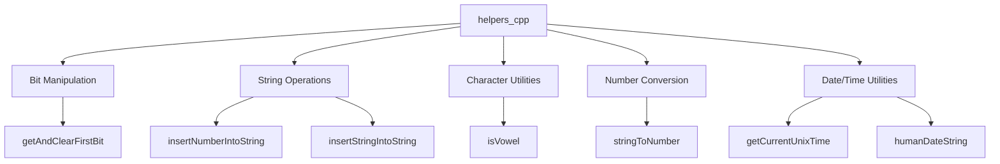
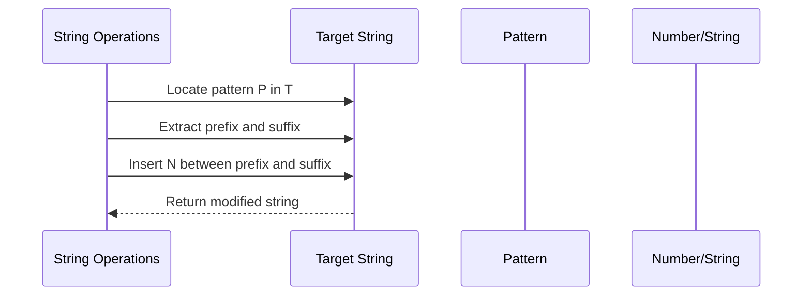
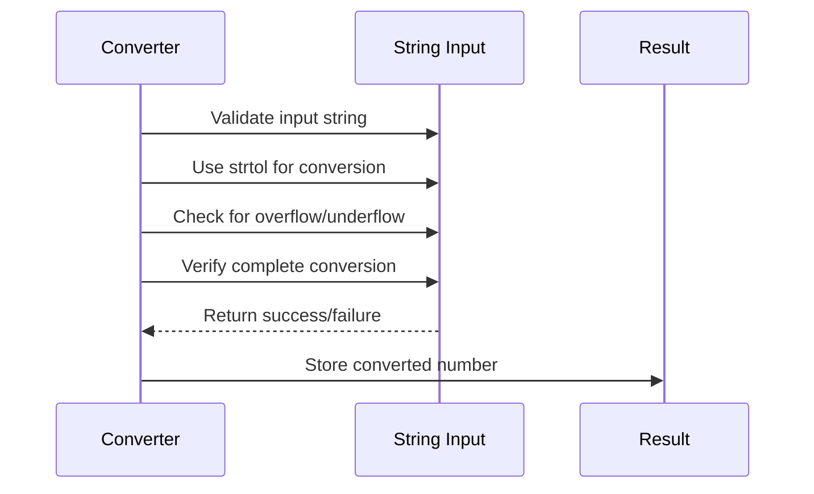

# helpers_cpp Module Documentation

## Brief Introduction

The `helpers_cpp` module provides essential utility functions for C++ applications within the Moria project. This module contains various helper functions for bit manipulation, string operations, character classification, number conversion, and date/time handling. These utilities are designed to be reusable across different parts of the application to reduce code duplication and improve maintainability.

## Module Overview

This module exposes several key functionalities:

- Bit manipulation operations for flag management
- String insertion and replacement utilities
- Character classification helpers
- String-to-number conversion with error handling
- Date formatting utilities
- Time-related functions

## Architecture and Component Relationships



## Detailed Function Documentation

### Bit Manipulation Functions

#### `getAndClearFirstBit`
```cpp
int getAndClearFirstBit(uint32_t &flag)
```

This function extracts and clears the first set bit from a 32-bit unsigned integer flag. It returns the position of the first set bit (0-31), or -1 if no bits are set.

**Parameters:**
- `flag`: Reference to a 32-bit unsigned integer whose first set bit will be cleared

**Returns:**
- Position of the first set bit (0-31) or -1 if no bits are set

### String Operations

#### `insertNumberIntoString`
```cpp
void insertNumberIntoString(char *to_string, const char *from_string, int32_t number, bool show_sign)
```

Inserts a number into a string at the location of a specified pattern. Replaces the first occurrence of `from_string` with the formatted number.

**Parameters:**
- `to_string`: Destination string where replacement occurs
- `from_string`: Pattern to locate and replace
- `number`: Number to insert
- `show_sign`: Whether to show positive sign for positive numbers

#### `insertStringIntoString`
```cpp
void insertStringIntoString(char *to_string, const char *from_string, const char *str_to_insert)
```

Inserts one string into another at the location of a specified pattern.

**Parameters:**
- `to_string`: Destination string where insertion occurs
- `from_string`: Pattern to locate for insertion point
- `str_to_insert`: String to insert

### Character Utilities

#### `isVowel`
```cpp
bool isVowel(char ch)
```

Determines whether a character is a vowel (case-insensitive).

**Parameters:**
- `ch`: Character to check

**Returns:**
- `true` if character is a vowel, `false` otherwise

### Number Conversion

#### `stringToNumber`
```cpp
bool stringToNumber(const char *str, int &number)
```

Converts a string representation of a number to an integer with comprehensive error checking.

**Parameters:**
- `str`: String to convert
- `number`: Reference to store the converted number

**Returns:**
- `true` if conversion was successful, `false` otherwise

### Date/Time Utilities

#### `getCurrentUnixTime`
```cpp
uint32_t getCurrentUnixTime()
```

Retrieves the current Unix timestamp as a 32-bit unsigned integer.

**Returns:**
- Current Unix timestamp

#### `humanDateString`
```cpp
void humanDateString(char *day)
```

Formats the current date into a human-readable format (e.g., "Mon Jan 1").

**Parameters:**
- `day`: Buffer to store formatted date string (minimum 11 characters)

## Data Flow and Process Flows

### String Replacement Process


### Number Conversion Process


## Integration Points

This module is typically used by other modules such as:
- [game_logic](game_logic.md) for game state management
- [ui_system](ui_system.md) for user interface text formatting
- [networking](networking.md) for message parsing and construction
- [save_system](save_system.md) for data serialization

## Dependencies

The `helpers_cpp` module depends on:
- Standard C++ libraries (`<cassert>`, `<cstdlib>`, `<ctime>`, `<cstring>`)
- Header definitions from `headers.h`
- Constants defined in `MORIA_MESSAGE_SIZE`

## Error Handling

All functions follow consistent error handling patterns:
- `stringToNumber` returns boolean status for conversion errors
- `getAndClearFirstBit` returns -1 when no bits are set
- All string operations use safe functions like `strncpy`, `snprintf`, and `strcat` with proper bounds checking

## Performance Considerations

- Bit manipulation functions operate in O(1) time complexity
- String operations have O(n) complexity where n is the length of the string being processed
- Memory usage is minimal and bounded by input parameters
- No dynamic memory allocation is performed

## Usage Examples

```cpp
// Example usage of getAndClearFirstBit
uint32_t flags = 0x00000004;
int bit_pos = getAndClearFirstBit(flags); // Returns 2, flags becomes 0x00000000

// Example usage of stringToNumber
int number;
if (stringToNumber("123", number)) {
    // number = 123
}

// Example usage of humanDateString
char date_buffer[11];
humanDateString(date_buffer); // Fills buffer with "Mon Jan 1"
```

## Related Modules

For complete system understanding, see:
- [headers](headers.md) - Common header definitions
- [game_logic](game_logic.md) - Main game logic implementation
- [ui_system](ui_system.md) - User interface components
- [networking](networking.md) - Network communication utilities
