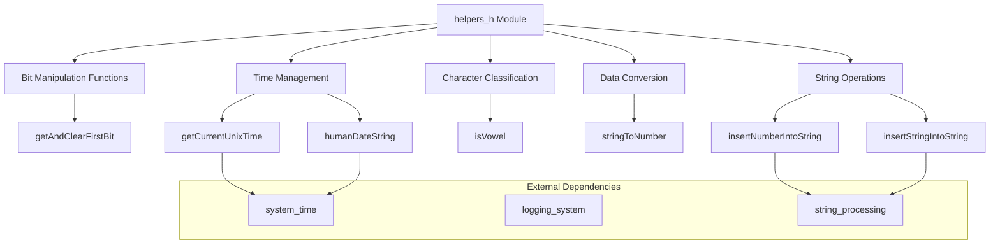
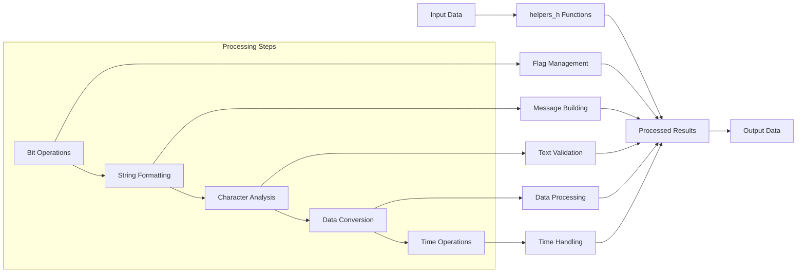
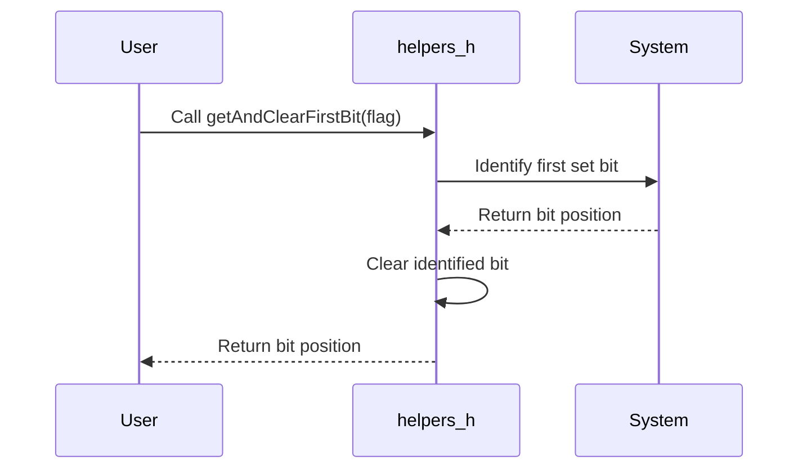
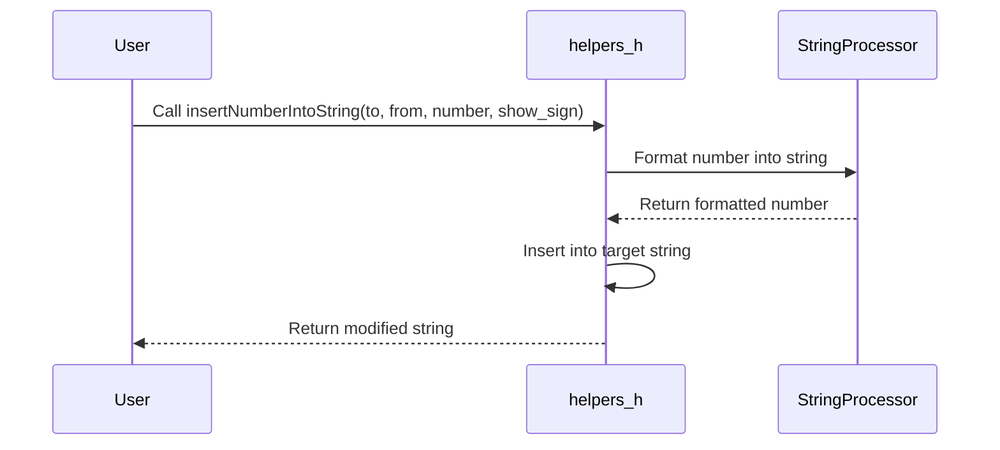

# helpers_h Module Documentation

## Brief Introduction

The `helpers_h` module provides a collection of utility functions that serve as foundational helpers for various operations within the system. These functions handle common tasks such as bit manipulation, string formatting, character classification, and time-related operations. The module acts as a supporting library that enhances code reusability and maintainability across different components of the application.

## Core Functionality

### Bit Manipulation
The module includes functions for working with bit flags, specifically designed to extract and clear bits from 32-bit unsigned integers. This functionality is essential for managing state flags and configuration settings efficiently.

### String Operations
Several string manipulation functions are provided to facilitate dynamic string construction and formatting. These include inserting numbers and strings into existing strings, which is particularly useful for generating formatted output or building complex messages.

### Character Classification
The module offers basic character classification capabilities, specifically identifying vowels in character data. This functionality supports text processing and validation scenarios.

### Data Conversion
Functions exist to convert string representations to numeric values and vice versa, enabling proper data handling between different data types.

### Time Management
The module provides utilities for retrieving current Unix timestamps and formatting date information, which are crucial for logging, scheduling, and time-based operations.

## Architecture and Component Relationships

## Module Interactions

The `helpers_h` module interacts with several other system components:

- **[system_time](system_time.md)**: The time management functions depend on system time services for retrieving current timestamps
- **[logging_system](logging_system.md)**: String formatting functions are used extensively in log message generation
- **[string_processing](string_processing.md)**: Core string manipulation functions integrate with broader string handling capabilities

## Data Flow

## Component Interaction Details

### getAndClearFirstBit
This function operates on a reference to a 32-bit unsigned integer flag. It identifies the first set bit (least significant bit) and clears it, returning the bit position. This is commonly used in state machine implementations and event handling systems where flags need to be processed sequentially.

### insertNumberIntoString
This function takes a destination string, source string, and a number to insert. It handles both signed and unsigned number formatting, making it suitable for creating formatted messages or reports that require numerical data integration.

### insertStringIntoString
Designed for dynamic string construction, this function allows insertion of one string into another at specified positions. It's particularly valuable when building complex user interfaces or generating structured output formats.

### isVowel
A simple character classifier that determines if a given character is a vowel. This function serves as a building block for text analysis and filtering operations throughout the system.

### stringToNumber
This conversion function parses a string representation of a number and converts it to an integer. It's essential for processing user input, configuration files, and command-line arguments that contain numeric data.

### getCurrentUnixTime
Returns the current Unix timestamp, providing a standardized way to obtain time information across the entire system. This function integrates with the system time management infrastructure.

### humanDateString
Formats a date string in a human-readable format, typically used for displaying dates in user interfaces or log entries.

## Process Flows

### Bit Flag Processing

### String Construction

## Integration Points

The `helpers_h` module serves as a utility layer that supports multiple subsystems:

1. **Configuration Management**: Uses string-to-number conversion for parsing configuration values
2. **Event Processing**: Employs bit flag operations for managing event queues
3. **Logging**: Leverages string formatting functions for log message construction
4. **User Interface**: Provides text processing capabilities for dynamic content generation
5. **Data Validation**: Utilizes character classification for input validation

## Performance Considerations

All functions in this module are designed for efficiency, with minimal overhead. The bit manipulation functions operate directly on memory representations, while string operations are optimized for common use cases. The time functions rely on system calls that are typically well-optimized by the underlying operating system.

## Error Handling

The module follows consistent error handling patterns:
- String conversion functions return boolean success indicators
- Bit manipulation functions assume valid input parameters
- Time functions provide reliable system time access
- String operations perform bounds checking where necessary

## Usage Examples

The functions in this module are typically used in combination with other system components to build robust applications. For example, a logging system might use `getCurrentUnixTime()` for timestamps, `insertNumberIntoString()` for formatting log messages, and `getAndClearFirstBit()` for processing queued events.
