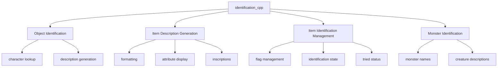
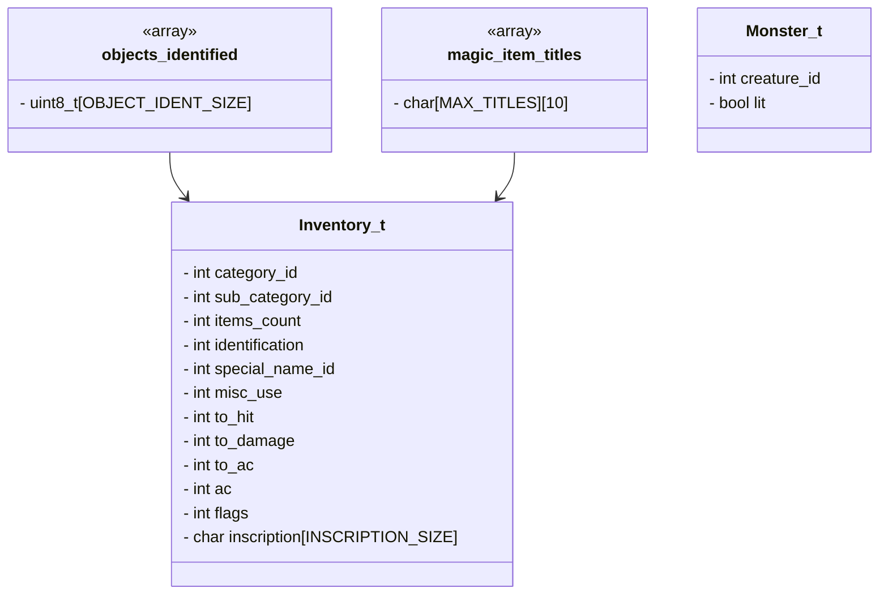
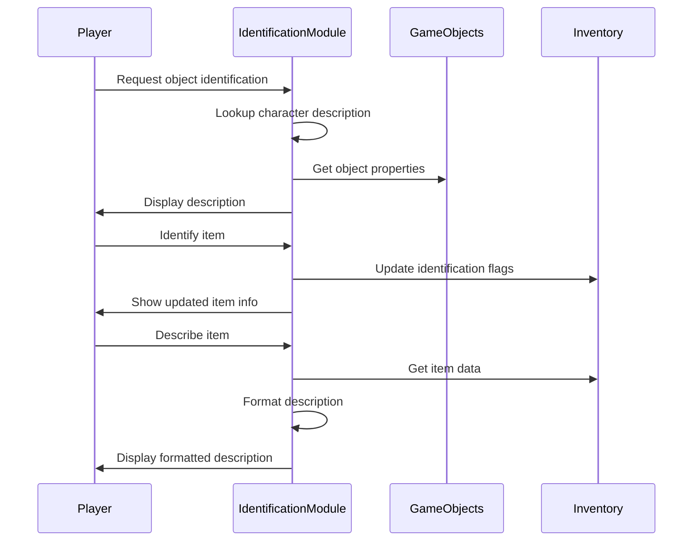
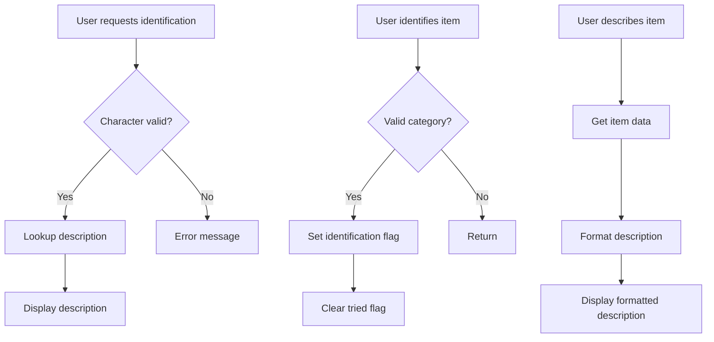
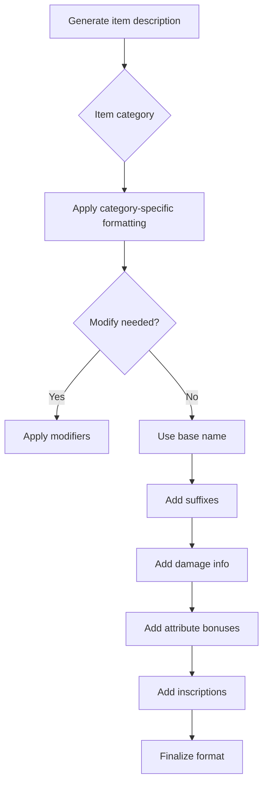

# identification_cpp Module Documentation

## Introduction

The `identification_cpp` module handles the identification and description of game objects, including items, monsters, and dungeon features. It provides functions for identifying game objects by character representation, generating item descriptions, managing item identification flags, and handling item inscriptions. This module works closely with the inventory management system and game object definitions to provide detailed information about items in the player's possession.

## Architecture Overview



## Component Relationships

### Core Components

The main component in this module is `identification.cpp`, which contains:

1. **Object Character Descriptions**: Functions to map character representations to descriptive text
2. **Item Identification Logic**: Management of item identification states and flags
3. **Item Description Generation**: Complex formatting logic for displaying item details
4. **Inscription Handling**: Functions for adding and managing item inscriptions
5. **Monster Identification**: Functions for describing monsters in the game world

### Data Structures

The module uses several key data structures:



## Dependencies

This module depends on several other modules:

- [headers.h](headers.md): Provides global definitions and includes
- [config](config.md): Configuration settings for identification flags and constants
- [game_objects](game_objects.md): Object definitions and properties
- [monsters](monsters.md): Monster definitions and creature information
- [inventory](inventory.md): Inventory management functions
- [utils](utils.md): Utility functions like string manipulation

## Data Flow



## Detailed Functionality

### Object Identification

The module provides functions to identify game objects by their character representation:

```cpp
void identifyGameObject()
```
This function prompts the user for a character and displays its description. It uses the `objectDescription()` helper function to map characters to descriptive text.

### Item Identification Management

The module maintains identification state for items through bit flags:

```cpp
void itemSetAsIdentified(int category_id, int sub_category_id)
void itemSetAsTried(Inventory_t const &item)
void spellItemIdentifyAndRemoveRandomInscription(Inventory_t &item)
```

These functions manage the identification state of items, tracking whether they've been identified, tried, or have specific identification attributes.

### Item Description Generation

The most complex functionality involves generating detailed item descriptions:

```cpp
void itemDescription(obj_desc_t description, Inventory_t const &item, bool add_prefix)
```

This function generates comprehensive item descriptions that include:
- Base item names
- Modifiers (colors, materials, etc.)
- Damage statistics
- Attribute bonuses
- Inscriptions
- Special properties

### Inscryption System

The module handles item inscriptions through these functions:

```cpp
void itemInscribe()
void itemAppendToInscription(Inventory_t &item, uint8_t item_ident_type)
void itemReplaceInscription(Inventory_t &item, const char *inscription)
```

These functions allow players to add custom inscriptions to items and manage existing ones.

## Process Flows

### Item Identification Process



### Item Description Generation



## Integration Points

This module integrates with:

1. **Inventory System**: Manages item identification flags and states
2. **Game Objects**: Uses object definitions for naming and properties
3. **Player Interface**: Provides text output for game interactions
4. **Monster System**: Handles monster identification messages
5. **Configuration**: Uses configuration options for display behavior

## Constants and Configuration

The module relies on several configuration constants:

- `OBJECT_IDENT_SIZE`: Size of identification tracking array
- `MAX_TITLES`: Maximum number of magic item titles
- Various identification flag constants from `config::identification`
- Item category constants from `TV_*` defines

## Error Handling

The module implements basic error checking:
- Invalid character input validation
- Boundary checks for arrays and indices
- Category validation for item operations
- Safe string operations to prevent buffer overflows

## Performance Considerations

The module is designed for efficiency:
- Pre-computed lookup tables for object descriptions
- Bit flag operations for fast identification state checks
- Minimal memory allocation during runtime
- Optimized string operations for item descriptions

This module forms a critical part of the game's user interface, providing essential information about the player's environment and possessions while maintaining efficient performance characteristics.
