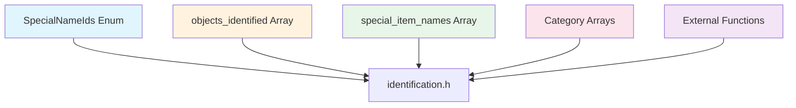
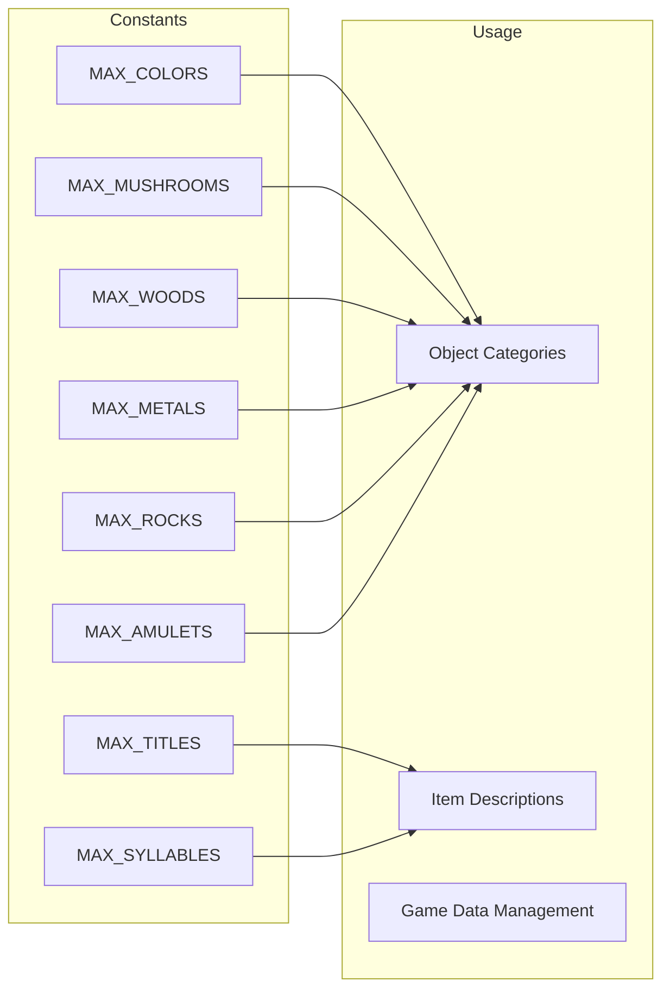
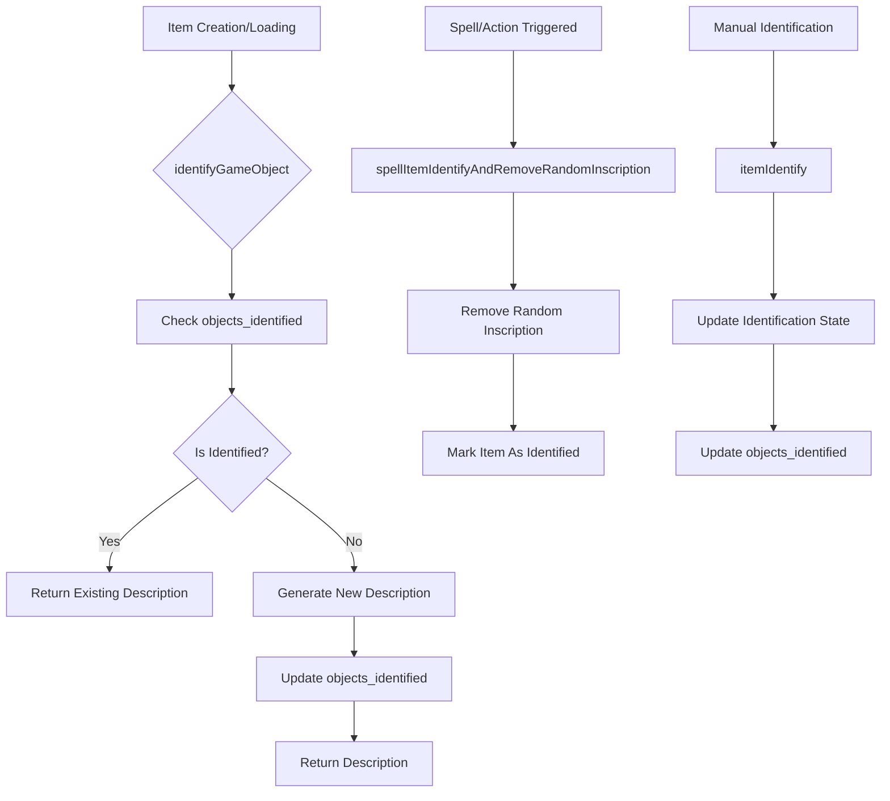
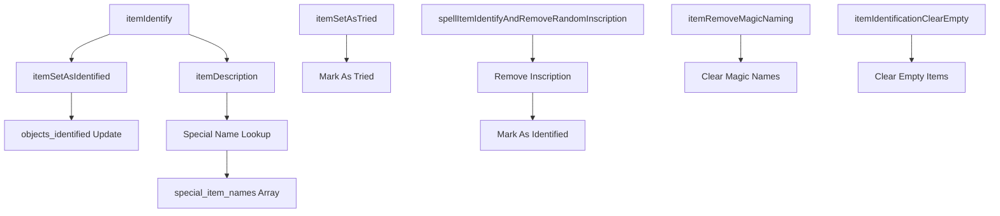
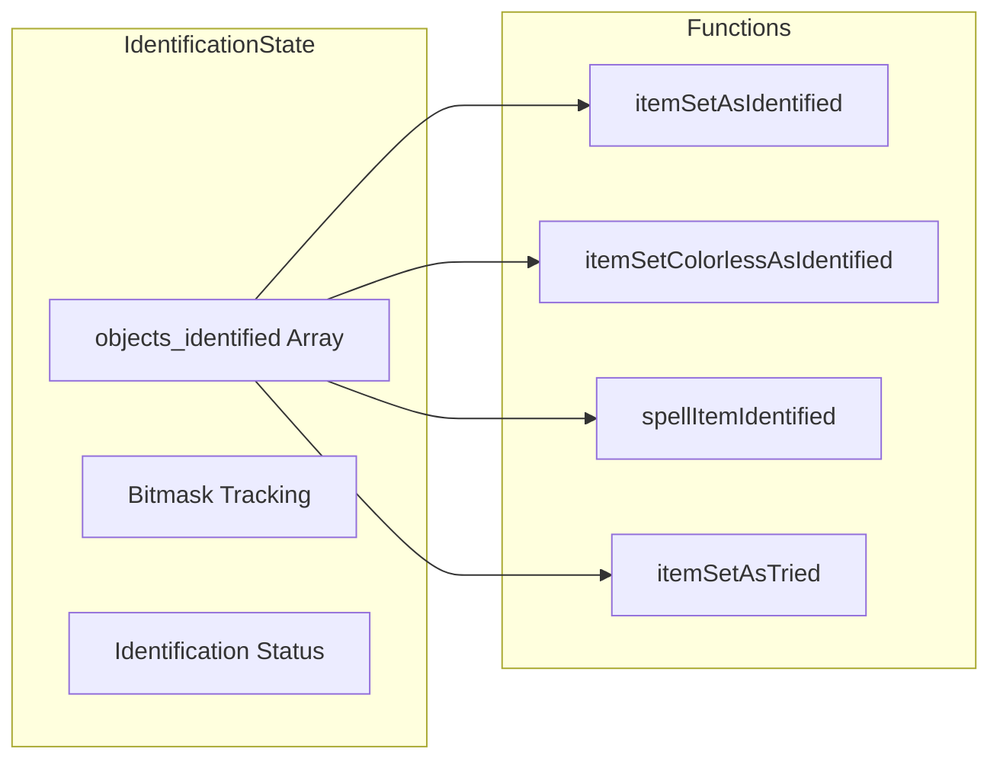

# Identification Module Documentation

## Introduction

The `identification_h` module provides core functionality for identifying game objects, managing item properties, and handling various identification-related operations within the game system. This module serves as a central hub for object identification logic, maintaining arrays of identified items and providing functions to manage item identification states.

## Module Overview

This module contains the essential declarations and definitions for managing object identification throughout the game. It includes:

- Enumerated constants for special item names and identification types
- Preprocessor constants defining maximum counts for various item categories
- External references to identification tracking arrays
- Function prototypes for item identification, description, and manipulation

## Architecture and Component Relationships

### Data Structures

The module defines several key data structures:



### Key Constants

The module defines several important constants that determine array sizes:



### Core Components

The module's main components include:

1. **Special Name Identifiers**: Enumerated values for special item names
2. **Identification Tracking**: Array for tracking which objects have been identified
3. **String Arrays**: Collections of descriptive strings for various item categories
4. **Identification Functions**: Core functions for managing item identification state

## Dependencies

This module depends on several other system components:

- [inventory_h](inventory_h.md) - For `Inventory_t` type and inventory management
- [object_h](object_h.md) - For `OBJECT_IDENT_SIZE` constant and object definitions
- [game_state_h](game_state_h.md) - For game state management related to identification

## Data Flow



## Component Interactions

### Identification Management Functions

The module provides several key functions for managing item identification:



### Identification State Management

The identification system maintains state through several mechanisms:



## Process Flows

### Object Identification Process

When an object needs to be identified:

1. Check if the object has already been identified using `objects_identified`
2. If not identified, generate appropriate description using item-specific arrays
3. Mark the object as identified in the tracking array
4. Return the generated description

### Spell-Based Identification

When spells trigger item identification:

1. Remove random inscriptions from the item
2. Mark the item as identified
3. Update the identification tracking system
4. Apply any additional effects or modifications

## Integration Points

This module integrates with:

- **Inventory System**: Uses `Inventory_t` structures for item manipulation
- **Object System**: Works with object categories and properties
- **Game State**: Maintains identification state across game sessions
- **UI System**: Provides descriptions for display purposes

## Usage Examples

### Basic Identification

```cpp
// Identify an item and get its description
Inventory_t item;
int item_id = 0;
itemIdentify(item, item_id);
itemDescription(description, item, true);
```

### Spell-Based Identification

```cpp
// Use a spell to identify an item
Inventory_t item;
spellItemIdentifyAndRemoveRandomInscription(item);
```

### Manual Identification Tracking

```cpp
// Mark an item as identified
itemSetAsIdentified(category_id, sub_category_id);
```

## Implementation Notes

The module uses a bit-based approach for tracking identification status through the `objects_identified` array, allowing efficient storage and retrieval of identification information. The use of `constexpr` for array sizes ensures compile-time optimization and prevents runtime errors due to incorrect sizing.

The module's design allows for easy expansion of item categories while maintaining consistent interfaces for identification management. All identification-related functions are designed to work seamlessly with the existing inventory and object systems.
