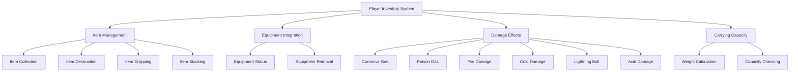
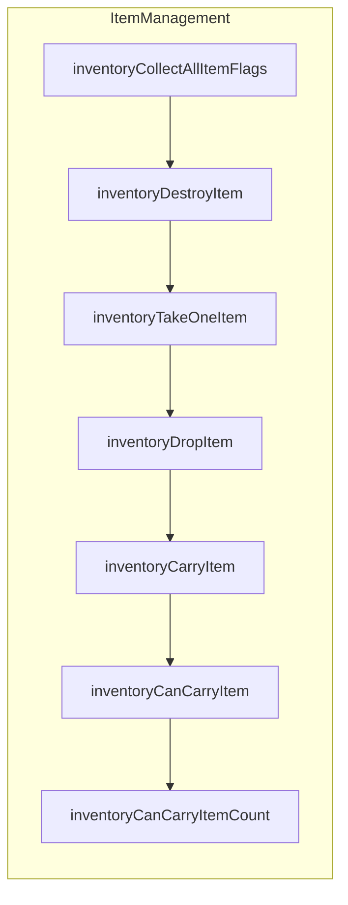
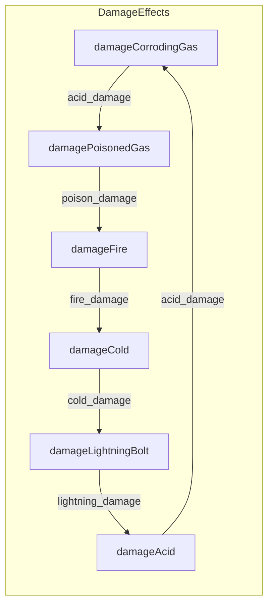
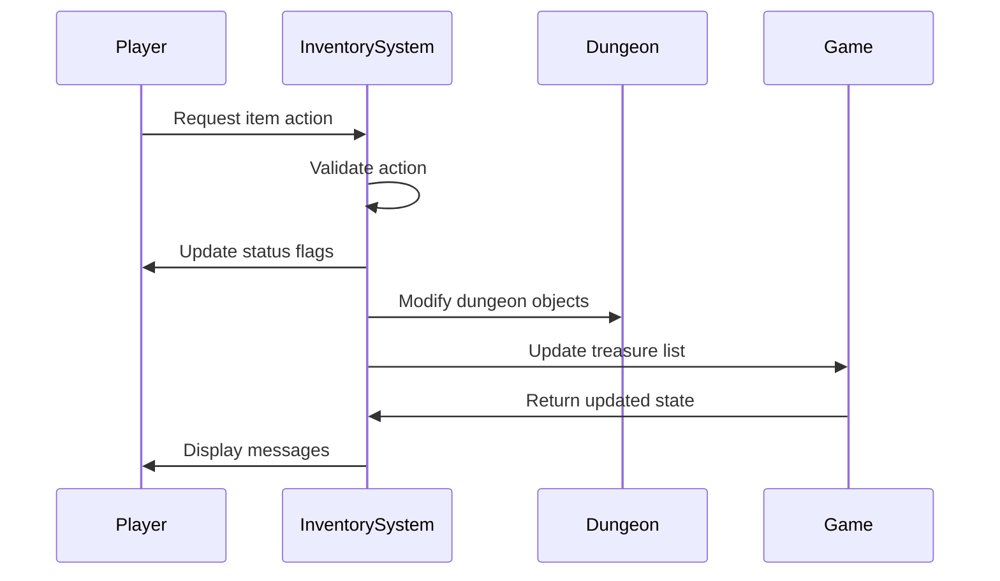

# inventory_cpp Module Documentation

## Overview

The `inventory_cpp` module provides core functionality for managing player inventory in the Moria game system. It handles item collection, stacking, carrying capacity calculations, item destruction, dropping, and various damage effects on inventory items. This module interfaces with the player's equipment system and dungeon objects to maintain consistent inventory state.

## Architecture



## Component Relationships

### Core Data Structures

The inventory system relies on several key data structures:

- **Inventory_t**: Represents individual items in the player's inventory
- **PlayerPack_t**: Manages the player's carrying capacity and unique items count
- **PlayerEquipment**: Enum defining equipment slots (Wield, Body, etc.)

### Key Functions

#### Item Management Functions



#### Damage Effect Functions



## Module Dependencies

This module depends on several other system components:

- [headers.h](headers.md): Provides essential type definitions and global variables
- [player.cpp](player.md): Interfaces with player status and equipment systems
- [dungeon.cpp](dungeon.md): Manages dungeon objects and floor interactions
- [game.cpp](game.md): Accesses game-wide treasure and object data
- [messages.cpp](messages.cpp): Handles message printing to user interface

## Detailed Function Descriptions

### Item Collection and Flags

```cpp
uint32_t inventoryCollectAllItemFlags()
```
Collects all item flags from equipped items (Wield through Light) and returns them as a combined bitmask.

### Item Destruction

```cpp
void inventoryDestroyItem(int item_id)
```
Destroys an item by reducing stack count or removing it entirely from inventory. Updates weight and maintains inventory ordering.

### Item Transfer Operations

```cpp
void inventoryTakeOneItem(Inventory_t *to_item, Inventory_t *from_item)
```
Copies one item from source to destination, handling single-stackable items properly.

### Item Dropping

```cpp
void inventoryDropItem(int item_id, bool drop_all)
```
Handles dropping items from inventory onto dungeon floor, including equipment removal and proper weight management.

### Damage Handling

```cpp
static int inventoryDamageItem(bool (*item_type)(Inventory_t *), int chance_percentage)
```
Applies damage to items based on type and chance percentage, removing damaged items from inventory.

### Equipment Interaction

```cpp
bool inventoryDiminishLightAttack(bool noticed)
bool inventoryDiminishChargesAttack(uint8_t creature_level, int16_t &monster_hp, bool noticed)
bool executeDisenchantAttack()
```
Functions that interact with equipment during combat attacks, affecting light sources, staff/wand charges, and enchantments.

### Carrying Capacity Management

```cpp
bool inventoryCanCarryItemCount(Inventory_t const &item)
bool inventoryCanCarryItem(Inventory_t const &item)
int inventoryCarryItem(Inventory_t &new_item)
```
Functions that determine if items can be carried and handle adding items to inventory with proper stacking logic.

### Item Identification and Properties

```cpp
bool inventoryItemSingleStackable(Inventory_t const &item)
bool inventoryItemStackable(Inventory_t const &item)
bool inventoryItemIsCursed(const Inventory_t &item)
void inventoryItemRemoveCurse(Inventory_t &item)
```
Helper functions for determining item properties and managing cursed items.

### Damage Type Specific Functions

```cpp
void damageCorrodingGas(const char *creature_name)
void damagePoisonedGas(int damage, const char *creature_name)
void damageFire(int damage, const char *creature_name)
void damageCold(int damage, const char *creature_name)
void damageLightningBolt(int damage, const char *creature_name)
void damageAcid(int damage, const char *creature_name)
```
Specialized damage handlers that affect inventory items based on damage type and resistance properties.

## Data Flow



## Integration Points

The inventory system integrates with:

1. **Player Status**: Updates PY_STR_WGT flag when weight changes
2. **Dungeon Objects**: Manages treasure placement and deletion
3. **Game Objects**: Accesses object definitions and properties
4. **Equipment System**: Coordinates with player equipment management
5. **Combat System**: Handles damage effects on inventory items

## Usage Patterns

The module follows these usage patterns:

1. **Item Addition**: Using `inventoryCarryItem()` to add new items to inventory
2. **Item Removal**: Through `inventoryDestroyItem()` or `inventoryDropItem()`
3. **Status Updates**: Automatic flag updates when inventory changes
4. **Damage Application**: Automatic item damage based on environmental effects
5. **Equipment Management**: Integration with equipment slot operations

This module forms a critical part of the game's resource management system, ensuring players can effectively manage their inventory while maintaining game balance through proper carrying capacity limits and item durability mechanics.
