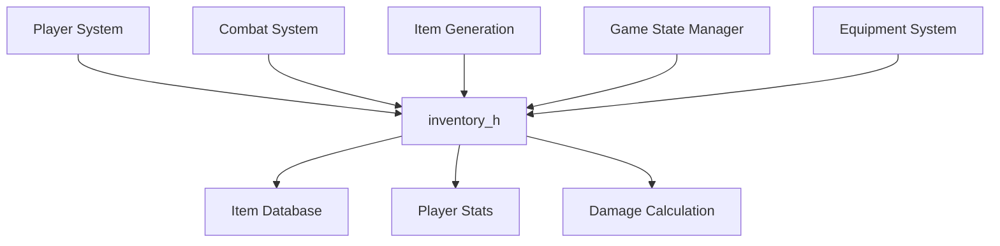
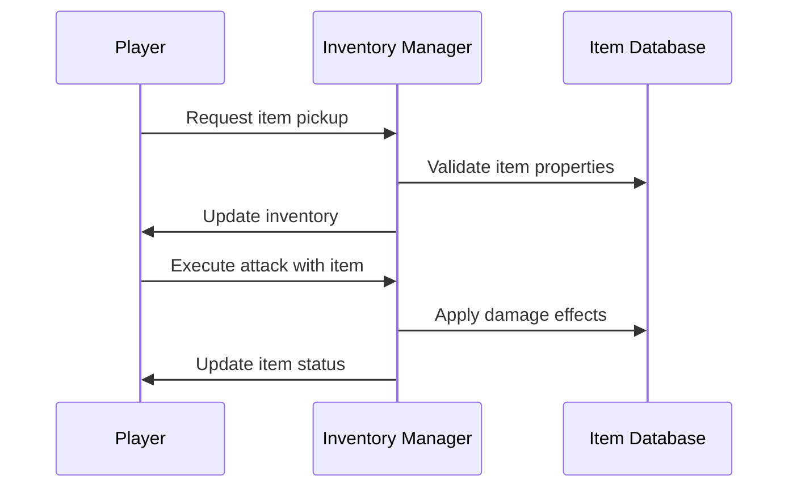
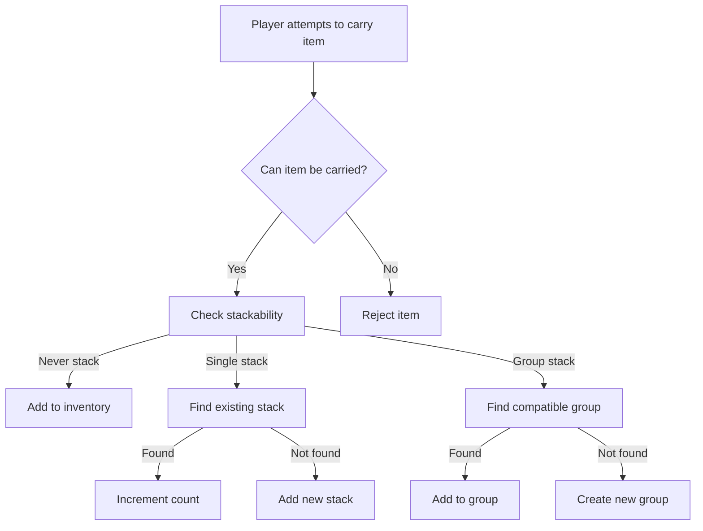
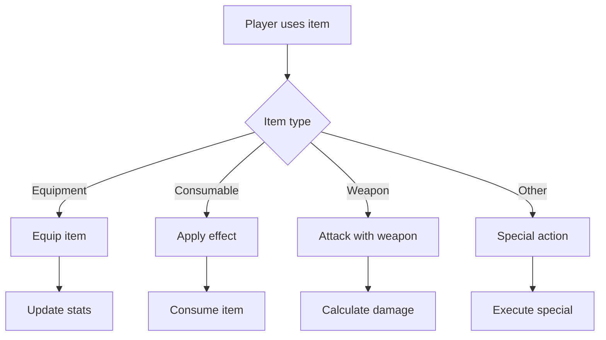

# inventory_h Module Documentation

## Introduction

The `inventory_h` module defines the core data structures and function interfaces for managing player inventories and item handling in the game system. This module provides the foundation for item storage, categorization, stacking rules, and various item-related operations such as carrying capacity calculations, item copying, and damage effects.

## Core Components

### Data Structures

#### Inventory_t Structure
The `Inventory_t` structure represents a single item in the game inventory system:

```c
typedef struct {
    uint16_t id;
    uint8_t special_name_id;
    char inscription[INSCRIP_SIZE];
    uint32_t flags;
    uint8_t category_id;
    uint8_t sprite;
    int16_t misc_use;
    int32_t cost;
    uint8_t sub_category_id;
    uint8_t items_count;
    uint16_t weight;
    int16_t to_hit;
    int16_t to_damage;
    int16_t ac;
    int16_t to_ac;
    Dice_t damage;
    uint8_t depth_first_found;
    uint8_t identification;
} Inventory_t;
```

This structure contains all essential properties of an item including:
- Basic identification and metadata (ID, name, inscription)
- Game mechanics properties (flags, categories, sprites)
- Item statistics (cost, weight, damage modifiers)
- Equipment-specific attributes (hit bonuses, armor class modifications)
- Special properties (depth found, identification status)

### Constants

#### Inventory Size Constants
```c
constexpr uint8_t PLAYER_INVENTORY_SIZE = 34;
```
Defines the maximum number of items a player can carry in their inventory.

#### Item Stackability Categories
```c
constexpr uint8_t ITEM_NEVER_STACK_MIN = 0;
constexpr uint8_t ITEM_NEVER_STACK_MAX = 63;
constexpr uint8_t ITEM_SINGLE_STACK_MIN = 64;
constexpr uint8_t ITEM_SINGLE_STACK_MAX = 192;
constexpr uint8_t ITEM_GROUP_MIN = 192;
constexpr uint8_t ITEM_GROUP_MAX = 255;
```
These constants define different item stackability categories:
- **Never Stack**: Items that cannot be stacked (IDs 0-63)
- **Single Stack**: Items that can only exist in one stack (IDs 64-192)  
- **Group Stack**: Items that can be grouped together (IDs 192-255)

#### Inscription Size
```c
constexpr uint8_t INSCRIP_SIZE = 13;
```
Maximum length of item inscriptions.

### Enumerations

#### PlayerEquipment Enum
```c
enum PlayerEquipment {
    Wield = 22,
    Head,
    Neck,
    Body,
    Arm,
    Hands,
    Right,
    Left,
    Feet,
    Outer,
    Light,
    Auxiliary,
};
```
Represents the different equipment slots available to players, with `Wield` being the primary weapon slot.

## Function Interfaces

### Item Management Functions

#### Basic Item Operations
- `inventoryDestroyItem(int item_id)` - Removes an item from inventory
- `inventoryTakeOneItem(Inventory_t *to_item, Inventory_t *from_item)` - Transfers one item from source to destination
- `inventoryDropItem(int item_id, bool drop_all)` - Drops items from inventory
- `setNull(Inventory_t *item)` - Initializes an item to null state

#### Item Copying and Manipulation
- `inventoryItemCopyTo(int from_item_id, Inventory_t &to_item)` - Copies item data to another location
- `inventoryItemSingleStackable(Inventory_t const &item)` - Checks if item can be single-stacked
- `inventoryItemStackable(Inventory_t const &item)` - Checks if item can be stacked

#### Item Status and Properties
- `inventoryItemIsCursed(const Inventory_t &item)` - Determines if item is cursed
- `inventoryItemRemoveCurse(Inventory_t &item)` - Removes curse from item
- `inventoryCanCarryItemCount(Inventory_t const &item)` - Checks if item count can be carried
- `inventoryCanCarryItem(Inventory_t const &item)` - Validates if item can be carried
- `inventoryCarryItem(Inventory_t &new_item)` - Adds item to inventory

#### Equipment and Range Operations
- `inventoryFindRange(int item_id_start, int item_id_end, int &j, int &k)` - Finds item ranges in inventory
- `inventoryCollectAllItemFlags()` - Collects all item flags from inventory

### Combat and Damage Functions

#### Attack Effects
- `inventoryDiminishLightAttack(bool noticed)` - Handles light attack effects
- `inventoryDiminishChargesAttack(uint8_t creature_level, int16_t &monster_hp, bool noticed)` - Handles charge-based attacks
- `executeDisenchantAttack()` - Executes disenchantment attack

#### Elemental Damage Functions
- `damageCorrodingGas(const char *creature_name)` - Applies corroding gas damage
- `damagePoisonedGas(int damage, const char *creature_name)` - Applies poisoned gas damage
- `damageFire(int damage, const char *creature_name)` - Applies fire damage
- `damageCold(int damage, const char *creature_name)` - Applies cold damage
- `damageLightningBolt(int damage, const char *creature_name)` - Applies lightning damage
- `damageAcid(int damage, const char *creature_name)` - Applies acid damage

### Destroyable Items Functions
- `setFrostDestroyableItems(Inventory_t *item)` - Sets frost destroyable properties
- `setLightningDestroyableItems(Inventory_t *item)` - Sets lightning destroyable properties
- `setAcidDestroyableItems(Inventory_t *item)` - Sets acid destroyable properties
- `setFireDestroyableItems(Inventory_t *item)` - Sets fire destroyable properties

## Architecture and Relationships

### Component Interactions

The inventory system interacts with several other core modules:



### Data Flow



### Process Flows

#### Item Carrying Process


#### Item Usage Process


## Integration Points

This module integrates with:
- [player_system](player_system.md) - For player inventory management
- [combat_system](combat_system.md) - For item-based combat effects
- [item_generation](item_generation.md) - For item creation and categorization
- [equipment_system](equipment_system.md) - For equipment slot management

## Dependencies

The `inventory_h` module depends on:
- Standard C++ types and utilities
- [dice](dice.md) - For damage dice handling
- [game_constants](game_constants.md) - For global game constants

## Notes

This module serves as the foundation for all inventory-related operations in the game. The stackability categories provide flexibility in how different item types behave in the inventory system, while the equipment enum defines the standard equipment slots available to players. All functions operate on the `Inventory_t` structure which maintains consistency across the entire game's item handling system.
