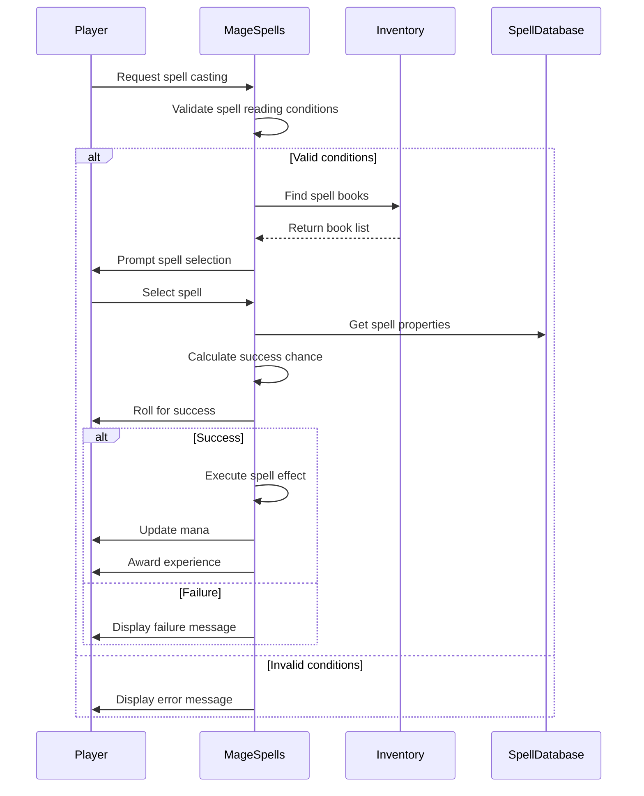

# Mage Spells C++ Module Documentation

## Brief Introduction

The `mage_spells_cpp` module implements the core functionality for mage-class spell casting in the game. This module handles spell selection, casting mechanics, spell failure calculations, and integration with the player's magical abilities. It provides the foundation for the wizard/mage character class's spellcasting system.

## Module Overview

This module contains the primary implementation for mage spell casting, including:

- Spell selection and validation
- Spell execution logic
- Spell failure probability calculations
- Integration with player status and inventory systems
- Connection to core game mechanics like mana management and character attributes

## Architecture and Component Relationships

### Core Components

The main component in this module is `mage_spells.cpp`, which contains:

1. **Spell ID enumeration** (`MageSpellId`) - Defines all available mage spells
2. **Spell validation functions** - Check if player can cast spells
3. **Spell casting logic** - Execute specific spell effects
4. **Spell selection interface** - Handle user input for spell casting
5. **Failure chance calculation** - Determine spell success probability

### Data Flow

```mermaid
graph TD
    A[Player Input] --> B[canReadSpells()]
    B --> C{Can Cast?}
    C -->|No| D[Display Error]
    C -->|Yes| E[Find Spell Book]
    E --> F[inventoryFindRange()]
    F --> G{Book Found?}
    G -->|No| H[Display No Book Message]
    G -->|Yes| I[Select Spell]
    I --> J[castSpellGetId()]
    J --> K{Valid Spell?}
    K -->|No| L[Display No Spells Message]
    K -->|Yes| M[Calculate Success Chance]
    M --> N[Check Random Failure]
    N --> O{Failed?}
    O -->|Yes| P[Display Failure Message]
    O -->|No| Q[Execute Spell]
    Q --> R[castSpell()]
    R --> S[Spell Effects]
    S --> T[Update Mana]
    T --> U[Update Experience]
    U --> V[Display Status]
```

### System Dependencies

This module depends on several other core systems:

- **Player State Management** ([player_state.md](player_state.md)) - Accesses player flags, stats, and current mana
- **Inventory System** ([inventory_system.md](inventory_system.md)) - Manages spell books and item handling
- **Spell Database** ([spell_database.md](spell_database.md)) - Contains spell definitions and properties
- **Game Mechanics** ([game_mechanics.md](game_mechanics.md)) - Handles random number generation and game state
- **Character Classes** ([character_classes.md](character_classes.md)) - Determines spell type and class-specific behavior

## Detailed Component Analysis

### Spell Identification and Enumeration

The `MageSpellId` enum defines all available mage spells in sequential order, providing a clear mapping between spell identifiers and their corresponding effects. Each spell has a unique numeric identifier that corresponds to its position in the spell database.

### Spell Validation Logic

The `canReadSpells()` function implements comprehensive validation checks before allowing spell casting:

1. **Visual Conditions** - Checks blindness and light conditions
2. **Mental State** - Verifies player isn't confused
3. **Class Compatibility** - Ensures the player is a mage class

### Spell Casting Implementation

The `castSpell()` function routes spell execution through a switch statement, handling different spell types with appropriate parameters:

- **Projectile Spells** - Use `getDirectionWithMemory()` for target direction
- **Area Effect Spells** - Apply effects to nearby areas or positions
- **Status Effect Spells** - Modify player or monster conditions
- **Utility Spells** - Provide healing, identification, or item manipulation

### Spell Selection Interface

The `getAndCastMagicSpell()` function coordinates the entire spell casting process:

1. Validates spell reading capabilities
2. Locates available spell books in inventory
3. Allows user selection of spell from book
4. Calculates and applies spell success chance
5. Executes spell effects when successful
6. Updates player mana and experience points

### Spell Success Probability

The `spellChanceOfSuccess()` function calculates spell failure rates based on:

- Spell difficulty level vs player level
- Player intelligence/wisdom attributes
- Available mana compared to spell requirements
- Clamped between 5% and 95% success rate

## Process Flows

### Spell Casting Process



### Spell Execution Flow

Each spell follows a consistent execution pattern:

1. **Input Validation** - Verify player can cast the spell
2. **Target Acquisition** - For directional spells, get player direction
3. **Effect Application** - Execute the specific spell effect
4. **Resource Management** - Update mana costs and experience gains
5. **Status Updates** - Refresh player status displays

## Integration Points

This module integrates with several key systems:

- **Mana System** - Consumes and manages player mana resources
- **Experience System** - Awards experience for successfully learned spells
- **Inventory Management** - Requires spell books for casting
- **Character Attributes** - Uses intelligence/wisdom for spell success calculations
- **Combat System** - Provides various offensive and defensive spell options

## Configuration and Extensibility

The module uses the `magic_spells` array from the spell database, making it easily extensible by adding new spells to the database without modifying the core casting logic. The enum-based approach allows for straightforward addition of new spells while maintaining backward compatibility.

## Performance Considerations

The module is designed for efficient execution with minimal overhead:

- Switch statements provide fast spell routing
- Early validation prevents unnecessary processing
- Direct access to global player state variables
- Minimal memory allocation during normal operation

## Error Handling

The module implements robust error handling through:

- Comprehensive pre-casting validation
- Graceful failure modes for invalid selections
- Clear messaging for various failure conditions
- Protection against invalid spell usage scenarios

This module forms a critical part of the game's magical system, providing the foundation for mage-class gameplay and spell-based strategy elements.
