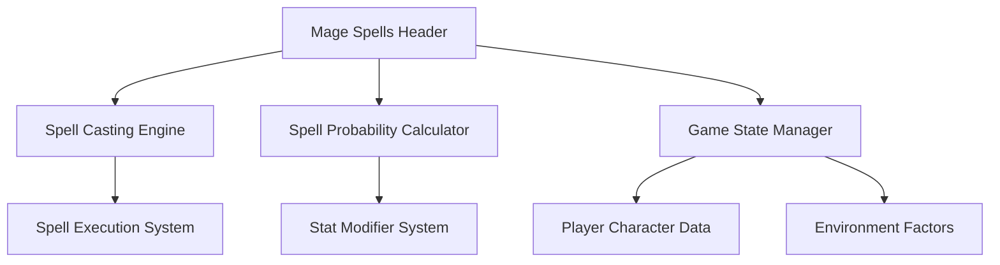
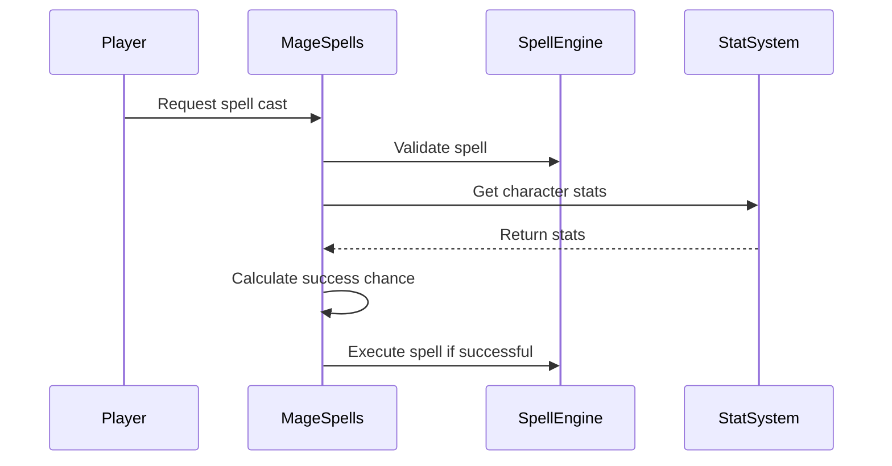

# Mage Spells Header Documentation

## Brief Introduction

The `mage_spells_h` module provides the header interface for mage spell casting functionality within the game system. This module defines the core functions and interfaces required for magic spell operations, including spell casting mechanics and success probability calculations.

## Module Overview

This header file serves as the primary interface definition for mage spell operations. It declares essential functions that enable the casting of magical spells and calculation of spell success probabilities based on various factors.

## Architecture and Component Relationships

## Core Functionality

### Function Declarations

#### `getAndCastMagicSpell()`
- **Purpose**: Main function for initiating and executing magic spell casting operations
- **Parameters**: None
- **Return Type**: void
- **Description**: This function orchestrates the complete spell casting process, including validation, execution, and result handling

#### `spellChanceOfSuccess(int spell_id)`
- **Purpose**: Calculates the probability of successfully casting a specific spell
- **Parameters**: 
  - `spell_id`: Identifier for the spell to evaluate
- **Return Type**: int (success probability percentage)
- **Description**: Computes the likelihood of spell success based on spell properties and character attributes

## Integration Points

This module integrates with several core systems:

- **[character_system.md](character_system.md)**: Accesses player character data for spell casting conditions
- **[magic_system.md](magic_system.md)**: Interfaces with the broader magic system framework
- **[combat_system.md](combat_system.md)**: Integrates with combat mechanics for spell effects
- **[stat_system.md](stat_system.md)**: Utilizes character statistics for spell success calculations

## Data Flow

## Process Flows

### Spell Casting Process

1. Player initiates spell casting through UI or command
2. `getAndCastMagicSpell()` is called to begin the process
3. Spell validation occurs through the spell engine
4. Character statistics are retrieved from stat system
5. Success probability calculated via `spellChanceOfSuccess()`
6. If successful, spell executes; otherwise, failure handling occurs

### Success Probability Calculation

The `spellChanceOfSuccess()` function evaluates multiple factors:
- Spell difficulty level
- Character magic proficiency
- Environmental conditions
- Current mana levels
- Equipment bonuses

## Dependencies

This module depends on:
- Character attribute systems for player data access
- Magic system infrastructure for spell definitions
- Game state management for contextual spell evaluation
- Statistical analysis components for probability calculations

## Implementation Notes

The header file follows standard C++ header conventions with include guards (`#pragma once`) to prevent multiple inclusion issues. All function declarations are kept minimal to maintain loose coupling with implementation details while providing clear interfaces for dependent modules.

For detailed implementation specifics, see the corresponding [mage_spells.cpp](mage_spells.cpp) file which contains the actual function implementations.
