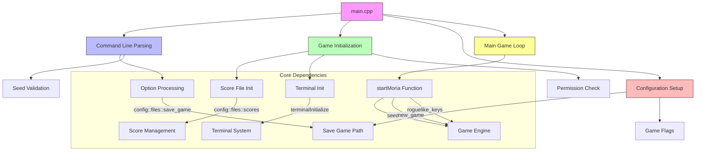

# main_cpp Module Documentation

## Brief Introduction

The `main_cpp` module serves as the entry point and primary control hub for the Umoria roguelike game. This module handles command-line argument parsing, initializes core game systems, manages game state flags, and orchestrates the main game loop execution. It provides the foundation for all game operations by setting up essential configurations and handling user input through command-line options.

## Module Overview

The main module is responsible for:
- Parsing command-line arguments and options
- Initializing game subsystems including terminal and score management
- Setting up game configuration parameters
- Managing game state flags (new game, wizard mode, etc.)
- Starting the main game loop with appropriate parameters

## Architecture and Component Relationships



## Data Flow and Process Flow

```mermaid
flowchart TD
    A[Start Program] --> B{Command Line Args?}
    B -->|Yes| C[Parse Arguments]
    B -->|No| D[Default Settings]
    
    C --> E{Option Type}
    E -->|Version (-v)| F[Print Version & Exit]
    E -->|New Game (-n)| G[Set new_game Flag]
    E -->|Roguelike Keys (-r)| H[Set roguelike_keys Flag]
    E -->|Display Scores (-d)| I[Show Scores & Exit]
    E -->|Seed (-s)| J[Validate Seed]
    E -->|Wizard Mode (-w)| K[Enable Wizard Mode]
    E -->|Help (-h)| L[Show Usage Instructions]
    
    J --> M{Valid Seed?}
    M -->|Yes| N[Store Seed Value]
    M -->|No| O[Error Message & Exit]
    
    D --> P[Initialize Systems]
    P --> Q[Score File Init]
    P --> R[Terminal Init]
    P --> S[Permission Check]
    
    Q --> T[Check Score File]
    R --> U[Initialize Terminal]
    S --> V[Check File Permissions]
    
    N --> W[Set Save Game Path]
    G --> X[Set New Game Flag]
    H --> Y[Set Roguelike Keys Flag]
    K --> Z[Set Wizard Mode Flag]
    
    W --> AA[Start Moria Game]
    X --> AA
    Y --> AA
    Z --> AA
    
    AA --> AB[Execute Main Game Loop]
    AB --> AC[Game Running]
    AC --> AD{Game Ends}
    AD -->|Normal| AE[Exit Successfully]
    AD -->|Error| AF[Exit with Error]
    
    style A fill:#e1f5fe
    style B fill:#fff3e0
    style C fill:#f3e5f5
    style E fill:#fce4ec
    style P fill:#e8f5e9
    style AA fill:#fff176
    style AD fill:#ffebee
```

## Detailed Component Analysis

### Main Function (`main`)
The `main` function serves as the primary entry point for the application. It performs several critical initialization steps:

1. **Score File Initialization**: Calls `initializeScoreFile()` to set up the high score tracking system
2. **File Permission Checks**: Validates that required files have proper access permissions
3. **Terminal Setup**: Initializes the terminal interface for game display
4. **Argument Parsing**: Processes command-line arguments using a loop that continues while arguments begin with '-'
5. **Game State Configuration**: Sets flags for new game, roguelike keys, and wizard mode based on parsed arguments
6. **Save Game Path**: Configures the save game file path from remaining arguments
7. **Game Launch**: Invokes `startMoria()` with configured parameters

### Argument Parsing Logic
The argument parsing uses a switch statement to handle various command-line options:
- `-v`: Displays version information and exits
- `-n`: Forces creation of a new game
- `-r`: Enables classic roguelike key bindings
- `-d`: Shows high scores and exits
- `-s`: Sets game seed for deterministic gameplay
- `-w`: Enables wizard mode
- `-h`: Displays usage instructions

### Seed Validation (`parseGameSeed`)
The `parseGameSeed` static function validates and converts seed values:
- Converts string input to integer
- Ensures value is within valid range (1 to 2147483647)
- Returns boolean indicating success/failure of conversion

## Integration Points

This module integrates with several other core modules:

- **[config](config.md)**: Uses `config::files::save_game` and `config::files::scores` for file paths
- **[score](score.md)**: Depends on `initializeScoreFile()` and `showScoresScreen()`
- **[terminal](terminal.md)**: Requires `terminalInitialize()` and `terminalRestore()`
- **[game](game.md)**: Calls `startMoria()` to begin gameplay
- **[utils](utils.md)**: Uses `stringToNumber()` for seed validation

## Error Handling and Exit Conditions

The module implements comprehensive error handling:
- Early termination when score file cannot be opened
- Permission check failures result in immediate exit
- Terminal initialization failures cause program termination
- Invalid seed values trigger error messages and exit codes
- Help/usage display on unrecognized options

## Configuration Parameters

The main module sets up these key configuration parameters:
- `new_game`: Boolean flag for starting fresh games
- `roguelike_keys`: Boolean flag for key binding preferences
- `seed`: Numeric value for game seed generation
- `save_game`: File path for save game persistence

## External Dependencies

This module depends on several other modules for full functionality:
- **Headers**: Includes standard headers and project-specific headers
- **Version**: Uses version constants for display purposes
- **Score Management**: For high score handling
- **Terminal Interface**: For game display and input
- **Game Engine**: For actual game execution

The main module acts as the central coordinator that brings together all other system components to create a functional roguelike gaming experience.
