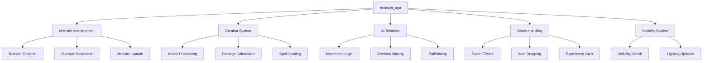
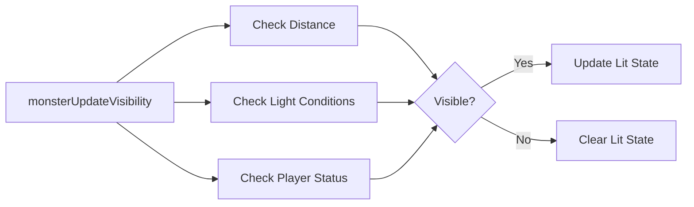
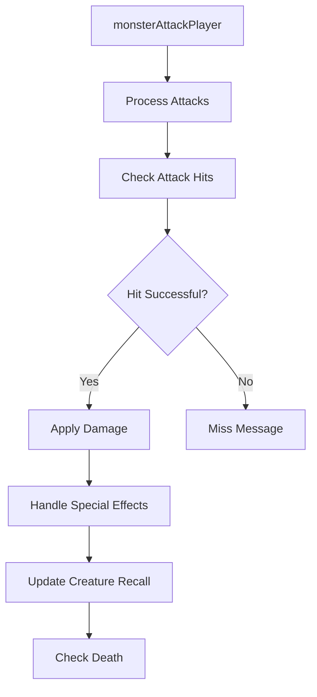
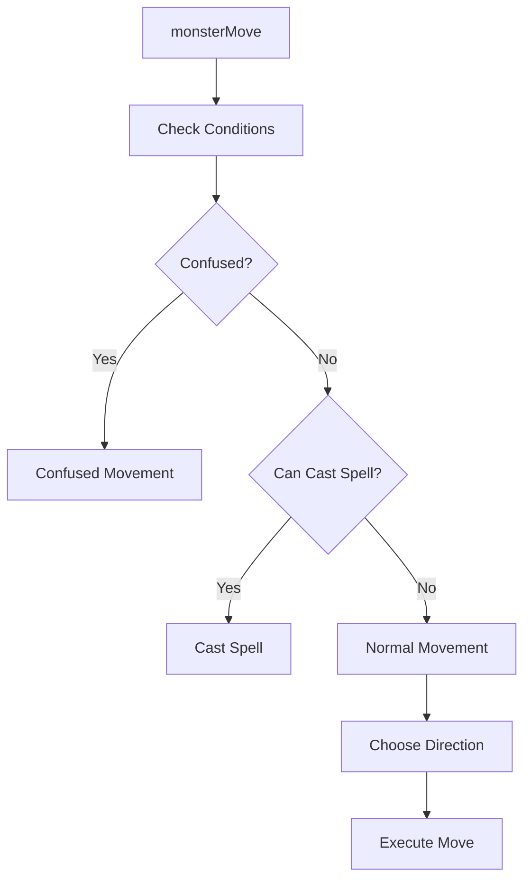
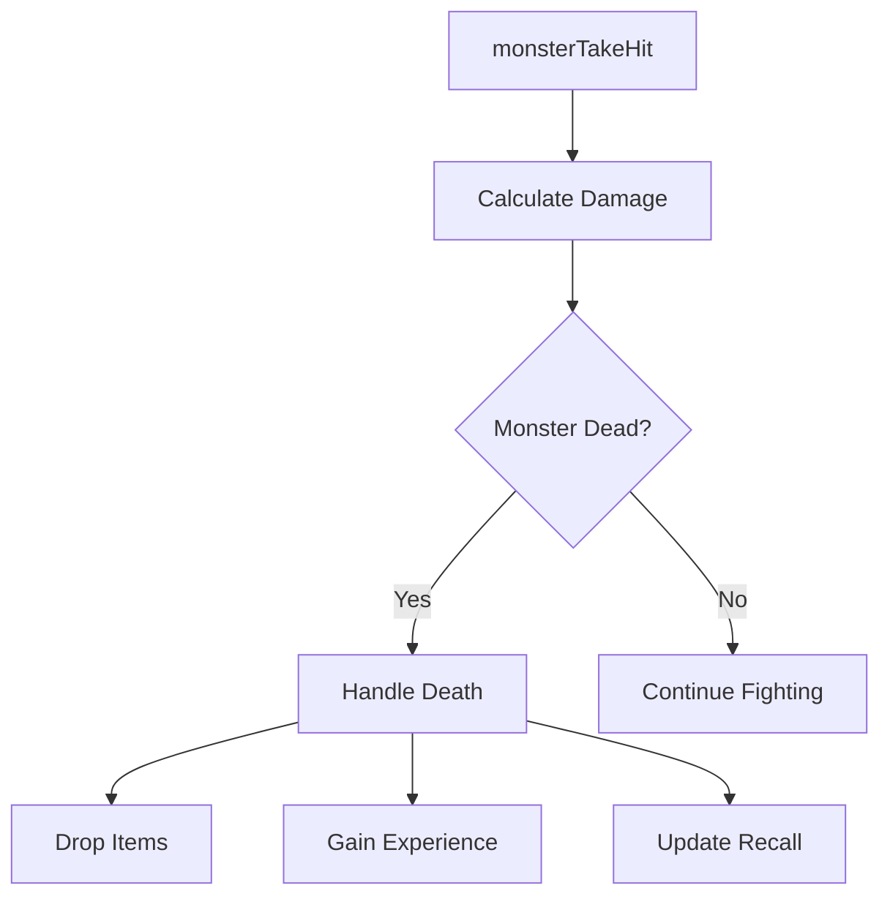
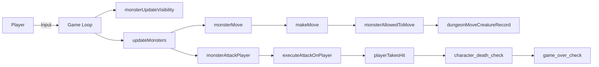

# monster_cpp Module Documentation

## Introduction

The `monster_cpp` module handles all monster-related functionality in the game, including monster movement, combat, AI behavior, death handling, and interaction with the player character. This module is essential for creating dynamic and challenging gameplay experiences through intelligent monster behavior.

## Architecture Overview

## Core Components

### Monster Data Structures

The module works with several key data structures:

- **Monster_t**: Represents individual monsters with properties like position, health, and state
- **Creature_t**: Defines monster types with attributes like movement patterns, attacks, and defenses
- **Recall_t**: Stores player knowledge about monsters for character recall
- **Tile_t**: Represents dungeon tiles that contain monsters and items

### Key Functions

#### Visibility Management

The visibility system determines whether monsters are visible to the player based on lighting conditions, player status, and monster properties. It uses the `monsterIsVisible()` function to check if a monster should be displayed on screen.

#### Combat System

The combat system processes monster attacks against the player, handling hit detection, damage calculation, and special attack effects. It includes functions for:

- `executeAttackOnPlayer()`: Processes specific attack types and applies effects
- `monsterPrintAttackDescription()`: Displays attack messages
- `monsterConfuseOnAttack()`: Handles confusion effects from attacks

#### Monster Movement AI

The AI system controls monster movement through various strategies:

- **Confusion handling** (`monsterMoveConfused`)
- **Spell casting** (`monsterCastSpell`)
- **Normal movement** (`monsterMoveNormally`)
- **Random movement** (`monsterMoveRandomly`)
- **Special behaviors** (`monsterMultiplyCritter`, `monsterMoveOutOfWall`)

#### Death and Experience Handling

When monsters are defeated, they trigger the death sequence which handles:

- Item dropping based on monster flags
- Experience gain for the player
- Memory updates for creature recall
- Special win conditions

## Component Interactions

## Data Flow

1. **Player Input Processing**: Game loop calls `updateMonsters()` to process all active monsters
2. **Visibility Updates**: `monsterUpdateVisibility()` checks if monsters should be visible
3. **Movement Execution**: `monsterMove()` determines how each monster should act
4. **Combat Resolution**: `monsterAttackPlayer()` handles attacks against the player
5. **Damage Application**: `executeAttackOnPlayer()` applies specific damage effects
6. **State Updates**: Monster health, status, and memory are updated throughout the process

## Dependencies

This module depends on several other system components:

- [headers.h](headers.md): Contains global definitions and includes
- [player_cpp](player_cpp.md): Player character management and combat
- [dungeon_cpp](dungeon_cpp.md): Dungeon layout and tile management
- [items_cpp](items_cpp.md): Item handling and treasure generation
- [spells_cpp](spells_cpp.md): Spell casting mechanics
- [config_cpp](config_cpp.md): Configuration constants and settings

## Configuration Constants

The module uses various configuration constants defined in the config system:

- `MON_MAX_SIGHT`: Maximum sight range for monsters
- `MON_MAX_LEVELS`: Maximum monster level for calculations
- `MON_MULTIPLY_ADJUST`: Adjustment factor for monster multiplication
- Various movement and attack flags from the config namespace

## Performance Considerations

The monster processing system is designed to handle multiple monsters efficiently:

- Uses optimized movement algorithms
- Implements early termination for non-interactive monsters
- Minimizes redundant visibility checks
- Processes monsters in reverse order to avoid index issues during deletion

## Error Handling

The module implements robust error handling for edge cases:

- Checks for valid monster IDs before operations
- Validates coordinates before movement
- Handles dead monsters gracefully
- Ensures proper cleanup when monsters are removed

## Security Considerations

The module follows security best practices:

- Bounds checking for array accesses
- Validation of monster IDs and positions
- Proper handling of player input and state changes
- Prevention of buffer overflows in string operations
