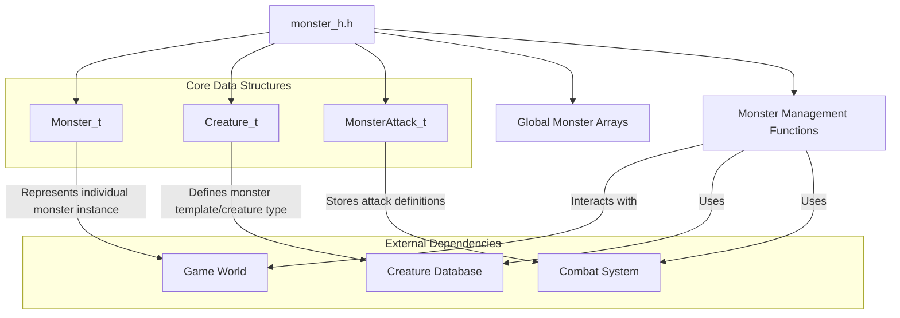
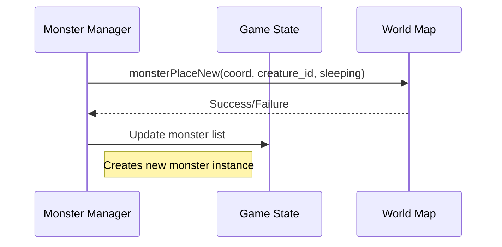
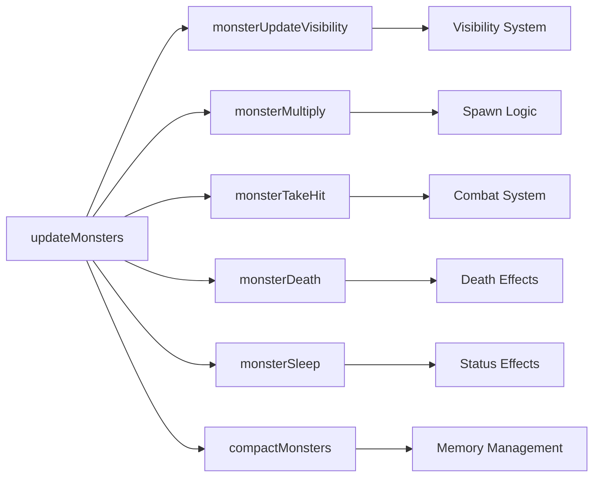
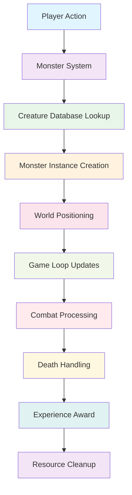

# Monster Handling Module Documentation

## Introduction

The `monster_h` module provides the core data structures and function declarations for managing monsters within the game world. This module defines the fundamental types used to represent monsters and their properties, along with the interface for monster creation, movement, combat, and destruction. It serves as a critical component in the game's entity management system, working closely with other modules such as [game_state](game_state.md) and [map_system](map_system.md) to maintain the dynamic world elements.

## Architecture Overview



## Core Data Structures

### Monster_t Structure

The `Monster_t` structure represents an individual monster instance in the game world:

```c
typedef struct {
    int16_t hp;                    // Current hit points
    int16_t sleep_count;           // Sleep timer countdown
    int16_t speed;                 // Movement speed modifier
    uint16_t creature_id;          // Reference to creature template
    
    Coord_t pos;                   // Current position coordinates
    uint8_t distance_from_player;  // Distance to player
    
    bool lit;                      // Visibility state
    uint8_t stunned_amount;        // Stun duration counter
    uint8_t confused_amount;       // Confusion duration counter
} Monster_t;
```

This structure holds the runtime state of each monster instance, including its current health, position, status effects, and behavioral attributes.

### Creature_t Structure

The `Creature_t` structure defines the static properties of monster types:

```c
typedef struct {
    const char *name;              // Monster name
    uint32_t movement;             // Movement behavior flags
    uint32_t spells;               // Spell casting abilities
    uint16_t defenses;             // Defense characteristics
    uint16_t kill_exp_value;       // Experience gained by killing
    uint8_t sleep_counter;         // Sleep duration when created
    uint8_t area_affect_radius;    // Area of effect radius
    uint8_t ac;                    // Armor class
    uint8_t speed;                 // Base movement speed
    uint8_t sprite;                // Sprite identifier
    Dice_t hit_die;                // Hit point calculation die
    uint8_t damage[4];             // Damage dice per attack type
    uint8_t level;                 // Monster level
} Creature_t;
```

This structure serves as a template defining the characteristics of different monster types, providing consistent properties across all instances of that creature type.

### MonsterAttack_t Structure

The `MonsterAttack_t` structure stores attack definitions:

```c
typedef struct {
    uint8_t type_id;               // Attack type identifier
    uint8_t description_id;        // Description lookup index
    Dice_t dice;                   // Damage dice for this attack
} MonsterAttack_t;
```

## Constants

The module defines several important constants that govern monster behavior and limits:

```c
constexpr uint16_t MON_MAX_CREATURES = 279;     // Maximum creature types
constexpr uint8_t MON_ATTACK_TYPES = 215;       // Maximum attack types
constexpr uint8_t MON_TOTAL_ALLOCATIONS = 125;  // Maximum active monsters
constexpr uint8_t MON_MAX_LEVELS = 40;          // Maximum monster levels
constexpr uint8_t MON_MAX_ATTACKS = 4;          // Maximum attacks per monster
```

## Global Variables

The module exposes several global variables for monster management:

```c
extern int hack_monptr;                           // Temporary monster pointer
extern Creature_t creatures_list[MON_MAX_CREATURES]; // Creature database
extern Monster_t monsters[MON_TOTAL_ALLOCATIONS];   // Active monster instances
extern int16_t monster_levels[MON_MAX_LEVELS + 1];  // Level progression table
extern MonsterAttack_t monster_attacks[MON_ATTACK_TYPES]; // Attack definitions
extern Monster_t blank_monster;                   // Empty monster template
extern int16_t next_free_monster_id;              // Next available monster ID
extern int16_t monster_multiply_total;            // Multiplication counter
```

## Function Interface

### Monster Creation and Placement



### Monster Behavior and Updates



### Key Functions

#### Monster Management Functions

- `monsterUpdateVisibility(int monster_id)` - Updates monster visibility state
- `monsterMultiply(Coord_t coord, int creature_id, int monster_id)` - Handles monster reproduction
- `updateMonsters(bool attack)` - Main monster update loop
- `monsterDeath(Coord_t coord, uint32_t flags)` - Handles monster death and cleanup
- `monsterTakeHit(int monster_id, int damage)` - Processes damage to monsters

#### Monster Placement Functions

- `monsterPlaceNew(Coord_t coord, int creature_id, bool sleeping)` - Places new monster at coordinate
- `monsterPlaceWinning()` - Places winning monster
- `monsterPlaceNewWithinDistance(int number, int distance_from_source, bool sleeping)` - Places monsters within distance
- `monsterSummon(Coord_t &coord, bool sleeping)` - Summons monster at location
- `monsterSummonUndead(Coord_t &coord)` - Special undead summoning

#### Status and Utility Functions

- `printMonsterActionText(const std::string &name, const std::string &action)` - Displays monster actions
- `monsterNameDescription(const std::string &real_name, bool is_lit)` - Formats monster names
- `monsterSleep(Coord_t coord)` - Handles monster sleeping state
- `compactMonsters()` - Compacts monster array for memory efficiency

## Integration Points

The `monster_h` module integrates with several other system components:

1. **[game_state.md](game_state.md)** - Uses monster data for game state persistence and management
2. **[map_system.md](map_system.md)** - Interacts with map coordinates for monster placement and movement
3. **[combat_system.md](combat_system.md)** - Provides monster data for combat calculations
4. **[render_system.md](render_system.md)** - Accesses monster properties for rendering
5. **[player_system.md](player_system.md)** - Manages monster-player interactions and visibility

## Data Flow



## Process Flows

### Monster Creation Process

1. Player action triggers monster creation
2. Creature template is looked up from `creatures_list`
3. New `Monster_t` instance is allocated from `monsters` array
4. Monster is positioned on the map
5. Initial state is set (sleeping, health, etc.)
6. Monster is added to active monster list

### Monster Death Process

1. Combat system determines monster death
2. `monsterDeath()` function is called with coordinates and flags
3. Experience is awarded to player
4. Monster is removed from active list
5. Resources are cleaned up
6. Death effects are processed

## Memory Management

The module implements a fixed-size allocation system for monsters:

- Maximum 125 active monsters (`MON_TOTAL_ALLOCATIONS`)
- 279 creature templates (`MON_MAX_CREATURES`)
- 215 attack definitions (`MON_ATTACK_TYPES`)

This design ensures predictable memory usage while allowing for complex monster behaviors through the creature template system.

## Performance Considerations

The module is designed for efficient iteration over monster arrays during game updates. The use of fixed-size arrays and direct indexing allows for O(1) access times, while the separation of creature templates from instance data enables efficient memory usage and easy scaling of monster types.
