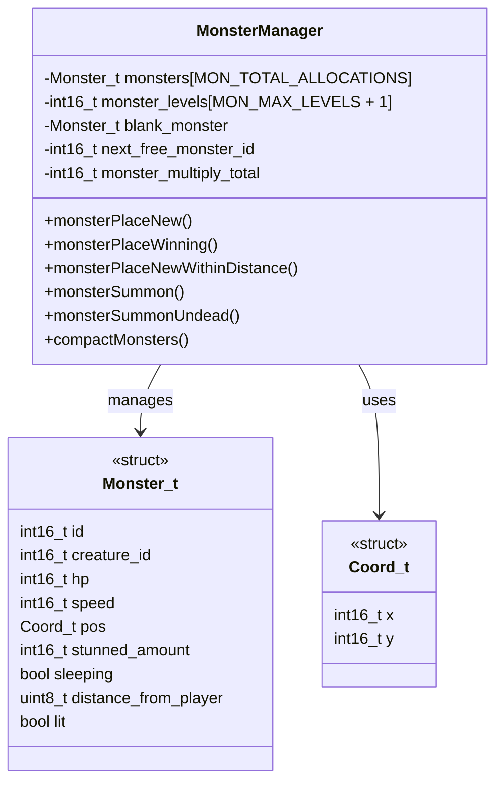
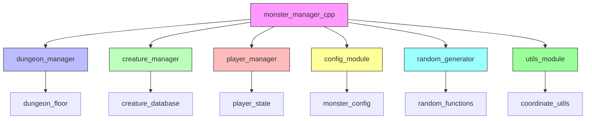
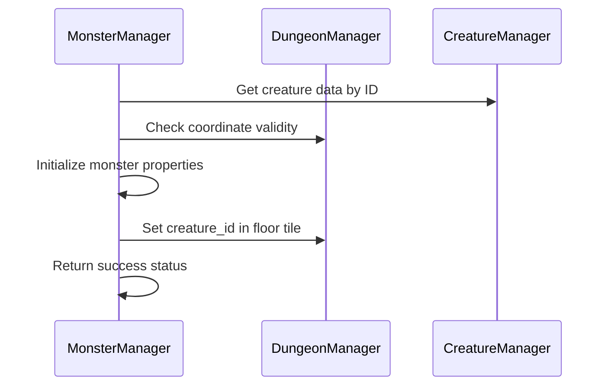
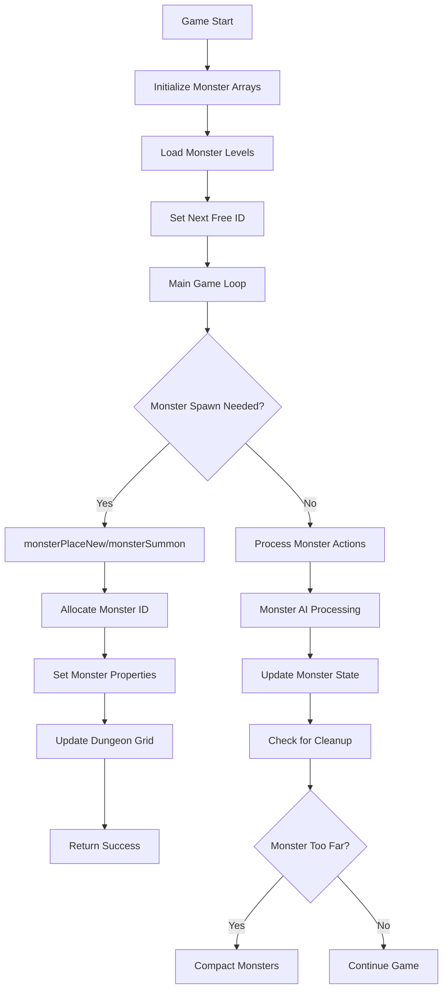
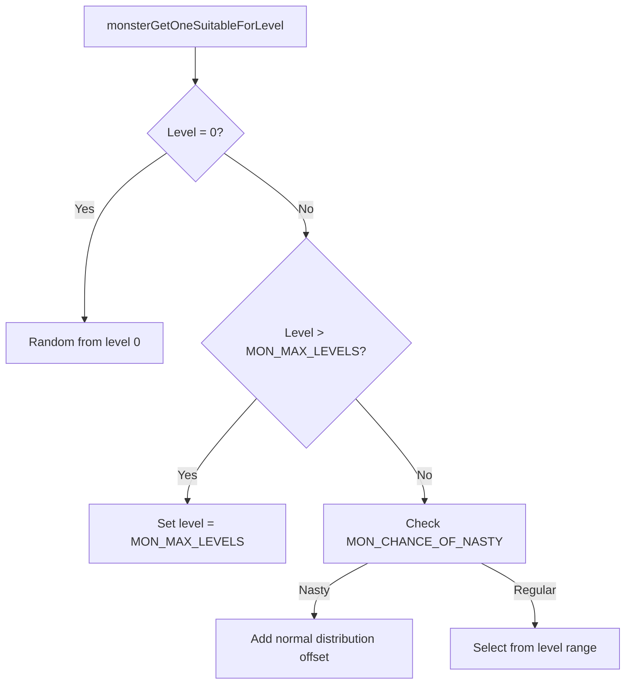

# Monster Manager C++ Module Documentation

## Brief Introduction

The `monster_manager_cpp` module is responsible for managing all monster-related operations within the game. It handles monster creation, placement, movement, and cleanup. This module interfaces with the dungeon management system to place monsters in appropriate locations and maintains the monster data structures that track each creature's state and properties.

## Module Overview

This module provides core functionality for monster management including:
- Monster allocation and deallocation
- Monster placement algorithms
- Monster level-based spawning
- Monster summoning mechanics
- Monster compaction for performance optimization

## Architecture and Component Relationships

### Core Data Structures



### Module Dependencies



## Detailed Component Documentation

### Monster Management Functions

#### `monsterPlaceNew`
Places a new monster at a specified coordinate with given properties.



#### `monsterPlaceWinning`
Places the winning monster at a random location when player wins.

#### `monsterPlaceNewWithinDistance`
Places multiple monsters within a specified distance from the player.

#### `monsterSummon`
Summons a monster adjacent to a given coordinate.

#### `monsterSummonUndead`
Summons an undead monster specifically.

#### `compactMonsters`
Removes distant monsters to optimize memory usage.

### Data Flow and Processing



## Integration Points

### With Dungeon Management
The monster manager directly interacts with the dungeon grid through `dg.floor[coord.y][coord.x].creature_id` to place and update monster positions.

### With Creature Database
Uses `creatures_list[creature_id]` to access creature properties like hit dice, speed, defenses, and sprite information.

### With Player Management
References `py.pos` and `py.flags.speed` to calculate monster speeds and distances.

### With Configuration System
Depends on configuration values from `config::monsters` namespace for:
- Monster level definitions
- Spawn probabilities
- Movement patterns
- Combat behaviors

## Key Algorithms

### Monster Allocation Algorithm
```mermaid
graph LR
    A[popm()] --> B{next_free_monster_id < MON_TOTAL_ALLOCATIONS?}
    B -->|Yes| C[Return next_free_monster_id]
    B -->|No| D[compactMonsters()]
    D --> E{compactMonsters() successful?}
    E -->|Yes| F[Return next_free_monster_id]
    E -->|No| G[Return -1]
```

### Level-Based Monster Selection


## Performance Considerations

The monster manager implements several optimization strategies:
1. **Memory Compaction**: Removes distant monsters to prevent memory bloat
2. **Efficient Allocation**: Uses a simple counter-based allocation system
3. **Batch Placement**: Handles multiple monster placements efficiently
4. **Collision Avoidance**: Ensures proper coordinate validation before placement

## Error Handling

The module includes robust error handling:
- Returns false when monster allocation fails
- Uses abort() when critical monster placement fails during win condition
- Validates coordinates and dungeon states before placing monsters
- Implements retry mechanisms for monster placement

## External References

For detailed information about related systems, see:
- [creature_manager.md](creature_manager.md)
- [dungeon_manager.md](dungeon_manager.md)
- [player_manager.md](player_manager.md)
- [config_module.md](config_module.md)
