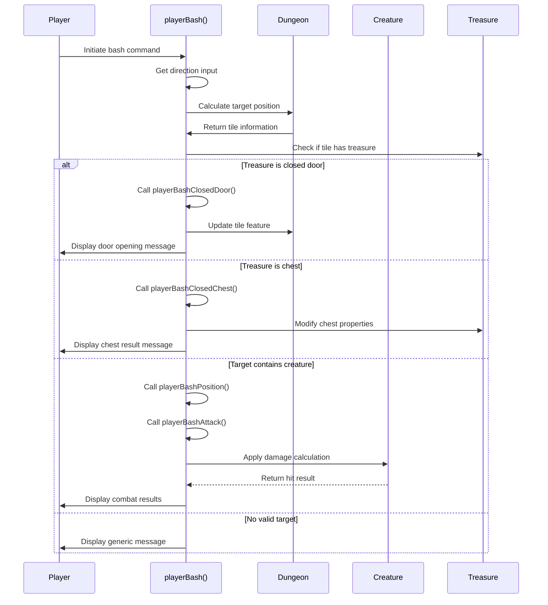

# player_bash_cpp Module Documentation

## Introduction

The `player_bash_cpp` module implements the player's bashing action in the Moria game. This functionality allows players to attempt to break through doors, chests, or attack monsters by using physical force. The module handles the logic for determining success rates, calculating damage, and managing the consequences of bashing actions.

## Architecture Overview

```mermaid
graph TD
    A[Player Input] --> B[playerBash()]
    B --> C{Confusion Check}
    C -->|Confused| D[Get Random Direction]
    C -->|Not Confused| E[Get Direction with Memory]
    
    D --> F[Calculate Target Position]
    E --> F
    
    F --> G{Target Contains Creature}
    G -->|Yes| H[playerBashPosition()]
    G -->|No| I{Target Contains Treasure}
    
    I -->|Closed Door| J[playerBashClosedDoor()]
    I -->|Chest| K[playerBashClosedChest()]
    I -->|Other| L[Generic Message]
    
    G -->|No| M{Target Contains Wall}
    M -->|Valid Wall| N[Generic Message]
    M -->|Invalid Wall| O[Generic Message]
    
    H --> P[playerBashAttack()]
    P --> Q{Success Check}
    Q -->|Success| R[Apply Damage]
    Q -->|Failure| S[Miss Message]
    
    R --> T{Monster Killed}
    T -->|Yes| U[Display Experience]
    T -->|No| V[Stun Chance]
```

## Component Relationships

### Main Function: `playerBash()`
The entry point function that orchestrates the entire bashing process. It handles:
- Direction input processing
- Confusion state management
- Position calculation
- Target type identification
- Dispatching to appropriate handler functions

### Supporting Functions

#### `playerBashAttack(Coord_t coord)`
Handles combat-related bashing when attacking creatures:
- Calculates hit probability based on player attributes
- Applies weapon damage calculations
- Manages monster hit points and death conditions
- Implements stun mechanics for successful hits

#### `playerBashPosition(Coord_t coord)`
Wrapper function that checks fear status before attempting attack:
- Prevents bashing while afraid
- Delegates to `playerBashAttack()` when safe

#### `playerBashClosedDoor(Coord_t coord, int dir, Tile_t &tile, Inventory_t &item)`
Manages door destruction attempts:
- Calculates success probability based on strength and weight
- Handles door opening mechanics
- Updates dungeon tile features
- Manages player movement after successful bash

#### `playerBashClosedChest(Inventory_t &item)`
Handles chest destruction attempts:
- Implements chance-based chest destruction
- Manages lock breaking mechanics
- Updates treasure object state

## Data Flow



## Process Flow

### Bashing Command Execution

1. **Input Processing**
   - Get player direction input
   - Handle confusion state by randomizing direction
   - Calculate target coordinate

2. **Target Evaluation**
   - Check if target contains creature
   - Check if target contains treasure
   - Validate wall/feature existence

3. **Action Selection**
   - Creature target → Attack sequence
   - Closed door → Door destruction
   - Chest → Chest destruction
   - Other → Generic failure message

### Combat Mechanics

When bashing creatures, the system uses:
- Strength-based hit probability calculation
- Weapon damage dice rolling
- Critical blow calculations
- Stun chance implementation
- Experience gain upon monster death

### Door Destruction

Door bashing follows these rules:
- Success probability depends on player strength and weight
- Chance to destroy door increases with player stats
- Successful destruction updates dungeon tiles
- Player may be knocked off balance

### Chest Destruction

Chest bashing includes:
- 10% chance to completely destroy chest and contents
- Lock-breaking mechanics for locked chests
- Standard "holds firm" messages for failed attempts

## Integration Points

This module integrates with several core systems:

- **[headers.h](headers.md)** - Provides essential game definitions and constants
- **[dice.h](dice.md)** - Supplies dice rolling functionality for damage calculations
- **[player_move](player_move.md)** - Uses movement functions for player positioning
- **[monster_system](monster_system.md)** - Interacts with monster hit point management
- **[dungeon_generation](dungeon_generation.md)** - Modifies dungeon tile features
- **[inventory_system](inventory_system.md)** - Manages treasure objects and their properties

## Dependencies

The module requires:
- Game state variables (`py`, `dg`, `game`, `monsters`, `creatures_list`)
- Configuration constants from various system headers
- Utility functions for message printing and random number generation
- Core game mechanics for combat and dungeon management

## Error Handling

The module handles several error conditions:
- Confusion state effects on direction selection
- Fear state preventing attacks
- Failed bashing attempts with appropriate feedback
- Invalid target types with generic messages

## Performance Considerations

The module is designed for minimal performance impact during normal gameplay operations. All calculations use integer arithmetic and avoid complex data structures. The random number generation is kept to a minimum to maintain responsive gameplay.
