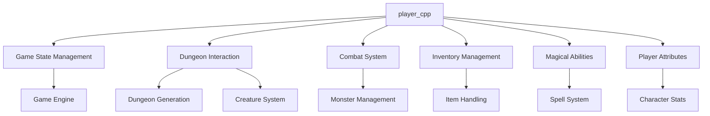
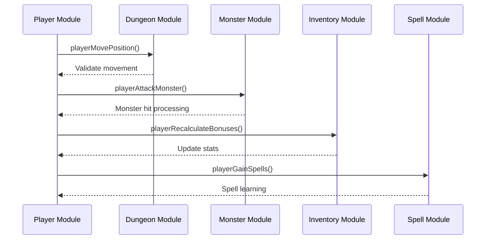
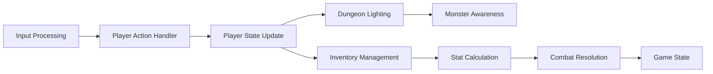

# player_cpp Module Documentation

## Introduction

The `player_cpp` module contains the core implementation for player-related functionality in the Moria game engine. This module manages player attributes, actions, combat mechanics, inventory systems, and magical abilities. It interfaces with dungeon management, creature systems, and game state tracking to provide a complete player experience within the game world.

## Architecture Overview

## Core Components and Functionality

### Player Data Structure

The module defines a global `Player_t` structure (`py`) that holds all player-related data including:

- **Attributes**: Strength, intelligence, wisdom, etc.
- **Status Flags**: Various conditions like blindness, confusion, etc.
- **Inventory**: Equipment and carried items
- **Combat Statistics**: Hit points, armor class, damage bonuses
- **Magic Abilities**: Spell knowledge, mana, casting ability

### Player Actions and Movement

The module handles player movement through the `playerMovePosition()` function, which processes directional input and validates movement within dungeon boundaries. It also implements teleportation via `playerTeleport()` with proper lighting updates and position tracking.

### Combat System

Key combat functions include:
- `playerAttackMonster()`: Handles melee attacks against monsters
- `playerTestBeingHit()`: Determines if an attack hits based on various factors
- `playerTakesHit()`: Processes damage taken by the player
- `playerWeaponCriticalBlow()`: Calculates critical hit damage multipliers

### Inventory and Equipment Management

The module provides comprehensive inventory handling:
- `playerAdjustBonusesForItem()`: Applies item bonuses to player stats
- `playerRecalculateBonuses()`: Recalculates all player bonuses from equipment
- `playerTakeOff()`: Removes equipment from player inventory
- `playerStrength()`: Manages carrying capacity and weapon weight effects

### Magical Systems

The module implements spell learning and casting:
- `playerGainSpells()`: Allows players to learn new spells
- `playerGainMana()`: Calculates and updates mana reserves
- `playerCalculateAllowedSpellsCount()`: Manages spell capacity based on level
- `playerSavingThrow()`: Performs saving throws against magical effects

### Status and Conditions

Player status flags are managed through:
- `playerSearchOn/Off()`: Toggle search mode
- `playerRestOn/Off()`: Handle resting behavior
- `playerDisturb()`: Interrupt current activities
- `playerResetFlags()`: Reset all status flags to default values

### Utility Functions

Several helper functions support core gameplay:
- `playerIsMale()`, `playerSetGender()`: Gender management
- `playerGetGenderLabel()`: Human-readable gender representation
- `playerNoLight()`: Check for illumination status
- `playerCarryingLoadLimit()`: Calculate maximum carrying capacity
- `playerRankTitle()`: Determine player rank title based on level

## Component Interactions

## Data Flow

## Integration Points

This module integrates with several other core systems:
- [dungeon_cpp](dungeon_cpp.md): For dungeon tile manipulation and lighting
- [monster_cpp](monster_cpp.md): For combat interactions and monster management
- [inventory_cpp](inventory_cpp.md): For equipment and item handling
- [spell_cpp](spell_cpp.md): For magical abilities and spell systems
- [game_cpp](game_cpp.md): For overall game state management

## Key Constants and Configuration

The module references several configuration constants:
- `config::player::status`: Player status flag definitions
- `config::treasure::flags`: Item property flags
- `config::monsters::move`: Monster movement behaviors
- `config::spells::SPELL_TYPE_MAGE`: Spell classification
- `config::dungeon::objects::OBJ_NOTHING`: Empty item identifier

## Performance Considerations

The module is designed for efficient execution during gameplay:
- Minimal memory allocation during runtime
- Fast flag checking and bit operations
- Optimized loops for inventory calculations
- Cached stat computations where appropriate

## Error Handling

The module includes basic error checking:
- Boundary validation for movement coordinates
- Input validation for rest commands
- Safe handling of invalid spell selections
- Proper cleanup when removing equipment

## Future Extensibility

The modular design allows for easy extension:
- Additional player attributes can be added to `Player_t`
- New combat mechanics can be implemented in existing functions
- Additional magical systems can integrate with the spell learning framework
- New inventory categories can be supported through flag-based systems
