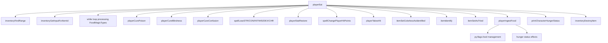
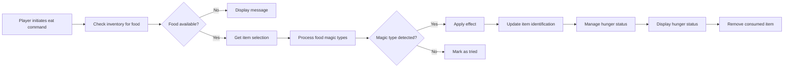

# player_eat_cpp Module Documentation

## Brief Introduction

The `player_eat_cpp` module handles the player's ability to consume food items in the game. This module implements the core logic for food consumption, including various magical effects that can occur when eating different types of food items. It manages inventory interactions, status effects, hunger management, and item identification processes.

## Module Overview

This module provides two primary functions:
1. `playerEat()` - Main function that handles the player eating action
2. `playerIngestFood()` - Helper function that manages the actual food consumption and hunger effects

## Architecture and Component Relationships

### Core Components



### Data Flow



## Detailed Functionality

### playerEat() Function

The main entry point for food consumption. This function:

1. **Initial Setup**: Sets `game.player_free_turn = true` to allow free turns during eating
2. **Inventory Validation**: Checks if player has any items and specifically food items
3. **User Interaction**: Prompts user to select which food item to eat
4. **Effect Processing**: Processes each magic type associated with the food item through a bit-flag system
5. **Identification Logic**: Handles item identification based on whether effects were applied
6. **Hunger Management**: Calls `playerIngestFood()` to handle hunger status changes
7. **Cleanup**: Removes the consumed item from inventory

### playerIngestFood() Function

Manages the physical consumption of food and its effects on player hunger:

1. **Food Value Adjustment**: Adds food value to player's current food level
2. **Overeating Detection**: Checks if player has exceeded maximum food capacity
3. **Overeating Penalties**: Applies penalties for overconsumption (slowness)
4. **Status Updates**: Updates hunger-related status flags

## Magic Types Enumerations

The module uses an enum class `FoodMagicTypes` to represent various food effects:

```cpp
enum class FoodMagicTypes {
    Poison = 1,
    Blindness,
    Paranoia,
    Confusion,
    Hallucination,
    CurePoison,
    CureBlindness,
    CureParanoia,
    CureConfusion,
    Weakness,
    Unhealth,
    RestoreSTR = 16,
    RestoreCON,
    RestoreINT,
    RestoreWIS,
    RestoreDEX,
    RestoreCHR,
    FirstAid,
    MinorCures,
    LightCures,
    MajorCures = 26,
    PoisonousFood,
};
```

## Integration Points

This module integrates with several other system components:

- **Inventory System** ([inventory.md](inventory.md)): Uses inventory functions for item selection and management
- **Player Status System** ([player_status.md](player_status.md)): Modifies player status flags like poison, blindness, etc.
- **Character Statistics** ([character_stats.md](character_stats.md)): Interacts with player attribute restoration and loss functions
- **Game State Management** ([game_state.md](game_state.md)): Manages player turn state and game flow

## Dependencies

The module depends on:
- `headers.h`: Standard game headers
- Inventory management functions (`inventoryFindRange`, `inventoryGetInputForItemId`, `inventoryDestroyItem`)
- Player status functions (`playerCurePoison`, `playerCureBlindness`, `playerCureConfusion`)
- Spell effect functions (`spellLoseSTR`, `spellLoseCON`, `playerStatRestore`, `spellChangePlayerHitPoints`)
- Item identification functions (`itemSetColorlessAsIdentified`, `itemIdentify`, `itemSetAsTried`)
- Game configuration constants (`config::player::PLAYER_FOOD_MAX`, `config::player::PLAYER_FOOD_FULL`)

## Error Handling

The module includes basic error handling:
- Checks for empty inventory before attempting to eat
- Validates food availability in inventory
- Handles internal errors with debug messages
- Manages overeating scenarios with appropriate penalties

## Performance Considerations

The module is designed for efficient execution:
- Uses bit-flag processing for multiple magic types
- Minimal memory allocation
- Direct access to player and item structures
- Early returns for invalid conditions

## Related Modules

- [inventory.md](inventory.md): Inventory management for food selection
- [player_status.md](player_status.md): Player status effects management
- [character_stats.md](character_stats.md): Attribute restoration and loss functions
- [game_state.md](game_state.md): Game flow and turn management
