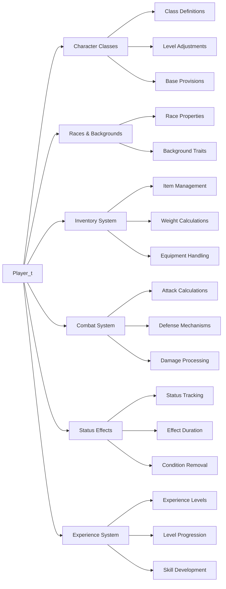

# player_h Module Documentation

## Introduction

The `player_h` module defines the core data structures and function prototypes for the player character in the game. This module contains the main `Player_t` structure that represents the player's state, including attributes, statistics, inventory, and various gameplay-related functions. It serves as the central hub for player-related operations and interactions within the game engine.

## Architecture Overview

```mermaid
graph TD
    A[Player_t Structure] --> B[Player Misc Data]
    A --> C[Player Stats]
    A --> D[Player Status Flags]
    A --> E[Player Position]
    A --> F[Player Inventory]
    A --> G[Player Equipment]
    
    B --> B1[Name, Gender, Age]
    B --> B2[Experience, Level, Gold]
    B --> B3[Hit Points, Mana]
    B --> B4[Attributes, Skills]
    
    C --> C1[Strength, Intelligence]
    C --> C2[Dexterity, Wisdom]
    C --> C3[Constitution, Charisma]
    
    D --> D1[Status Effects]
    D --> D2[Temporary Conditions]
    D --> D3[Spell Tracking]
    
    F --> F1[Inventory Items]
    F --> F2[Pack Weight]
    F --> F3[Equipment Slots]
    
    subgraph "Player Functions"
        H[playerMovePosition]
        I[playerTakesHit]
        J[playerGainExperience]
        K[playerCalculateBonuses]
        L[playerUseItem]
        M[playerAttack]
    end
    
    A --> H
    A --> I
    A --> J
    A --> K
    A --> L
    A --> M
```



## Core Data Structures

### Player_t Structure

The main player structure that holds all player-related data:

```c
typedef struct Player_t {
    // Miscellaneous player information
    struct {
        char name[PLAYER_NAME_SIZE];
        bool gender;
        int32_t date_of_birth;
        int32_t au;
        int32_t max_exp;
        int32_t exp;
        uint16_t exp_fraction;
        uint16_t age;
        uint16_t height;
        uint16_t weight;
        uint16_t level;
        uint16_t max_dungeon_depth;
        int16_t chance_in_search;
        int166_t fos;
        int16_t bth;
        int16_t bth_with_bows;
        int16_t mana;
        int16_t max_hp;
        int16_t plusses_to_hit;
        int16_t plusses_to_damage;
        int16_t ac;
        int16_t magical_ac;
        int16_t display_to_hit;
        int16_t display_to_damage;
        int16_t display_ac;
        int16_t display_to_ac;
        int16_t disarm;
        int16_t saving_throw;
        int16_t social_class;
        int16_t stealth_factor;
        uint8_t class_id;
        uint8_t race_id;
        uint8_t hit_die;
        uint8_t experience_factor;
        int16_t current_mana;
        uint16_t current_mana_fraction;
        int16_t current_hp;
        uint16_t current_hp_fraction;
        char history[4][60];
    } misc{};

    // Player statistics
    struct {
        uint8_t max[6];
        uint8_t current[6];
        int16_t modified[6];
        uint8_t used[6];
    } stats{};

    // Player status flags and conditions
    struct {
        uint32_t status;
        int16_t rest;
        int16_t blind;
        int16_t paralysis;
        int16_t confused;
        int16_t food;
        int16_t food_digested;
        int16_t protection;
        int16_t speed;
        int16_t fast;
        int16_t slow;
        int16_t afraid;
        int16_t poisoned;
        int16_t image;
        int16_t protect_evil;
        int16_t invulnerability;
        int16_t heroism;
        int16_t super_heroism;
        int16_t blessed;
        int16_t heat_resistance;
        int16_t cold_resistance;
        int16_t detect_invisible;
        int16_t word_of_recall;
        int16_t see_infra;
        int16_t timed_infra;
        bool see_invisible;
        bool teleport;
        bool free_action;
        bool slow_digest;
        bool aggravate;
        bool resistant_to_fire;
        bool resistant_to_cold;
        bool resistant_to_acid;
        bool regenerate_hp;
        bool resistant_to_light;
        bool free_fall;
        bool sustain_str;
        bool sustain_int;
        bool sustain_wis;
        bool sustain_con;
        bool sustain_dex;
        bool sustain_chr;
        bool confuse_monster;

        uint8_t new_spells_to_learn;
        uint32_t spells_learnt;
        uint32_t spells_worked;
        uint32_t spells_forgotten;
        uint8_t spells_learned_order[32];
    } flags{};

    Coord_t pos{};
    char prev_dir = ' ';

    uint16_t base_hp_levels[PLAYER_MAX_LEVEL]{};
    uint32_t base_exp_levels[PLAYER_MAX_LEVEL]{};

    uint8_t running_tracker = 0;
    bool temporary_light_only = false;

    int32_t max_score = 0;

    struct {
        int16_t unique_items = 0;
        int16_t weight = 0;
        int16_t heaviness = 0;
    } pack;

    Inventory_t inventory[PLAYER_INVENTORY_SIZE]{};

    int16_t equipment_count = 0;
    bool weapon_is_heavy = false;
    bool carrying_light = false;
} Player_t;
```

### Constants

Key constants defined for player behavior and limits:

- `PLAYER_MAX_LEVEL`: Maximum player level (40)
- `PLAYER_MAX_CLASSES`: Maximum number of character classes (6)
- `PLAYER_MAX_RACES`: Maximum number of races (8)
- `PLAYER_MAX_BACKGROUNDS`: Maximum number of backgrounds (128)
- `PLAYER_NAME_SIZE`: Maximum player name length (27 characters)
- `CLASS_MAX_LEVEL_ADJUST`: Maximum level adjustments for classes (5)
- `CLASS_MISC_HIT`: Miscellaneous hit adjustment index

## Component Relationships



## Function Categories

### Movement and Positioning

Functions related to player movement and spatial positioning:

```c
bool playerMovePosition(int dir, Coord_t &coord);
void playerTeleport(int new_distance);
bool playerNoLight();
void playerMove(int direction, bool do_pickup);
void playerFindInitialize(int direction);
void playerRunAndFind();
void playerEndRunning();
void playerAreaAffect(int direction, Coord_t coord);
```

### Combat and Attack Systems

Combat-related functions for attacking and defending:

```c
void playerAttackPosition(Coord_t coord);
bool playerTestAttackHits(int attack_id, uint8_t level);
bool playerTestBeingHit(int base_to_hit, int level, int plus_to_hit, int armor_class, int attack_type_id);
void playerTakesHit(int damage, const char *creature_name);
int playerWeaponCriticalBlow(int weapon_weight, int plus_to_hit, int damage, int attack_type_id);
bool playerSavingThrow();
int playerAttackBlows(int weight, int &weight_to_hit);
```

### Statistics and Attributes

Functions managing player statistics and attribute calculations:

```c
void playerSetAndUseStat(int stat);
bool playerStatRandomIncrease(int stat);
bool playerStatRandomDecrease(int stat);
bool playerStatRestore(int stat);
void playerStatBoost(int stat, int amount);
int16_t playerToHitAdjustment();
int16_t playerArmorClassAdjustment();
int16_t playerDisarmAdjustment();
int16_t playerDamageAdjustment();
int playerStatAdjustmentWisdomIntelligence(int stat);
int playerStatAdjustmentCharisma();
int playerStatAdjustmentConstitution();
```

### Inventory and Equipment

Functions handling player inventory and equipment management:

```c
void playerTakeOff(int item_id, int pack_position_id);
bool playerIsWieldingItem();
bool playerLeftHandRingEmpty();
bool playerRightHandRingEmpty();
bool playerWornItemIsCursed(PlayerEquipment id);
void playerWornItemRemoveCurse(PlayerEquipment id);
void playerAdjustBonusesForItem(Inventory_t const &item, int factor);
void playerRecalculateBonuses();
int playerCarryingLoadLimit();
void playerStrength();
```

### Experience and Leveling

Functions for experience gain and level progression:

```c
void playerGainKillExperience(Creature_t const &creature);
void playerGainSpells();
void playerCalculateAllowedSpellsCount(int stat);
void playerInitializeBaseExperienceLevels();
void playerCalculateHitPoints();
char *playerRankTitle();
```

### Status Effects and Healing

Functions for managing player status effects and healing:

```c
bool playerCureConfusion();
bool playerCureBlindness();
bool playerCurePoison();
bool playerRemoveFear();
bool playerProtectEvil();
void playerBless(int adjustment);
void playerDetectInvisible(int adjustment);
void playerDisturb(int major_disturbance, int light_disturbance);
```

### Special Actions

Special gameplay actions and abilities:

```c
void playerSearch(Coord_t coord, int chance);
void playerSearchOn();
void playerSearchOff();
void playerRestOn();
void playerRestOff();
void playerBash();
void playerTunnel(int direction);
void playerTunnelWall(Coord_t coord, int digging_ability, int digging_chance);
void playerThrowItem();
void playerDisarmTrap();
void chestTrap(Coord_t coord);
void playerEat();
void playerIngestFood(int amount);
void quaff();
void pray();
```

## Integration with Other Modules

This module integrates closely with several other core systems:

- **[inventory_h](inventory_h.md)**: Manages player inventory and equipment
- **[combat_h](combat_h.md)**: Handles combat mechanics and damage calculation
- **[class_h](class_h.md)**: Provides class-specific behaviors and adjustments
- **[race_h](race_h.md)**: Defines racial characteristics and bonuses
- **[status_h](status_h.md)**: Manages player status effects and conditions
- **[experience_h](experience_h.md)**: Controls experience gain and leveling
- **[item_h](item_h.md)**: Interacts with item properties and magic effects

## Usage Patterns

The player module follows these usage patterns:

1. **State Management**: The `Player_t` structure maintains all player state throughout gameplay
2. **Function Chaining**: Combat and action functions often call multiple helper functions
3. **Event Handling**: Many functions respond to game events like attacks, item use, or status changes
4. **Data Validation**: Functions validate inputs and player state before performing operations

## Performance Considerations

- The player structure is designed to be compact for efficient memory usage
- Critical combat functions are optimized for performance
- Status effect tracking uses bitfields for efficient storage
- Many calculations are precomputed during initialization

## Dependencies

This module depends on:
- [inventory_h](inventory_h.md) for inventory management
- [combat_h](combat_h.md) for combat calculations
- [class_h](class_h.md) for class-specific data
- [race_h](race_h.md) for racial data
- [status_h](status_h.md) for status effect handling
- [experience_h](experience_h.md) for experience management

The module provides the foundation for all player interactions in the game world and interfaces with all major gameplay systems through its well-defined API.
