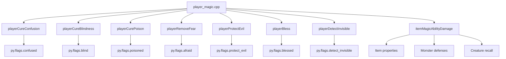
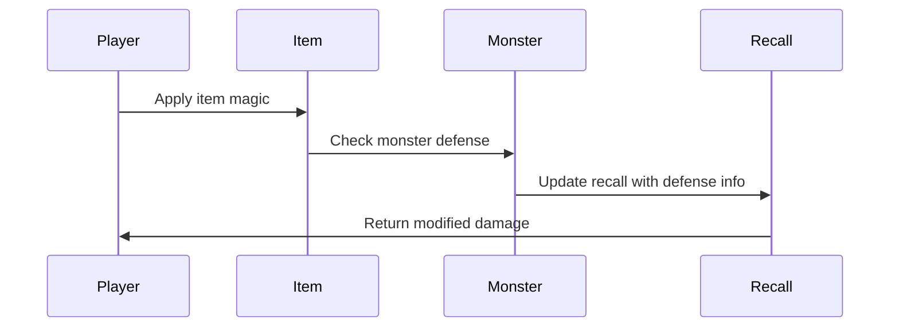

# Player Magic C++ Module Documentation

## Introduction

The `player_magic_cpp` module handles various magical effects and abilities related to player character status conditions, enchantments, and weapon magic properties. This module provides functions for curing status ailments, applying magical blessings, detecting invisible creatures, and calculating damage modifications based on item properties and monster defenses.

## Module Overview

This module contains core C++ functions that manage player magical states and interactions with enchanted items. It interfaces with the game's player state management system through the global `py` structure and monster recall system through `creature_recall`.

## Architecture and Component Relationships

### Core Components



### Data Flow



## Detailed Function Documentation

### Status Cure Functions

#### `playerCureConfusion()`
Cures confusion status by reducing the confusion timer to 1 turn if it's currently above 1.

#### `playerCureBlindness()`
Cures blindness status by reducing the blindness timer to 1 turn if it's currently above 1.

#### `playerCurePoison()`
Cures poison status by reducing the poison timer to 1 turn if it's currently above 1.

#### `playerRemoveFear()`
Removes fear status by reducing the fear timer to 1 turn if it's currently above 1.

### Magical Enhancement Functions

#### `playerProtectEvil()`
Applies protection from evil effect. Returns true if the player was previously unprotected.

#### `playerBless()`
Adjusts the player's blessed status by the specified amount.

#### `playerDetectInvisible()`
Adjusts the player's invisible detection ability by the specified amount.

### Item Magic Calculation

#### `itemMagicAbilityDamage()`
Calculates modified damage based on item properties and monster defenses:

- **Ego weapons** with specific categories (projectiles, hafted weapons, swords, flasks) trigger special damage calculations
- **Damage multipliers** based on monster defenses:
  - Dragon slaying: 4x damage
  - Undead slaying: 3x damage  
  - Animal slaying: 2x damage
  - Evil slaying: 2x damage
  - Frost brand: 1.5x damage
  - Flame tongue: 1.5x damage

## Integration Points

This module integrates with:
- [player_state.md](player_state.md) - For accessing player flags and status conditions
- [monster_recognition.md](monster_recognition.md) - For updating monster recall information
- [item_enchantments.md](item_enchantments.md) - For handling item property checks and magic effects

## Dependencies

The module requires:
- `headers.h` - Standard game headers
- Global `py` structure - Player state management
- `creatures_list` - Monster database
- `creature_recall` - Monster memory tracking
- Configuration constants from `config::treasure::flags` and `config::monsters::defense`

## Usage Examples

```cpp
// Cure confusion status
if (playerCureConfusion()) {
    // Display message about confusion being cured
}

// Apply protection from evil
if (playerProtectEvil()) {
    // Display message about protection being applied
}

// Calculate damage with weapon magic
int final_damage = itemMagicAbilityDamage(item, base_damage, monster_id);
```

## System Integration

This module forms part of the broader player interaction system and works alongside:
- [combat_system.md](combat_system.md) - Damage calculation and combat mechanics
- [inventory_management.md](inventory_management.md) - Item handling and enchantment systems
- [status_effects.md](status_effects.md) - Player condition management
