# player_pray_cpp Module Documentation

## Brief Introduction

The `player_pray_cpp` module implements the prayer system for priest-class characters in the game. It handles the logic for checking prerequisites for praying, selecting prayer books, choosing specific prayers, and executing the effects of those prayers. This module integrates with the broader game system through various utility functions and global state management.

## Module Overview

This module provides the core functionality for players to perform prayers, which are magical abilities specific to priest characters. The implementation includes validation checks, spell selection mechanics, and execution of various prayer effects.

### Key Components

- **playerCanPray**: Validates whether a player can perform a prayer
- **playerRecitePrayer**: Executes the selected prayer effect
- **pray**: Main function that orchestrates the prayer process

## Architecture and Dependencies

```mermaid
graph TD
    A[player_pray.cpp] --> B[headers.h]
    A --> C[inventoryFindRange]
    A --> D[playerNoLight]
    A --> E[printMessage]
    A --> F[getDirectionWithMemory]
    A --> G[inventoryGetInputForItemId]
    A --> H[castSpellGetId]
    A --> I[spellChangePlayerHitPoints]
    A --> J[playerBless]
    A --> K[playerRemoveFear]
    A --> L[spellLightArea]
    A --> M[spellDetectTrapsWithinVicinity]
    A --> N[spellDetectSecretDoorssWithinVicinity]
    A --> O[spellSlowPoison]
    A --> P[spellConfuseMonster]
    A --> Q[playerTeleport]
    A --> R[spellCreateFood]
    A --> S[inventoryItemRemoveCurse]
    A --> T[playerCurePoison]
    A --> U[spellFireBall]
    A --> V[playerDetectInvisible]
    A --> W[playerProtectEvil]
    A --> X[spellEarthquake]
    A --> Y[spellMapCurrentArea]
    A --> Z[spellTurnUndead]
    A --> AA[spellDispelCreature]
    A --> AB[spellWardingGlyph]
    A --> AC[displayCharacterExperience]
    A --> AD[printCharacterCurrentMana]
    
    subgraph Game System
        B
        C
        D
        E
        F
        G
        H
        I
        J
        K
        L
        M
        N
        O
        P
        Q
        R
        S
        T
        U
        V
        W
        X
        Y
        Z
        AA
        AB
        AC
        AD
    end
    
    subgraph Global State
        py
        game
        classes
        magic_spells
    end
```



## Data Flow and Process Flow

```mermaid
flowchart TD
    A[Start pray()] --> B{playerCanPray?}
    B -- No --> C[Return]
    B -- Yes --> D[Get prayer book input]
    D --> E{Valid book selected?}
    E -- No --> F[Return]
    E -- Yes --> G[Select prayer]
    G --> H{Prayer available?}
    H -- No --> I[Print message]
    H -- Yes --> J[Calculate chance]
    J --> K{Success?}
    K -- No --> L[Print concentration loss]
    K -- Yes --> M[Execute prayer]
    M --> N{Free turn?}
    N -- No --> O[Update experience]
    O --> P[Check mana]
    P --> Q{Sufficient mana?}
    Q -- No --> R[Mana drain effect]
    Q -- Yes --> S[Reduce mana]
    S --> T[Print mana status]
    N -- Yes --> U[Print mana status]
```

## Component Interactions

### Validation Process

The `playerCanPray` function performs several checks before allowing a prayer:

1. **Blindness Check**: Ensures the player isn't blind
2. **Light Check**: Verifies the player has light source
3. **Confusion Check**: Confirms the player isn't confused
4. **Class Check**: Validates the player is a priest class
5. **Inventory Check**: Ensures the player carries items
6. **Prayer Book Check**: Confirms the presence of holy books

### Prayer Execution

The `playerRecitePrayer` function handles the execution of different prayer types through a switch statement that maps prayer numbers to specific spell effects. Each prayer type has unique behavior including:

- Direct stat modifications
- Area effects
- Monster targeting
- Status effect removal
- Damage dealing
- Healing effects

### Mana Management

The main `pray` function manages the player's mana consumption and potential consequences:

1. **Mana Cost Calculation**: Uses spell-specific mana requirements
2. **Mana Depletion**: Reduces current mana when spells are cast
3. **Fatigue Effects**: Handles cases where mana is insufficient
4. **Experience Gain**: Awards experience points for learned spells

## Integration Points

This module interacts with several other system components:

- **[inventory](inventory.md)**: For finding prayer books and managing inventory items
- **[spells](spells.md)**: For spell definitions and casting mechanics
- **[player](player.md)**: For player status and attribute management
- **[magic](magic.md)**: For spell data structures and spell effects
- **[input](input.md)**: For user interaction and direction input

## External Dependencies

The module depends on several global systems and utilities:

- `py`: Player state structure containing class info, inventory, and stats
- `game`: Game state management
- `classes`: Class-specific configuration data
- `magic_spells`: Spell database with priest-specific spells
- Various spell functions from the spell system
- Input handling functions for user interaction

## Error Handling

The module implements comprehensive error handling through:

1. **Pre-validation checks** that prevent invalid prayer attempts
2. **User feedback messages** for various failure conditions
3. **Graceful degradation** when prayers fail due to concentration issues
4. **Mana management** that prevents over-consumption

## Performance Considerations

The module is designed for efficient execution with minimal overhead:

- Early returns prevent unnecessary processing
- Simple conditional checks avoid complex calculations
- Direct function calls minimize abstraction layers
- Memory-efficient spell execution patterns

## Security and Safety

The module ensures safe operation through:

- Comprehensive validation before spell execution
- Proper bounds checking for spell indices
- Controlled access to player attributes
- Protection against invalid spell casting states
