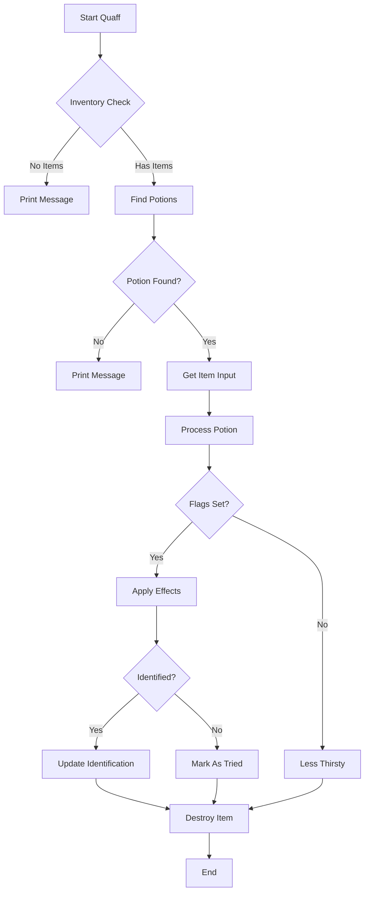

# player_quaff_cpp Module Documentation

## Brief Introduction

The `player_quaff_cpp` module handles the logic for players quaffing (drinking) potions in the game. It processes potion effects, manages player status changes, and handles identification of potions. This module is part of the core gameplay mechanics that affect player attributes, status conditions, and magical effects.

## Module Overview

This module implements the quaffing behavior for potions, including:
- Processing different potion types and their effects
- Managing player attribute modifications
- Handling status condition changes
- Implementing potion identification systems
- Managing inventory interactions during potion consumption

## Architecture and Component Relationships

### Core Components

The main component in this module is the `quaff()` function which orchestrates the entire potion drinking process, and the helper function `playerDrinkPotion()` which processes individual potion effects.

### Data Flow

```mermaid
graph TD
    A[quaff()] --> B[playerDrinkPotion()]
    B --> C[Potion Effect Processing]
    C --> D[Attribute Changes]
    C --> E[Status Condition Changes]
    C --> F[Experience Changes]
    D --> G[printMessage()]
    E --> G
    F --> G
    G --> H[Item Identification]
    H --> I[inventoryDestroyItem()]
```

### Process Flow



## Detailed Functionality

### Main Functions

#### `quaff()`
The primary entry point for potion consumption. This function:
1. Sets up the player free turn flag
2. Validates inventory has potions
3. Finds available potion items
4. Gets user input for potion selection
5. Processes the selected potion
6. Handles identification and inventory management

#### `playerDrinkPotion()`
Processes individual potion effects based on flags and item type:
- Handles attribute modifications (strength, intelligence, wisdom, charisma, dexterity, constitution)
- Manages status conditions (blindness, confusion, poison, sleep)
- Implements healing and damage effects
- Controls experience gain/loss
- Manages special abilities and resistances

### Potion Types Enum

The module defines `PotionSpellTypes` enum covering various potion effects:
- Attribute modification potions (strength, intelligence, wisdom, charisma, dexterity, constitution)
- Healing potions (light, serious, critical wounds, general healing)
- Status effect potions (sleep, blindness, confusion, poison)
- Experience potions (gain, loss)
- Special ability potions (haste, slowness, invulnerability, heroism)
- Resistance potions (heat, cold)
- Detection potions (invisible detection)
- Poison treatment potions

## Integration Points

This module integrates with several other core systems:

- **Inventory Management** ([inventory.md](inventory.md)): Uses inventory functions for finding and managing potion items
- **Player Statistics** ([player_stats.md](player_stats.md)): Calls functions for attribute modifications and status changes
- **Game State** ([game_state.md](game_state.md)): Modifies player flags and game state variables
- **Character Display** ([character_display.md](character_display.md)): Updates character experience and mana displays
- **Item Identification** ([item_identification.md](item_identification.md)): Handles potion identification and marking as tried

## Dependencies

This module depends on:
- `headers.h`: Standard game headers
- Player statistics and status management functions
- Inventory management functions
- Game state management
- Character display functions
- Item identification systems

## Error Handling

The module includes basic error handling through:
- Validation of inventory contents
- Checking for valid potion categories
- Graceful handling of edge cases like maximum experience limits
- Default error message for unrecognized potion types

## Performance Considerations

The module is designed for efficient processing of potion effects with:
- Bit manipulation for flag processing
- Early returns for invalid conditions
- Minimal memory allocation
- Direct access to player state variables

## Security Considerations

The module ensures proper validation of:
- Item categories and subcategories
- Player state before applying effects
- Experience value boundaries
- Status condition application limits

## Related Modules

- [inventory.md](inventory.md): Inventory management for potion selection
- [player_stats.md](player_stats.md): Player attribute modification functions
- [game_state.md](game_state.md): Game state management for player flags
- [character_display.md](character_display.md): Character information display updates
- [item_identification.md](item_identification.md): Item identification and tracking systems
