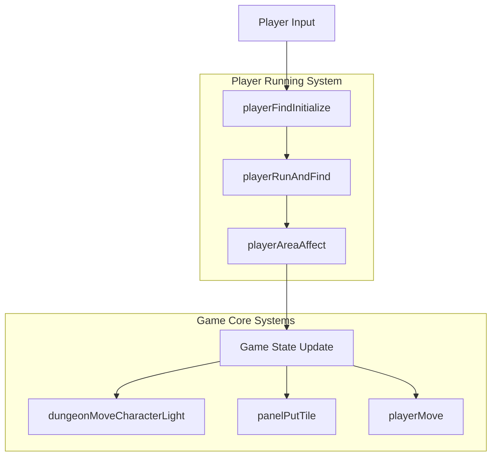
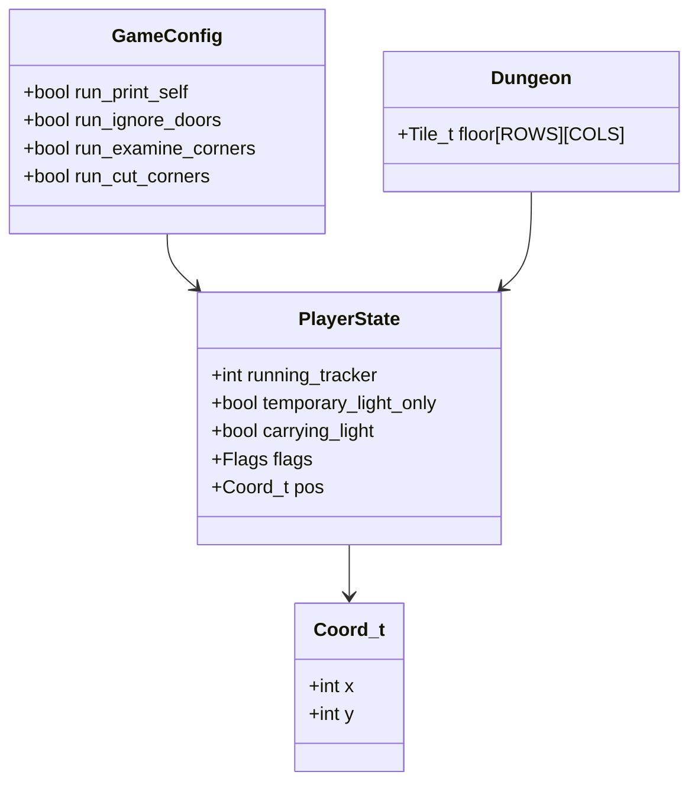
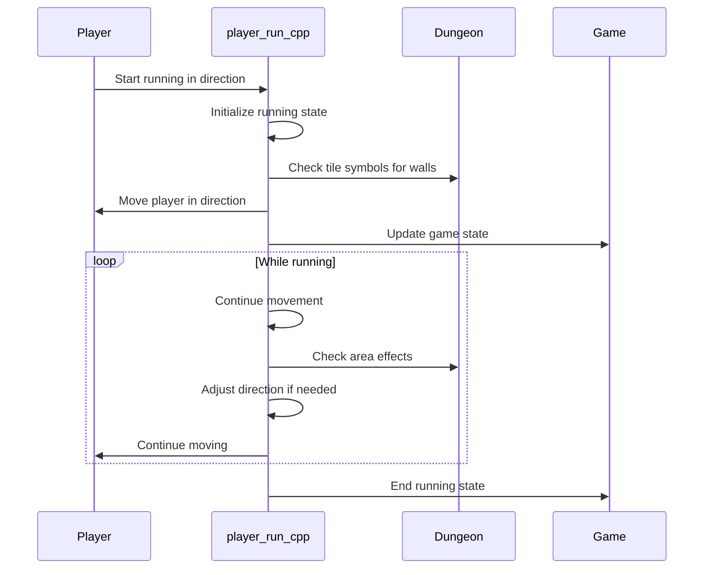
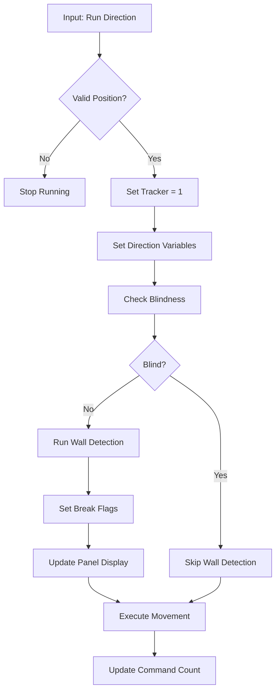
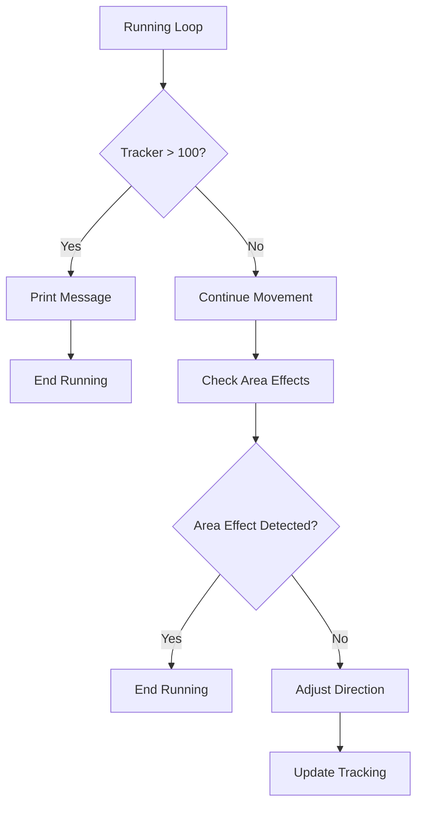

# player_run_cpp Module Documentation

## Introduction

The `player_run_cpp` module handles the player's running mechanics and pathfinding behavior in the game. This module manages how players move when running, including directional tracking, obstacle detection, and decision-making for continuing or stopping movement. It interfaces with the dungeon and player state management systems to provide smooth running behavior.

## Architecture Overview

## Component Relationships

### Core Functions

The module consists of several interconnected functions that work together to manage player running:

1. **playerFindInitialize** - Initializes running state and sets up tracking variables
2. **playerRunAndFind** - Handles continuous running logic and movement
3. **playerEndRunning** - Cleans up running state when stopping
4. **playerAreaAffect** - Processes area effects and adjusts running direction
5. **Helper Functions** - Support functions for wall detection and position calculations

### Data Structures

## Dependencies

This module depends on several other core systems:

- [headers.h](headers.md) - Provides essential type definitions and global variables
- [dungeon.h](dungeon.h.md) - Accesses dungeon tile information through `caveGetTileSymbol`
- [player.h](player.h.md) - Interacts with player state and movement functions
- [game.h](game.h.md) - Uses game configuration and command handling
- [config.h](config.h.md) - Accesses running-related configuration options

## Data Flow

## Process Flows

### Running Initialization Process

### Running Decision Process

## Configuration Options

The module respects several configuration settings from the game options:

- `run_print_self` - Controls whether to display the player character during running
- `run_ignore_doors` - Determines if doors should interrupt running
- `run_examine_corners` - Enables corner examination during running
- `run_cut_corners` - Allows corner-cutting behavior during running

## Integration Points

### With Player System

The module integrates closely with the player system through:
- `py.running_tracker` - Tracks running state
- `py.pos` - Current player position
- `playerMove()` - Executes actual movement
- `py.flags.blind` - Blindness status affecting vision

### With Dungeon System

The module interacts with dungeon elements via:
- `caveGetTileSymbol()` - Gets tile symbols for wall detection
- `dungeonMoveCharacterLight()` - Updates lighting when stopping
- `panelPutTile()` - Updates display panel

### With Game System

The module works with game state through:
- `game.command_count` - Command counter management
- `game.treasure.list` - Treasure detection for running interruption
- `monsters[]` - Monster detection for running interruption

## Error Handling

The module implements basic error checking:
- Invalid movement positions are handled gracefully
- Blindness status prevents certain visual checks
- Running timeout prevents infinite loops
- Proper cleanup ensures running state is reset correctly

## Performance Considerations

The module is designed for efficient real-time operation:
- Minimal memory allocation during running
- Fast lookup of tile symbols
- Early termination of running when conditions change
- Efficient directional calculations using precomputed arrays

## Usage Examples

When a player initiates running:
1. `playerFindInitialize()` is called with the desired direction
2. The running tracker is set and initial conditions are established
3. As the player moves, `playerRunAndFind()` continues the movement
4. `playerAreaAffect()` processes environmental effects and adjusts direction
5. When conditions change, `playerEndRunning()` cleans up the state

This module forms a critical part of the player interaction system, providing the foundation for smooth and responsive running mechanics in the game.
