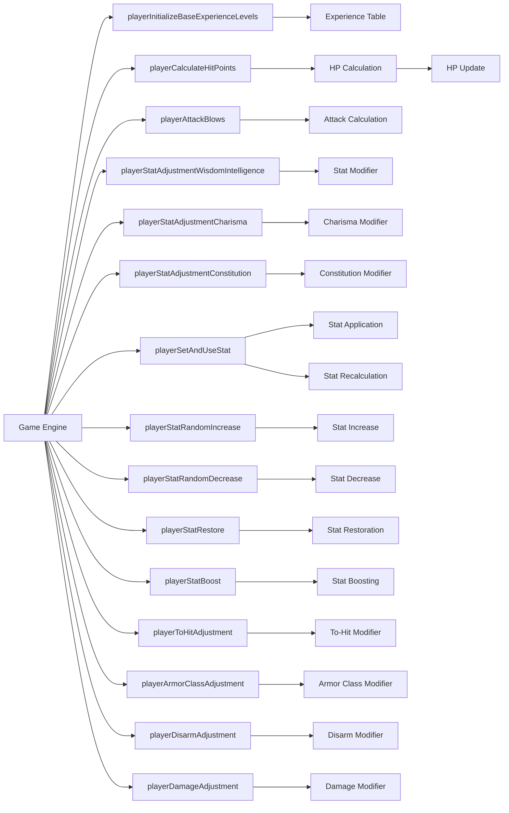
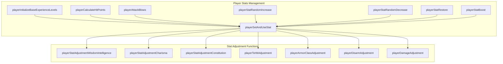
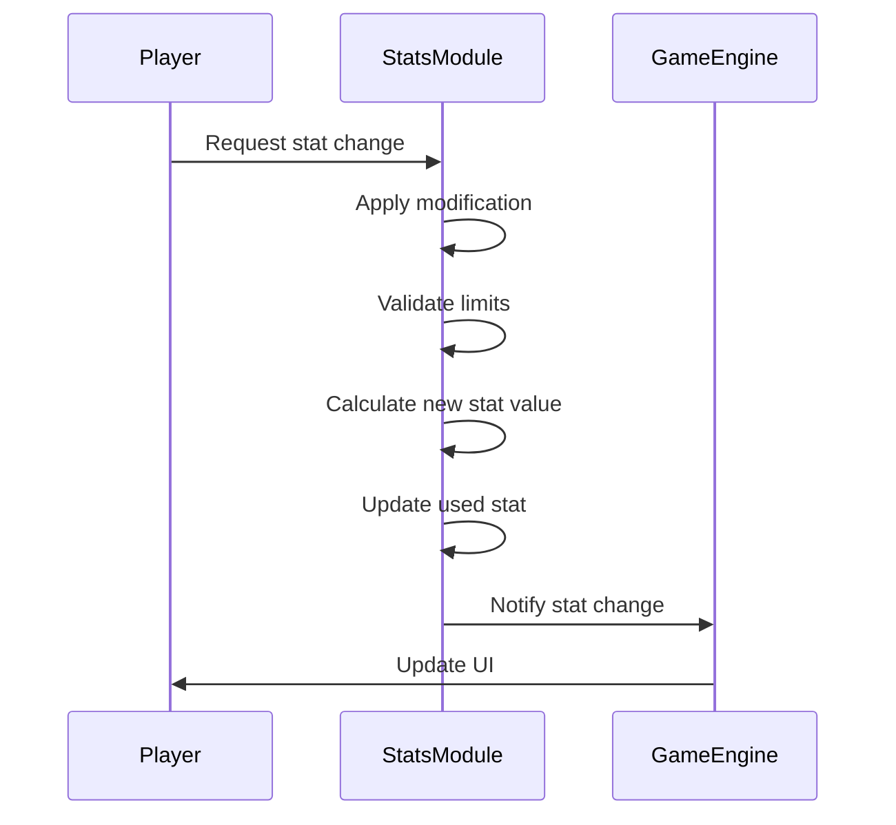
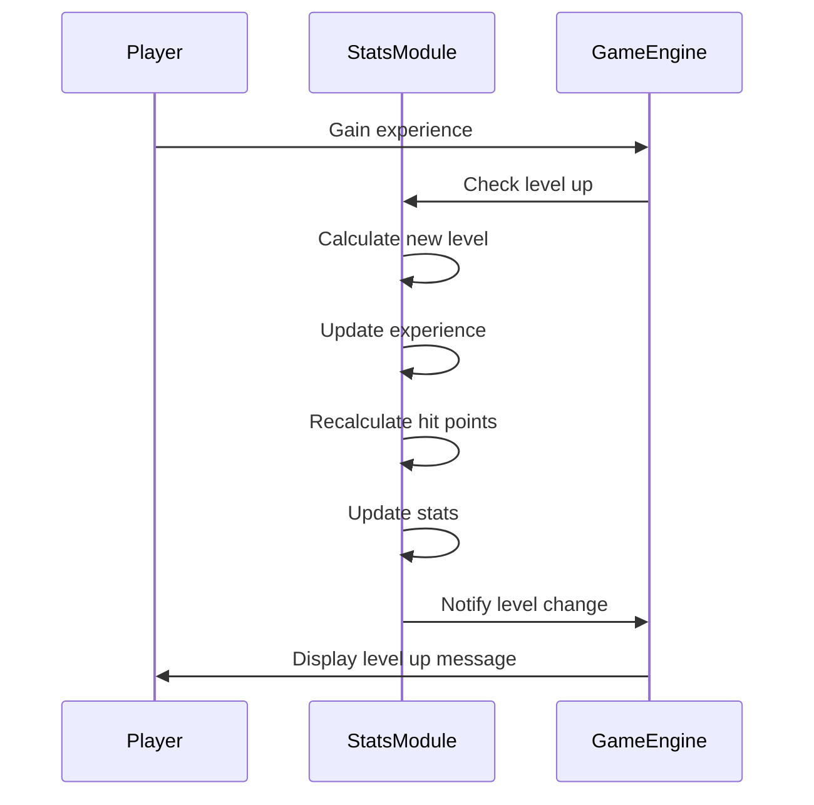

# player_stats_cpp Module Documentation

## Overview

The `player_stats_cpp` module handles all player statistics calculations and modifications within the game engine. This module manages character attributes, experience levels, hit points calculation, attack mechanics, and various stat adjustments that affect gameplay balance and character progression.

## Architecture

```mermaid
graph TD
    A[player_stats.cpp] --> B[Player Stats Management]
    A --> C[Experience Level System]
    A --> D[Hit Points Calculation]
    A --> E[Attack Mechanics]
    A --> F[Stat Adjustment Systems]
    A --> G[Character Attribute Management]
    
    B --> H[playerInitializeBaseExperienceLevels]
    B --> I[playerCalculateHitPoints]
    B --> J[playerAttackBlows]
    B --> K[playerStatAdjustmentWisdomIntelligence]
    B --> L[playerStatAdjustmentCharisma]
    B --> M[playerStatAdjustmentConstitution]
    B --> N[playerSetAndUseStat]
    B --> O[playerStatRandomIncrease]
    B --> P[playerStatRandomDecrease]
    B --> Q[playerStatRestore]
    B --> R[playerStatBoost]
    B --> S[playerToHitAdjustment]
    B --> T[playerArmorClassAdjustment]
    B --> U[playerDisarmAdjustment]
    B --> V[playerDamageAdjustment]
```

## Core Components

### Experience Level System

The module initializes base experience levels required for each character level through `playerInitializeBaseExperienceLevels()`. This function sets up a predefined array of experience values that determine when players advance to higher levels.

### Hit Points Calculation

`playerCalculateHitPoints()` calculates a player's maximum hit points based on:
- Base HP levels from class configuration
- Constitution modifier
- Heroic status bonuses
- Current HP proportion maintenance during level changes

### Attack Mechanics

The attack system includes several functions:
- `playerAttackBlows()`: Determines number of attacks per round based on strength and dexterity
- `playerToHitAdjustment()`: Calculates bonus to hit probability
- `playerArmorClassAdjustment()`: Computes armor class modifier
- `playerDisarmAdjustment()`: Handles disarm success chance
- `playerDamageAdjustment()`: Modifies damage output

### Stat Adjustment Systems

Multiple functions handle different aspects of player statistics:
- **Wisdom/Intelligence Adjustment**: `playerStatAdjustmentWisdomIntelligence()`
- **Charisma Adjustment**: `playerStatAdjustmentCharisma()`
- **Constitution Adjustment**: `playerStatAdjustmentConstitution()`
- **Stat Modification**: `playerModifyStat()` (internal helper)
- **Stat Application**: `playerSetAndUseStat()`

### Character Attribute Management

The module provides comprehensive stat management including:
- Random stat increases/decreases (`playerStatRandomIncrease()`, `playerStatRandomDecrease()`)
- Stat restoration (`playerStatRestore()`)
- Stat boosting (`playerStatBoost()`)

## Data Flow

## Component Interactions

## Integration Points

This module integrates with:
- [game_config](game_config.md): Accesses configuration data for class-specific spell systems
- [character_system](character_system.md): Manages character state and attributes
- [combat_system](combat_system.md): Uses attack and defense modifiers
- [level_system](level_system.md): Works with experience and level progression
- [spell_system](spell_system.md): Handles spell casting based on intelligence/wisdom stats

## Key Constants and Configuration

The module references several configuration constants:
- `PLAYER_MAX_LEVEL`: Maximum player level cap
- `PlayerAttr` enum: Defines attribute types (STR, DEX, INT, etc.)
- `blows_table[]`: Attack frequency table based on strength/dexterity combinations
- Status flags from `config::player::status`: Heroic status indicators

## Process Flows

### Stat Modification Process

### Level Progression Flow

## Dependencies

This module depends on:
- `headers.h`: Includes necessary definitions and global variables
- Global `py` structure: Contains player data and state
- Configuration arrays like `classes[]` and `blows_table[]`
- Random number generation functions
- Display functions for character stats

## Notes

The module implements complex stat calculations that directly impact gameplay balance. All stat modifications are carefully bounded to prevent extreme values while maintaining meaningful progression. The system supports both direct stat manipulation and random stat fluctuations for character development variety.
