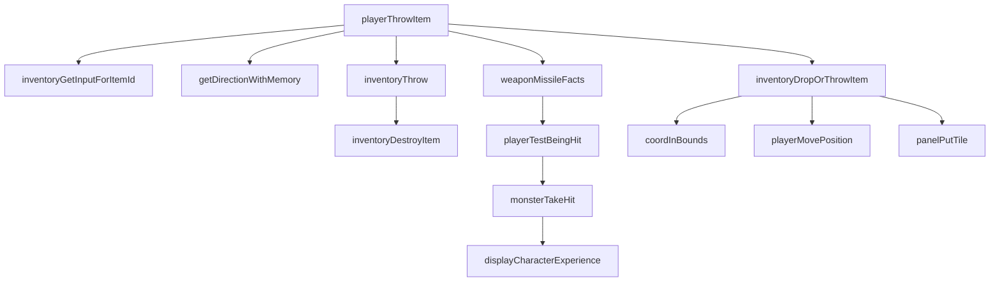
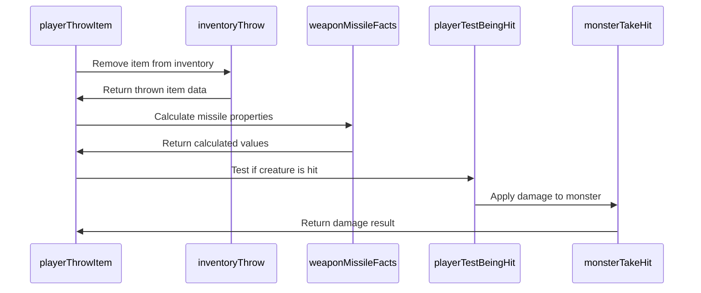

# player_throw_cpp Module Documentation

## Introduction

The `player_throw_cpp` module handles the logic for throwing items in the game. This module implements the core functionality for players to throw items from their inventory, including item handling, missile calculation, and combat mechanics. It integrates with the broader game system through various utility functions and interacts with player state management, inventory systems, and creature combat mechanics.

## Module Overview

This module provides the implementation for the player's ability to throw items, which includes:
- Item selection and removal from inventory
- Calculation of missile properties (damage, hit chance, distance)
- Projectile movement simulation
- Combat resolution when projectiles hit creatures
- Item dropping behavior when projectiles miss or hit walls

## Architecture and Component Relationships

### Core Components

The module consists of four main functions:

1. **`inventoryThrow`** - Handles the removal of items from inventory during throwing
2. **`weaponMissileFacts`** - Calculates missile properties based on item and player attributes
3. **`inventoryDropOrThrowItem`** - Manages item placement when throwing fails
4. **`playerThrowItem`** - Main entry point that orchestrates the entire throwing process

### Data Flow Diagram

### Component Interaction Flow

## Detailed Function Descriptions

### `inventoryThrow` Function

This function handles the removal of items from the player's inventory when they are thrown. It manages both single-item and stackable item scenarios:

- For items with quantity > 1, it reduces the count by 1 and updates the player's weight
- For single items, it completely removes them from inventory using `inventoryDestroyItem`
- Updates player status flags when weight changes occur

### `weaponMissileFacts` Function

Calculates all missile-related properties including:
- Damage calculation using dice rolls and modifiers
- To-hit probability adjustments
- Distance calculations based on strength and item weight
- Special bow effects for different ammunition types

The function applies special rules for bows with different magic properties (misc_use values 1-6) that modify damage, hit chance, and range.

### `inventoryDropOrThrowItem` Function

Handles the placement of thrown items when they don't hit anything:
- Attempts to find a valid drop location within a 3x3 area around the target
- If successful, places the item on the dungeon floor
- If no valid location exists, displays a message indicating the item disappeared
- Uses dungeon lighting and visibility systems for proper rendering

### `playerThrowItem` Function

The main orchestration function that:
1. Validates player has items to throw
2. Gets user input for item selection and direction
3. Handles confusion effects on player actions
4. Calls the throwing sequence with proper parameters
5. Manages the projectile's flight path and combat resolution
6. Handles both successful hits and misses appropriately

## Integration Points

This module integrates with several other system components:

- **[inventory_system](inventory_system.md)** - Uses inventory management functions for item handling
- **[player_system](player_system.md)** - Accesses player stats, equipment, and status flags
- **[combat_system](combat_system.md)** - Utilizes combat testing and damage calculation functions
- **[dungeon_system](dungeon_system.md)** - Interacts with dungeon tiles and coordinate systems
- **[creature_system](creature_system.md)** - Works with monster data and combat resolution

## System Dependencies

The module depends on:
- Game state variables (`py`, `dg`, `game`)
- Configuration constants (`MAX_OPEN_SPACE`, `TV_NOTHING`, etc.)
- Utility functions for random number generation, string formatting, and coordinate operations
- Player equipment and attribute access systems

## Process Flow

The throwing process follows these steps:
1. Player selects an item from inventory
2. Player chooses a direction to throw
3. Item is removed from inventory and prepared for throwing
4. Missile properties are calculated
5. Projectile moves through dungeon tiles
6. Combat resolution occurs when hitting creatures
7. Items are properly placed on the ground when needed

This module forms a critical part of the player's tactical options in combat situations, providing both offensive and utility capabilities through item throwing mechanics.
