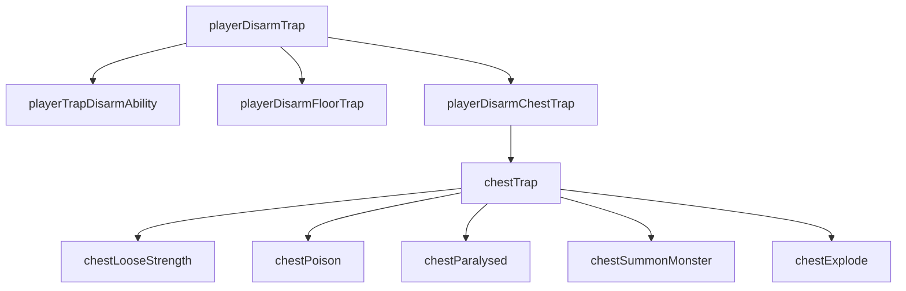
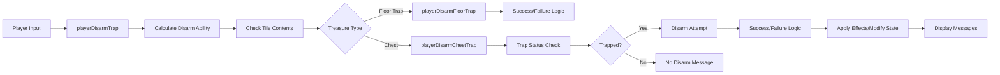

# Player Traps C++ Module Documentation

## Brief Introduction

The `player_traps_cpp` module handles all player-related trap mechanics in the game, including trap disarming capabilities, trap detection, and chest trap activation. This module provides the core logic for players to interact with various types of traps found in the dungeon environment.

## Module Overview

This module contains functions that manage:
- Player trap disarming abilities and success calculations
- Floor trap disarming mechanics
- Chest trap disarming procedures
- Chest trap activation effects
- Trap-related game state modifications

## Architecture and Component Relationships

### Core Components

### Data Flow

## Detailed Function Documentation

### `playerTrapDisarmAbility()`
Calculates the player's trap disarming ability based on:
- Base disarm skill from player.misc.disarm
- Player stat adjustments for wisdom/intelligence
- Class level adjustments
- Environmental factors (blindness, confusion, hallucination)
- Returns final calculated ability score

### `playerDisarmFloorTrap(Coord_t coord, int total, int level, int dir, int16_t misc_use)`
Handles floor trap disarming logic:
- Checks if disarming attempt succeeds
- Updates player experience when successful
- Removes trap from dungeon
- Handles movement and confusion state management
- Displays appropriate messages based on outcome

### `playerDisarmChestTrap(Coord_t coord, int total, Inventory_t &item)`
Manages chest trap disarming:
- Verifies trap identification
- Checks if chest is actually trapped
- Implements disarming success/failure logic
- Handles chest state changes (disarmed/locked)
- Applies trap effects when disarming fails

### `playerDisarmTrap()`
Main entry point for player trap disarming:
- Gets player direction input
- Calculates target coordinates
- Determines treasure type at location
- Routes to appropriate disarming function
- Handles error cases and displays messages

### `chestTrap(Coord_t coord)`
Activates all active chest trap effects:
- Processes multiple trap types simultaneously
- Calls specific effect functions based on trap flags
- Manages game state modifications

### Supporting Functions

#### `chestLooseStrength()`
Applies strength loss and damage from poison needle trap:
- Checks for sustain strength flag
- Decreases player strength randomly
- Inflicts damage and displays messages

#### `chestPoison()`
Applies poison effect from chest trap:
- Inflicts damage from poison needle
- Increases poison timer

#### `chestParalysed()`
Applies paralysis effect from chest trap:
- Checks for free action protection
- Applies paralysis status
- Displays appropriate messages

#### `chestSummonMonster(Coord_t coord)`
Summons monsters from chest trap:
- Creates multiple monster summons around chest location
- Uses monster summoning logic

#### `chestExplode(Coord_t coord)`
Applies explosion effect from chest trap:
- Removes chest from dungeon
- Inflicts damage from explosion

## Integration Points

This module integrates with several other core systems:

- **[player_movement_cpp.md](player_movement_cpp.md)** - Uses movement functions and coordinate calculations
- **[inventory_system_cpp.md](inventory_system_cpp.md)** - Interacts with treasure and inventory management
- **[monster_generation_cpp.md](monster_generation_cpp.md)** - Uses monster summoning functionality
- **[combat_system_cpp.md](combat_system_cpp.md)** - Calls damage calculation and player hit functions
- **[character_stats_cpp.md](character_stats_cpp.md)** - Accesses player stats and status flags

## Game State Management

The module modifies several key game states:
- Player experience points (`py.misc.exp`)
- Player status flags (confusion, blindness, hallucination)
- Player attributes (strength)
- Dungeon tile contents
- Monster positions and states

## Dependencies

This module depends on:
- `headers.h` for standard definitions and includes
- Game state structures (`py`, `dg`, `game`)
- Random number generation functions
- Display and messaging systems
- Core game mechanics like combat and movement

## Error Handling

The module implements robust error handling through:
- Input validation for direction selection
- Checks for valid treasure objects
- Verification of trap status before disarming
- Graceful handling of invalid trap targets
- Proper state restoration during disarming attempts

## Performance Considerations

All functions are designed for efficient execution within the game loop context, with minimal memory allocation and direct access to global game state variables. The module avoids complex data structures and focuses on straightforward procedural logic for optimal performance.
