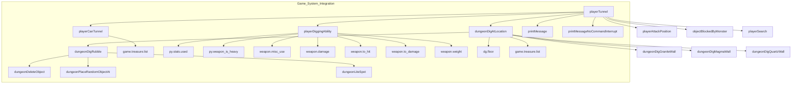
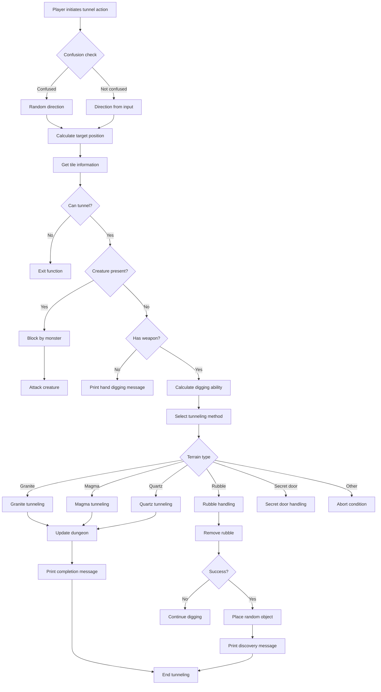

# Player Tunnel C++ Module Documentation

## Brief Introduction

The `player_tunnel_cpp` module implements the core functionality for player tunneling actions within the game world. This module handles the logic for players digging through various types of walls and obstacles, including granite, magma, quartz walls, and rubble. It integrates with the game's inventory system, player attributes, and dungeon generation mechanics to provide realistic tunneling behavior.

## Comprehensive Documentation

### Module Overview

The player tunneling system allows characters to excavate through dungeon walls and obstacles using either equipped tools or bare hands. The system considers player strength, equipment properties, and terrain characteristics to determine tunneling success and effects.

### Key Components

#### Core Functions

1. **playerCanTunnel()** - Validates whether a player can tunnel at a given location
2. **playerDiggingAbility()** - Calculates player's tunneling effectiveness based on attributes and equipment
3. **dungeonDigGraniteWall()** - Handles granite wall tunneling logic
4. **dungeonDigMagmaWall()** - Handles magma wall tunneling logic
5. **dungeonDigQuartzWall()** - Handles quartz wall tunneling logic
6. **dungeonDigRubble()** - Handles rubble removal logic
7. **dungeonDigAtLocation()** - Dispatches tunneling operations based on terrain type
8. **playerTunnel()** - Main entry point for player tunneling actions

### Architecture and Component Relationships

### Data Flow and Process Flow

### Dependencies and Integration Points

The `player_tunnel_cpp` module depends on several core systems:

- **Game State Management**: Accesses `game.treasure.list` for treasure category information
- **Player System**: Uses `py.stats.used`, `py.inventory`, and `py.weapon_is_heavy`
- **Dungeon Generation**: Interacts with `dg.floor` for terrain data
- **Combat System**: Calls `objectBlockedByMonster()` and `playerAttackPosition()`
- **Message System**: Utilizes `printMessage()` and `printMessageNoCommandInterrupt()`
- **Random Number Generation**: Uses `randomNumber()` for probability calculations
- **Object Management**: Interfaces with `dungeonDeleteObject()`, `dungeonPlaceRandomObjectAt()`, and `dungeonLiteSpot()`

### Detailed Function Descriptions

#### playerCanTunnel()
Validates if a player can tunnel through a specific tile. Returns false if:
- The tile is not a valid tunnelable surface (below minimum cave wall)
- The treasure is not empty and is not rubble or secret door

#### playerDiggingAbility()
Calculates the player's tunneling effectiveness:
- Base strength attribute
- Equipment bonuses when using tunneling-capable items
- Weapon damage calculations for non-tunneling items
- Weight considerations for heavy weapons

#### dungeonDigGraniteWall(), dungeonDigMagmaWall(), dungeonDigQuartzWall()
Handle specific wall types with different difficulty levels and success conditions.

#### dungeonDigRubble()
Manages rubble removal with chance-based item discovery.

#### playerTunnel()
Main tunneling interface that coordinates all tunneling activities based on player input and game state.

### System Integration

This module integrates with the broader game architecture through:

1. **Input Processing**: Receives direction input from player controls
2. **State Management**: Updates player and dungeon state during tunneling
3. **Event Handling**: Triggers appropriate messages and visual feedback
4. **Resource Management**: Manages player resources and equipment usage

For detailed information about related systems, see:
- [inventory_system.md](inventory_system.md)
- [player_attributes.md](player_attributes.md)
- [dungeon_generation.md](dungeon_generation.md)
- [combat_system.md](combat_system.md)
- [message_system.md](message_system.md)
