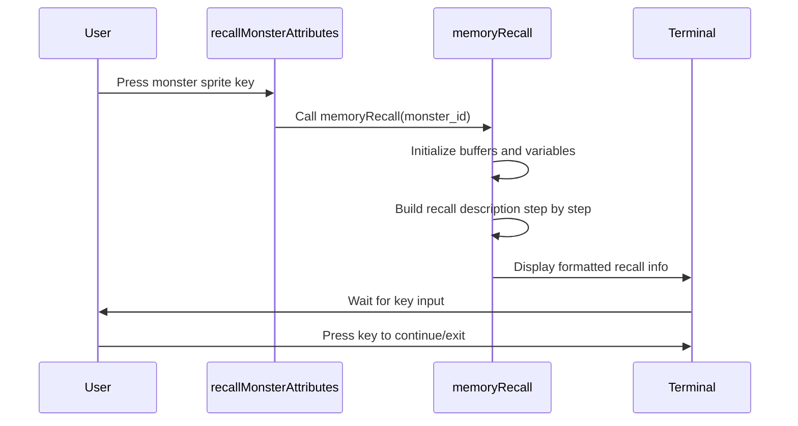
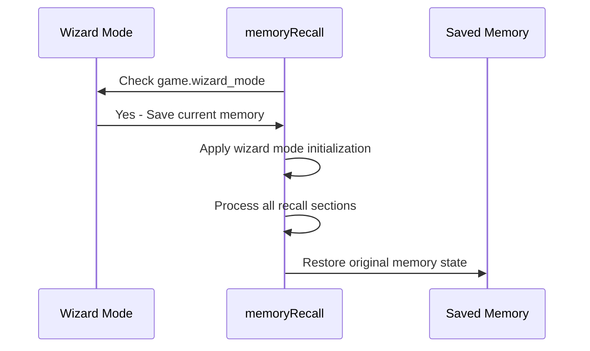

# recall_cpp Module Documentation

## Introduction

The `recall_cpp` module provides functionality for displaying detailed monster information in the game. This module handles the recall system that allows players to examine creature characteristics, behaviors, and combat statistics. The implementation includes various helper functions to format and display monster recall information in a readable manner.

## Architecture Overview

```mermaid
graph TD
    A[recallMonsterAttributes] --> B[memoryRecall]
    B --> C[memoryPrint]
    B --> D[memoryMonsterKnown]
    B --> E[memoryWizardModeInit]
    B --> F[memoryConflictHistory]
    B --> G[memoryDepthFoundAt]
    B --> H[memoryMovement]
    B --> I[memoryKillPoints]
    B --> J[memoryMagicSkills]
    B --> K[memoryKillDifficulty]
    B --> L[memorySpecialAbilities]
    B --> M[memoryWeaknesses]
    B --> N[memoryAwareness]
    B --> O[memoryLootCarried]
    B --> P[memoryAttackNumberAndDamage]
    B --> Q[putStringClearToEOL]
    B --> R[getKeyInput]
    
    subgraph Internal Functions
        C
        D
        E
        F
        G
        H
        I
        J
        K
        L
        M
        N
        O
        P
    end
    
    subgraph Game Interface
        Q
        R
    end
```

## Component Details

### Main Entry Points

#### `recallMonsterAttributes(char command)`
This function serves as the primary interface for recalling monster information. It iterates through all creatures looking for ones matching the specified sprite character and displays their recall information.

**Parameters:**
- `command`: Character representing the creature sprite to recall

**Process Flow:**
1. Iterates through all creatures in reverse order
2. Finds creatures matching the command character
3. Checks if monster is known using `memoryMonsterKnown`
4. Prompts user confirmation before displaying recall
5. Calls `memoryRecall` for each matching creature
6. Handles escape key to exit early

#### `memoryRecall(int monster_id)`
Main function that formats and displays detailed monster recall information.

**Parameters:**
- `monster_id`: Index of creature in creatures list

**Key Operations:**
1. Initializes recall buffer and line counter
2. Combines memory and creature data for display
3. Calls various helper functions to build the recall description
4. Displays formatted information using terminal output functions
5. Handles wizard mode special cases

### Helper Functions

#### `memoryPrint(const char *p)`
Handles printing text to the recall buffer with automatic line wrapping.

**Features:**
- Automatic word wrapping when buffer fills
- Line breaking at newline characters
- Buffer management for text display

#### `memoryMonsterKnown(Recall_t const &memory)`
Determines if a monster's information should be displayed based on player knowledge.

**Logic:**
- Always returns true in wizard mode
- Returns true if any monster attributes are known
- Checks movement, defenses, kills, spells, deaths, and attacks

#### `memoryWizardModeInit(Recall_t &memory, Creature_t const &creature)`
Initializes memory data for wizard mode display.

**Operations:**
- Sets kills to maximum value
- Processes movement flags for display
- Handles spell frequency flags
- Sets all attack values to maximum

#### `memoryConflictHistory(uint16_t deaths, uint16_t kills)`
Displays information about monster conflicts and battles.

#### `memoryDepthFoundAt(uint8_t level, uint16_t kills)`
Shows where monsters are typically found based on depth.

#### `memoryMovement(uint32_t rc_move, int monster_speed, bool is_known)`
Formats movement behavior descriptions.

#### `memoryKillPoints(uint16_t creature_defense, uint16_t monster_exp, uint8_t level)`
Calculates and displays points earned for killing a monster.

#### `memoryMagicSkills(uint32_t memory_spell_flags, uint32_t monster_spell_flags, uint32_t creature_spell_flags)`
Displays magical abilities and resistances.

#### `memoryKillDifficulty(Creature_t const &creature, uint32_t monster_kills)`
Shows difficulty factors for killing monsters.

#### `memorySpecialAbilities(uint32_t move)`
Displays special monster abilities like invisibility.

#### `memoryWeaknesses(uint32_t defense)`
Shows monster weaknesses to specific damage types.

#### `memoryAwareness(Creature_t const &creature, Recall_t const &memory)`
Describes monster awareness levels and detection ranges.

#### `memoryLootCarried(uint32_t creature_move, uint32_t memory_move)`
Displays information about monster loot carrying habits.

#### `memoryAttackNumberAndDamage(Recall_t const &memory, Creature_t const &creature)`
Formats attack methods and damage information.

## Data Structures

### Global Variables
- `creature_recall[MON_MAX_CREATURES]`: Array storing monster recall data
- `roff_buffer`: Buffer for formatted text output
- `roff_buffer_pointer`: Current position in output buffer
- `roff_print_line`: Current line number for display

### Constants
- `plural(c, ss, sp)`: Macro for singular/plural text formatting
- `knowdamage(l, a, d)`: Macro for damage knowledge calculation

## Dependencies

This module depends on:
- [headers.h](headers.md): Contains global definitions and includes
- [config::monsters](config_monsters.md): Monster configuration constants
- [creatures_list](creatures_list.md): Creature database
- Terminal I/O functions: `putStringClearToEOL`, `getKeyInput`, `terminalSaveScreen`, `terminalRestoreScreen`
- Input handling functions: `getInputConfirmationWithAbort`, `eraseLine`

## Integration Points

The recall system integrates with:
- [game_state](game_state.md): Accesses `game.wizard_mode` flag
- [player_info](player_info.md): Uses player level for calculations
- [terminal_interface](terminal_interface.md): Handles screen output and input
- [input_handler](input_handler.md): Manages user input during recall

## Process Flows

### Monster Recall Display Process

### Wizard Mode Processing

## Key Features

1. **Conditional Display**: Only shows information that the player knows about
2. **Wizard Mode**: Special display mode showing all monster information
3. **Text Formatting**: Automatic line wrapping and word breaking
4. **Statistical Calculations**: Points, difficulty, and probability calculations
5. **User Interaction**: Confirmation prompts and pause functionality
6. **Comprehensive Coverage**: All aspects of monster behavior and characteristics

## Usage Examples

The module is typically invoked when a player presses a creature sprite key (e.g., 'g' for goblins) to view detailed monster information. The system automatically determines what information is available based on player experience and displays it in a structured, readable format.

## Performance Considerations

- Uses static buffers to minimize dynamic allocation
- Efficient bit flag checking for monster properties
- Early termination when appropriate (e.g., escape key)
- Minimal memory footprint for recall data storage

## Error Handling

The module handles edge cases such as:
- Empty attack arrays
- Zero damage values
- Maximum value displays
- Buffer overflow prevention
- Invalid index handling
