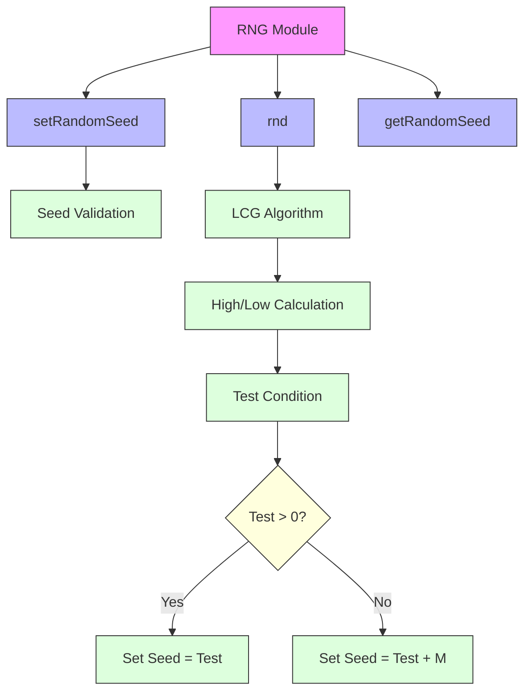
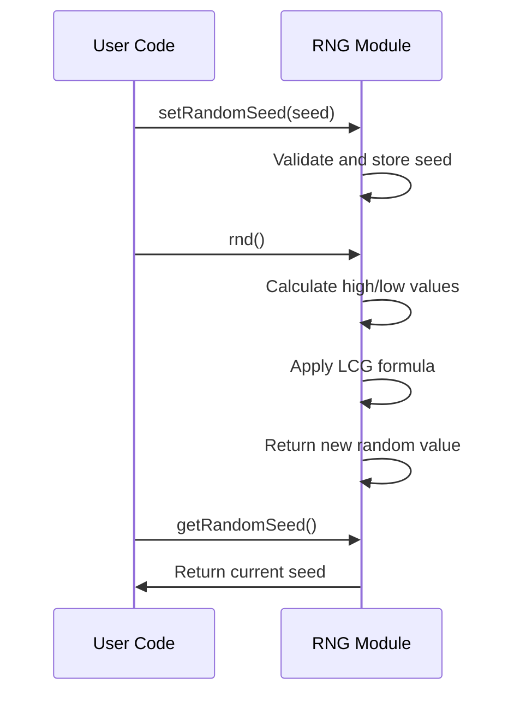

# rng_cpp Module Documentation

## Brief Introduction

The `rng_cpp` module implements a linear congruential generator (LCG) random number generator algorithm. This module provides functions for seeding the random number generator and generating pseudo-random integers using the Park-Miller algorithm. The implementation follows the classic LCG formula with carefully chosen constants to ensure good statistical properties and a long period.

## Core Functionality

The module exposes three primary functions:

1. **getRandomSeed()** - Returns the current random seed value
2. **setRandomSeed(uint32_t seed)** - Sets the random seed with proper validation
3. **rnd()** - Generates the next random number in the sequence

The implementation uses the classic Park-Miller parameters where:
- Modulus M = INT_MAX
- Multiplier A = 16807
- Quotient Q = M / A
- Remainder R = M % A

## Architecture and Component Relationships



## Data Flow



## Implementation Details

### Constants
The module defines four key constants:
- `RNG_M` - Modulus value (INT_MAX)
- `RNG_A` - Multiplier value (16807)
- `RNG_Q` - Quotient (M/A)
- `RNG_R` - Remainder (M%A)

These constants are chosen to satisfy the requirements for a good LCG implementation with maximum period.

### Seed Management
The `setRandomSeed` function ensures the seed is within valid range by:
1. Taking modulo with (RNG_M - 1)
2. Adding 1 to ensure non-zero seed
3. Casting to uint32_t for storage

### Random Number Generation
The `rnd()` function implements the Park-Miller algorithm:
1. Calculates high and low parts of current seed
2. Computes test value using LCG formula
3. Adjusts result based on comparison with zero
4. Updates internal seed and returns result

## Integration Points

This module integrates with other system components through:
- **System Initialization**: Requires seed setting during startup
- **Game Logic**: Provides random numbers for game mechanics
- **Testing Framework**: Includes test harness for verification

For detailed integration patterns, see [system_init.md](system_init.md) and [game_logic.md](game_logic.md).

## Dependencies

The module depends on:
- Standard C++ headers (`headers.h`) which includes standard library components
- Integer type definitions (int32_t, uint32_t)
- Standard I/O for testing purposes

## Testing

The module includes built-in testing capability when compiled with `TEST_RNG` flag:

```cpp
#ifdef TEST_RNG
main() {
    setRandomSeed(0L);
    // Generate 10000 numbers
    for (int32_t i = 1; i < 10000; i++) {
        (void) rnd();
    }
    // Verify specific output
    int32_t random = rnd();
    // Expected: 1043618065
}
#endif
```

## Performance Considerations

The implementation is optimized for:
- Single integer operations
- Minimal memory usage
- Fast execution time
- Predictable behavior

## Security Notes

This is a deterministic pseudo-random number generator suitable for games and simulations but NOT suitable for cryptographic applications due to:
- Predictable sequence from known seed
- Linear nature of the algorithm
- No entropy source

For security-sensitive applications, consider using cryptographically secure random number generators from [crypto_lib.md](crypto_lib.md).

## Configuration Options

The module supports conditional compilation with `TEST_RNG` flag for unit testing purposes only. No runtime configuration options are available.

## Version History

- v1.0: Initial implementation with Park-Miller algorithm
- v1.1: Added seed validation and improved documentation

## See Also

- [system_init.md](system_init.md) - System initialization requirements
- [game_logic.md](game_logic.md) - Game logic that uses random numbers
- [testing_framework.md](testing_framework.md) - Testing infrastructure for random number generation
