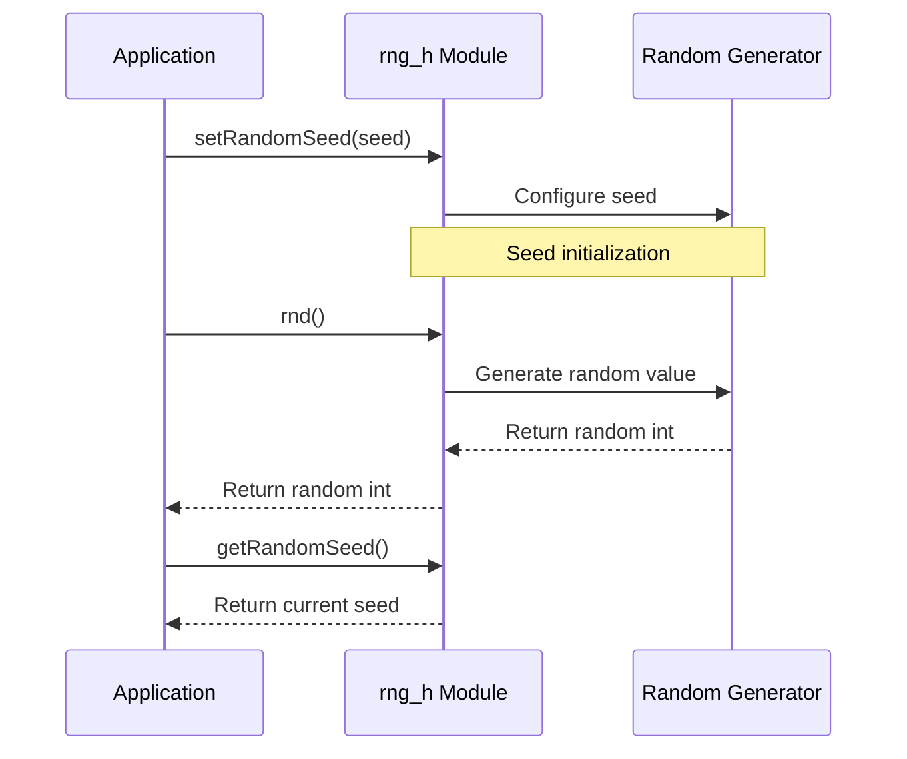

# rng_h Module Documentation

## Brief Introduction

The `rng_h` module provides a simple interface for generating pseudo-random numbers within the system. This module serves as a foundational component for applications requiring random number generation capabilities, offering basic functions for seeding and generating random values.

## Module Overview

The `rng_h` module exposes three key functions through its header file `rng.h`:

- `getRandomSeed()`: Retrieves the current random seed value
- `setRandomSeed(uint32_t seed)`: Sets a new seed value for the random number generator
- `rnd()`: Generates and returns a pseudo-random integer value

This module acts as a wrapper around underlying random number generation logic, providing a clean interface for other components to utilize randomization features.

## Architecture and Component Relationships

```mermaid
graph TD
    A[Application Layer] --> B[rng_h Module]
    B --> C[Random Number Generator Backend]
    D[System Initialization] --> E[setRandomSeed()]
    F[External Source] --> E
    G[getRandomSeed()] --> H[Seed Storage]
    I[rnd()] --> C
    C --> J[Random Value Generation]
```

The `rng_h` module interfaces with the system's random number generation backend while maintaining separation of concerns. It provides a clean abstraction layer that allows applications to generate random numbers without direct access to implementation details.

## Data Flow



The data flow demonstrates how the module handles seed management and random value generation through a well-defined sequence of operations.

## Integration Points

The `rng_h` module integrates with several other system components:

- **System Initialization**: The module requires proper seed initialization during system startup
- **Game Logic**: Applications requiring random events or procedural generation
- **Cryptographic Services**: May be used as part of broader security implementations (refer to [crypto](crypto.md) module)
- **Testing Framework**: Essential for unit testing requiring reproducible random sequences

## Implementation Details

### Function Descriptions

1. **`uint32_t getRandomSeed()`**
   - Returns the current seed value used by the random number generator
   - Useful for debugging and ensuring reproducible results

2. **`void setRandomSeed(uint32_t seed)`**
   - Configures the random number generator with a specified seed
   - Enables deterministic behavior when needed

3. **`int32_t rnd()`**
   - Generates and returns a pseudo-random signed 32-bit integer
   - Provides the primary interface for random number generation

## Usage Examples

```c
// Initialize with a known seed for reproducible results
setRandomSeed(12345);

// Generate random numbers
int32_t randomValue = rnd();
int32_t anotherRandom = rnd();

// Retrieve current seed
uint32_t currentSeed = getRandomSeed();
```

## Dependencies

This module depends on:
- System time functions for initial seed generation (typically implemented in [time](time.md) module)
- Memory management for seed storage (handled by [memory](memory.md) module)

## Security Considerations

For cryptographic purposes, this module should not be used directly. Applications requiring cryptographically secure random numbers should use the [crypto](crypto.md) module instead.

## Related Modules

- [crypto](crypto.md): For cryptographically secure random number generation
- [time](time.md): For system time-based seed generation
- [memory](memory.md): For memory management related to seed storage

## Performance Characteristics

The module provides O(1) time complexity for all operations, making it suitable for performance-critical applications where random number generation is frequently required.
