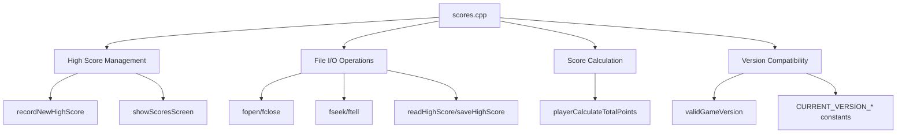
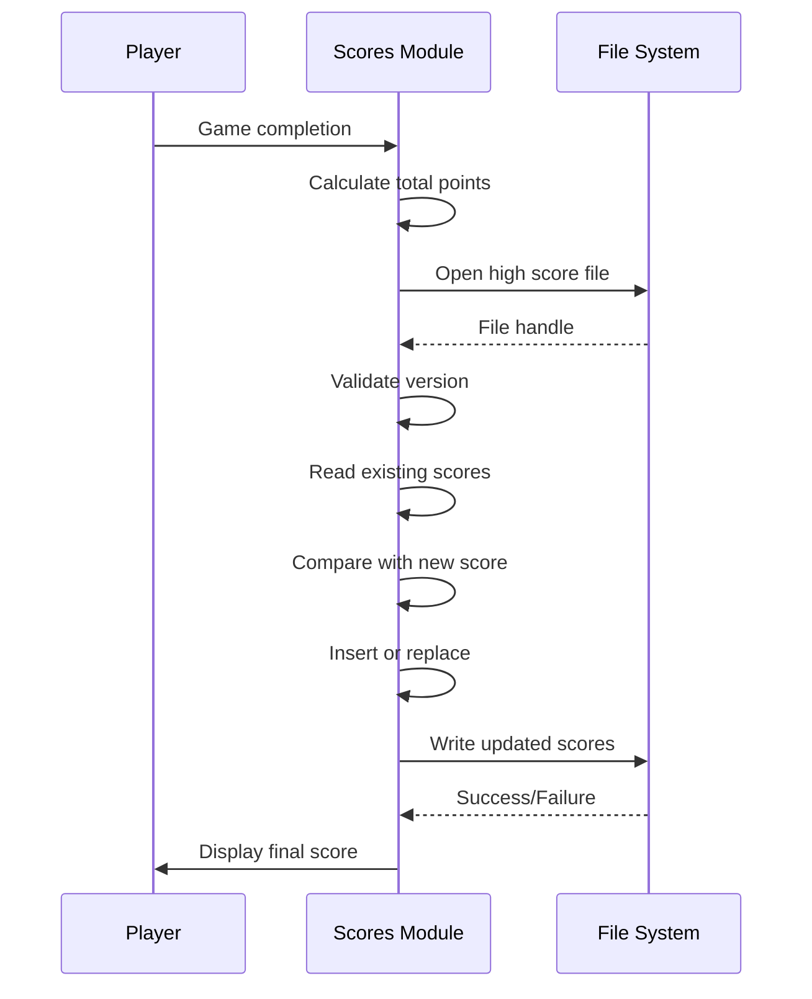

# scores_cpp Module Documentation

## Introduction

The `scores_cpp` module handles high score management for the game, including recording new high scores and displaying existing high scores. This module manages the persistence of player achievements through file I/O operations and implements logic for determining score rankings and handling duplicate entries.

## Architecture Overview



## Component Details

### Core Functions

#### `recordNewHighScore()`
This function records a new high score when a player completes a game. It performs several key operations:

1. **Validation Checks**: 
   - Skips recording if `game.noscore` is set
   - Handles panic save files appropriately
   - Validates game version compatibility

2. **Data Collection**:
   - Calculates total points using `playerCalculateTotalPoints()`
   - Gathers player statistics including level, dungeon depth, race, class, etc.
   - Processes death cause information from `game.character_died_from`

3. **File Management**:
   - Opens high score file in read/write mode
   - Handles version checking and file initialization
   - Implements ranking logic to determine where new score fits

4. **Ranking Logic**:
   - Compares new score against existing scores
   - Prevents duplicate entries for same player characteristics
   - Maintains maximum of `MAX_HIGH_SCORE_ENTRIES` entries

#### `showScoresScreen()`
Displays the current high score list to the player:

1. **File Access**:
   - Opens high score file in read-only mode
   - Performs version validation
   - Sets up file pointer for reading

2. **Display Logic**:
   - Reads and formats high score entries
   - Displays scores in pages of 20 entries
   - Provides navigation with key input
   - Shows formatted table with rank, points, name, gender, race, class, level, and death cause

#### `playerCalculateTotalPoints()`
Calculates the total points for a player's score:

```cpp
int32_t playerCalculateTotalPoints() {
    int32_t total = py.misc.max_exp + (100 * py.misc.max_dungeon_depth);
    total += py.misc.au / 100;

    for (auto &item : py.inventory) {
        total += storeItemValue(item);
    }

    total += dg.current_level * 50;

    if (py.max_score > total) {
        return py.max_score;
    }

    return total;
}
```

## Data Flow



## Dependencies

This module depends on:
- [headers.h](headers.md): Core game headers and definitions
- [version.h](version.md): Version control and compatibility functions
- [config::files::scores](config.md): Configuration for score file location
- [py](player.md): Player data structures and access
- [dg](dungeon.md): Dungeon information
- [game](game.md): Game state variables
- [character_races](races.md): Race information
- [classes](classes.md): Class information
- [storeItemValue](store.md): Item value calculation

## Integration Points

### Input/Output Handling
The module interfaces with the file system through standard C library functions (`fopen`, `fclose`, `fseek`, `ftell`) and custom file pointer management functions.

### Game State Integration
- Uses `py.misc` for player statistics
- Accesses `dg.current_level` for dungeon depth
- References `game.noscore` and `panic_save` flags
- Interacts with `game.character_died_from` for death cause information

### Version Management
The module includes robust version checking to ensure compatibility between different versions of the game data format.

## Error Handling

The module implements several error handling mechanisms:
1. File opening failures are reported to the user
2. Version mismatch detection prevents corruption
3. Duplicate entry prevention avoids invalid score entries
4. Boundary checks prevent exceeding maximum score entries

## Performance Considerations

1. **File I/O Optimization**: Uses efficient seek operations to navigate the score file
2. **Memory Usage**: Minimal memory allocation during normal operation
3. **Processing Efficiency**: Linear scan through existing scores for ranking
4. **Disk Access**: Minimizes file operations by maintaining single file handle

## Security Considerations

1. **Input Validation**: Validates all data read from score files
2. **Buffer Safety**: Uses safe string operations (`strcpy`, `snprintf`)
3. **File Permissions**: Proper file access modes for security
4. **Version Checking**: Prevents corruption from incompatible data formats

## Related Modules

- [config](config.md): Configuration management for file paths
- [player](player.md): Player data structures and calculations
- [dungeon](dungeon.md): Dungeon level information
- [game](game.md): Game state management
- [version](version.md): Version compatibility checking
- [store](store.md): Item value calculations for scoring
