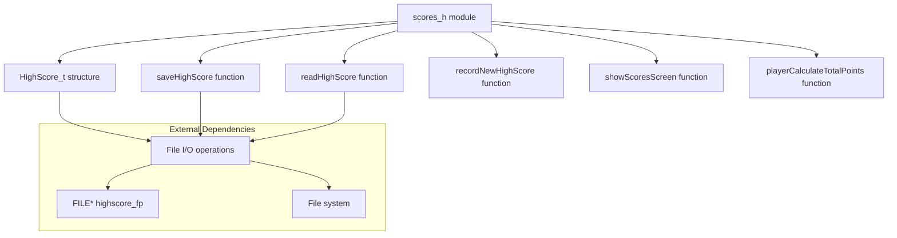
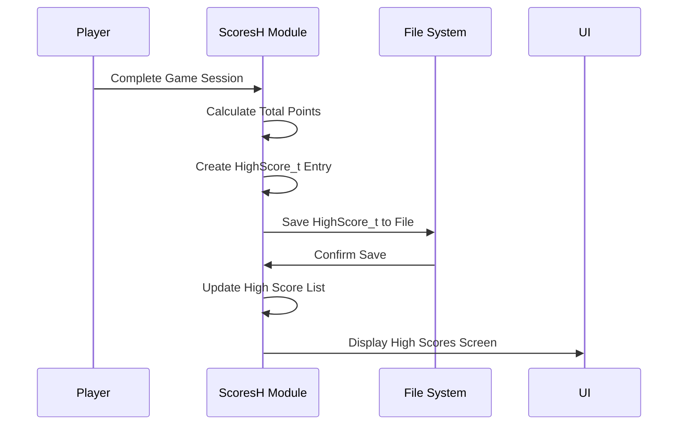

# scores_h Module Documentation

## Brief Introduction

The `scores_h` module provides the interface and core functionality for managing high scores in the game. It defines the data structure for high score entries and declares functions for saving, reading, and displaying high scores. This module serves as the foundation for the game's scoring system and maintains persistent records of player achievements.

## Module Overview

The `scores_h` module consists of a single header file (`scores.h`) that defines the high score data structure and declares the necessary functions for high score management. It interfaces with the file system through a global file pointer to persistently store high score data.

### Data Structure

The `HighScore_t` structure represents a single high score entry with the following fields:

- **points**: Total points earned by the player
- **birth_date**: Player's birth date (timestamp)
- **uid**: Unique identifier for the player
- **mhp**: Maximum hit points
- **chp**: Current hit points
- **dungeon_depth**: Current dungeon depth reached
- **level**: Player's current level
- **deepest_dungeon_depth**: Deepest dungeon level achieved
- **gender**: Player's gender
- **race**: Player's race
- **character_class**: Player's class
- **name**: Player's name (fixed size array)
- **died_from**: Cause of death (fixed size array)

### Constants

- `MAX_HIGH_SCORE_ENTRIES`: Maximum number of high score entries (1000)

### Global Variables

- `highscore_fp`: External file pointer for high score file operations

## Component Relationships

## Architecture and Integration

The `scores_h` module integrates with several other system components:

## Data Flow

## Function Descriptions

### saveHighScore
Saves a high score entry to the persistent storage file.

### readHighScore
Reads a high score entry from the persistent storage file.

### recordNewHighScore
Processes and records a new high score entry after game completion.

### showScoresScreen
Displays the current high scores screen to the player.

### playerCalculateTotalPoints
Calculates the total points earned by the player during gameplay.

## Module Dependencies

This module depends on:
- [player](player.md) - For player-related data structures and constants like `PLAYER_NAME_SIZE`
- [file_io](file_io.md) - For file handling operations
- [ui](ui.md) - For displaying the high scores screen

## Implementation Details

The module uses a fixed-size array for player names (`PLAYER_NAME_SIZE`) which should be defined in the player module. The high score data is stored in binary format for efficient access and storage.

## Security Considerations

The module handles sensitive player data including names and scores. All file operations should be properly secured to prevent unauthorized access or modification of high score data.

## Performance Notes

- The maximum number of entries is limited to 1000 for memory management
- Binary file operations provide fast read/write performance
- The structure is designed for minimal memory footprint during operations

## Related Modules

For complete game scoring functionality, see:
- [game_core](game_core.md) - Main game loop integration
- [player](player.md) - Player data management
- [ui](ui.md) - User interface for score display

## Future Enhancements

Potential improvements could include:
- Database backend support for larger score databases
- Network synchronization for online leaderboards
- Enhanced security measures for preventing score manipulation
- Additional sorting and filtering options for score displays
