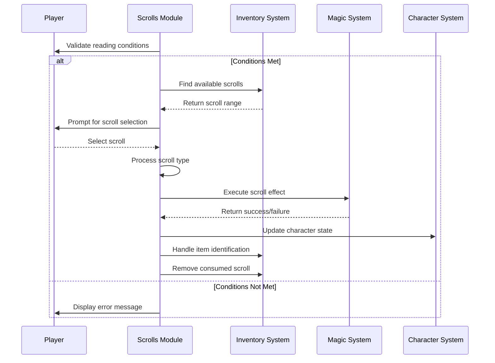

# scrolls_cpp Module Documentation

## Introduction

The `scrolls_cpp` module handles the functionality related to reading scrolls in the game. This module contains the core logic for processing scroll usage, including validation checks, scroll effects, and item management. It interfaces with various game systems such as inventory management, player status tracking, monster summoning, and spell casting.

## Module Overview

The module implements the `scrollRead()` function which serves as the main entry point for scroll usage. It validates player conditions, selects a scroll from inventory, processes the scroll's magical effect, and manages item destruction or identification.

## Architecture and Component Relationships

```mermaid
graph TD
    A[scrollRead()] --> B[playerCanReadScroll()]
    A --> C[inventoryGetInputForItemId()]
    B --> D[py.flags.blind]
    B --> E[py.flags.confused]
    B --> F[py.pack.unique_items]
    B --> G[inventoryFindRange()]
    C --> H[Inventory Selection]
    A --> I[Scroll Processing Loop]
    I --> J[getAndClearFirstBit()]
    I --> K[Scroll Type Switch]
    K --> L[scrollEnchantWeaponToHit]
    K --> M[scrollEnchantWeaponToDamage]
    K --> N[scrollEnchantItemToAC]
    K --> O[scrollIdentifyItem]
    K --> P[scrollRemoveCurse]
    K --> Q[spellLightArea]
    K --> R[scrollSummonMonster]
    K --> S[playerTeleport]
    K --> T[scrollTeleportLevel]
    K --> U[scrollConfuseMonster]
    K --> V[spellMapCurrentArea]
    K --> W[monsterSleep]
    K --> X[spellWardingGlyph]
    K --> Y[spellDetectTreasureWithinVicinity]
    K --> Z[spellDetectObjectsWithinVicinity]
    K --> AA[spellDetectTrapsWithinVicinity]
    K --> AB[spellDetectSecretDoorssWithinVicinity]
    K --> AC[spellMassGenocide]
    K --> AD[spellDetectInvisibleCreaturesWithinVicinity]
    K --> AE[spellAggravateMonsters]
    K --> AF[spellSurroundPlayerWithTraps]
    K --> AG[spellDestroyAdjacentDoorsTraps]
    K --> AH[spellSurroundPlayerWithDoors]
    K --> AI[spellRechargeItem]
    K --> AJ[spellGenocide]
    K --> AK[spellDarkenArea]
    K --> AL[playerProtectEvil]
    K --> AM[spellCreateFood]
    K --> AN[spellDispelCreature]
    K --> AO[scrollEnchantWeapon]
    K --> AP[scrollCurseWeapon]
    K --> AQ[scrollEnchantArmor]
    K --> AR[scrollCurseArmor]
    K --> AS[scrollSummonUndead]
    K --> AT[playerBless]
    K --> AU[scrollWordOfRecall]
    K --> AV[spellDestroyArea]
    I --> AW[itemSetColorlessAsIdentified]
    I --> AX[itemIdentify]
    I --> AY[itemSetAsTried]
    I --> AZ[inventoryDestroyItem]
```

## Data Flow and Process Flow

### Main Scroll Reading Process



## Key Components and Functions

### Core Validation Functions

#### `playerCanReadScroll()`
Validates whether the player can read a scroll based on:
- Blindness status
- Light availability
- Confusion status
- Inventory contents
- Presence of scrolls

### Equipment Management

#### `inventoryItemIdOfCursedEquipment()`
Identifies a random cursed equipment item worn by the player for enchantment/cursing effects.

### Scroll Effect Handlers

#### Enchantment Functions
- `scrollEnchantWeaponToHit()`: Enhances weapon hit bonus
- `scrollEnchantWeaponToDamage()`: Enhances weapon damage bonus
- `scrollEnchantItemToAC()`: Enhances armor class
- `scrollEnchantWeapon()`: Comprehensive weapon enchantment
- `scrollEnchantArmor()`: Comprehensive armor enchantment

#### Curse Functions
- `scrollCurseWeapon()`: Applies curses to weapons
- `scrollCurseArmor()`: Applies curses to armor

#### Special Effects
- `scrollIdentifyItem()`: Identifies items
- `scrollRemoveCurse()`: Removes curses from all worn items
- `scrollSummonMonster()`: Summons monsters
- `scrollSummonUndead()`: Summons undead creatures
- `scrollTeleportLevel()`: Teleports player to different level
- `scrollConfuseMonster()`: Grants monster confusion ability
- `scrollWordOfRecall()`: Sets word of recall flag

## Integration Points

This module integrates with several other system components:

- **[inventory](inventory.md)**: For inventory management and item selection
- **[player](player.md)**: For player status checks and modifications
- **[spells](spells.md)**: For spell execution functions
- **[monsters](monsters.md)**: For monster summoning and effects
- **[items](items.md)**: For item identification and management

## Dependencies

The module depends on:
- `headers.h`: Standard game headers
- `inventoryFindRange()`: Inventory range finding function
- `inventoryGetInputForItemId()`: Item selection interface
- Various spell functions from the spells module
- Monster summoning functions from the monsters module
- Player status and attribute functions

## Error Handling

The module includes comprehensive error handling through:
- Player condition validation
- Item existence checks
- Scroll type validation
- Success/failure tracking for effects
- Proper cleanup of resources when operations fail

## Usage Patterns

The typical usage pattern involves:
1. Calling `scrollRead()` to initiate scroll reading
2. Validating player readiness conditions
3. Selecting a scroll from inventory
4. Processing the scroll's magical effect
5. Updating player state and inventory accordingly
6. Handling item identification or destruction

This module forms a critical part of the game's magic system, providing players with powerful tools for combat, exploration, and character enhancement through scroll usage.
