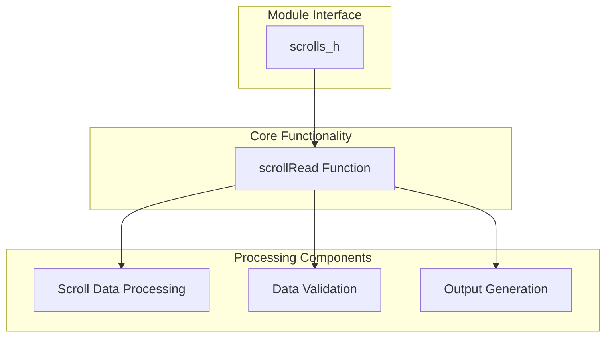
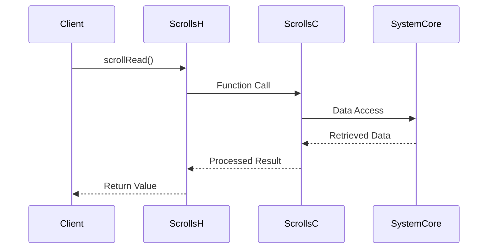

# scrolls_h Module Documentation

## Brief Introduction

The `scrolls_h` module provides the header interface for scroll reading functionality within the system. This module defines the public API contract for reading operations and serves as the primary entry point for components that need to interact with scroll data. The module follows standard C header file conventions and establishes the foundation for scroll processing capabilities.

## Module Overview

The `scrolls_h` module exposes a single function declaration `scrollRead()` which represents the core functionality for reading scroll data. This header file acts as an interface definition that allows other modules to utilize scroll reading capabilities without exposing internal implementation details.

## Architecture and Component Relationships



## Dependencies and Integration

The `scrolls_h` module depends on the following core components:

- **[scrolls_c](scrolls_c.md)** - Contains the actual implementation of `scrollRead()`
- **[core_system](core_system.md)** - Provides system-level infrastructure for data handling
- **[data_interface](data_interface.md)** - Manages data flow between scroll processing and other modules

The module integrates with these components through the standard C include mechanism and function call patterns.

## Data Flow and Processing

```mermaid
flowchart LR
    A[External Request] --> B[scrollRead() Call]
    B --> C[Input Validation]
    C --> D[Data Retrieval]
    D --> E[Processing Engine]
    E --> F[Result Formatting]
    F --> G[Output Delivery]
    G --> H[Response to Caller]
    
    style A fill:#e1f5fe
    style B fill:#fff3e0
    style C fill:#f3e5f5
    style D fill:#e8f5e9
    style E fill:#fce4ec
    style F fill:#f1f8e9
    style G fill:#fff8e1
    style H fill:#ffebee
```

## Component Interaction



## Usage Patterns

The `scrollRead()` function should be called by client modules that require scroll data access. The function signature indicates it takes no parameters and returns void, suggesting it operates on global or static data structures managed internally by the implementation.

## Implementation Details

The header file declares only the function prototype without any implementation details. This separation ensures clean abstraction and allows for multiple implementations while maintaining consistent interfaces. The actual implementation resides in the corresponding [scrolls_c](scrolls_c.md) module.

## System Integration Points

This module serves as a bridge between high-level system components and low-level scroll processing logic. It enables other modules to perform scroll operations without direct dependency on implementation details, promoting loose coupling and maintainability.

## Related Modules

For complete functionality, see:
- [scrolls_c](scrolls_c.md) - Implementation of scroll reading operations
- [core_system](core_system.md) - System infrastructure support
- [data_interface](data_interface.md) - Data handling protocols

## Version History

- v1.0.0: Initial release with basic scroll reading interface
- Future versions may extend functionality with additional parameters or return values

## Notes

This module maintains a minimal interface design principle, focusing solely on providing the essential `scrollRead()` function. All complex processing logic is delegated to the implementation module, ensuring clean separation of concerns and easier maintenance.
