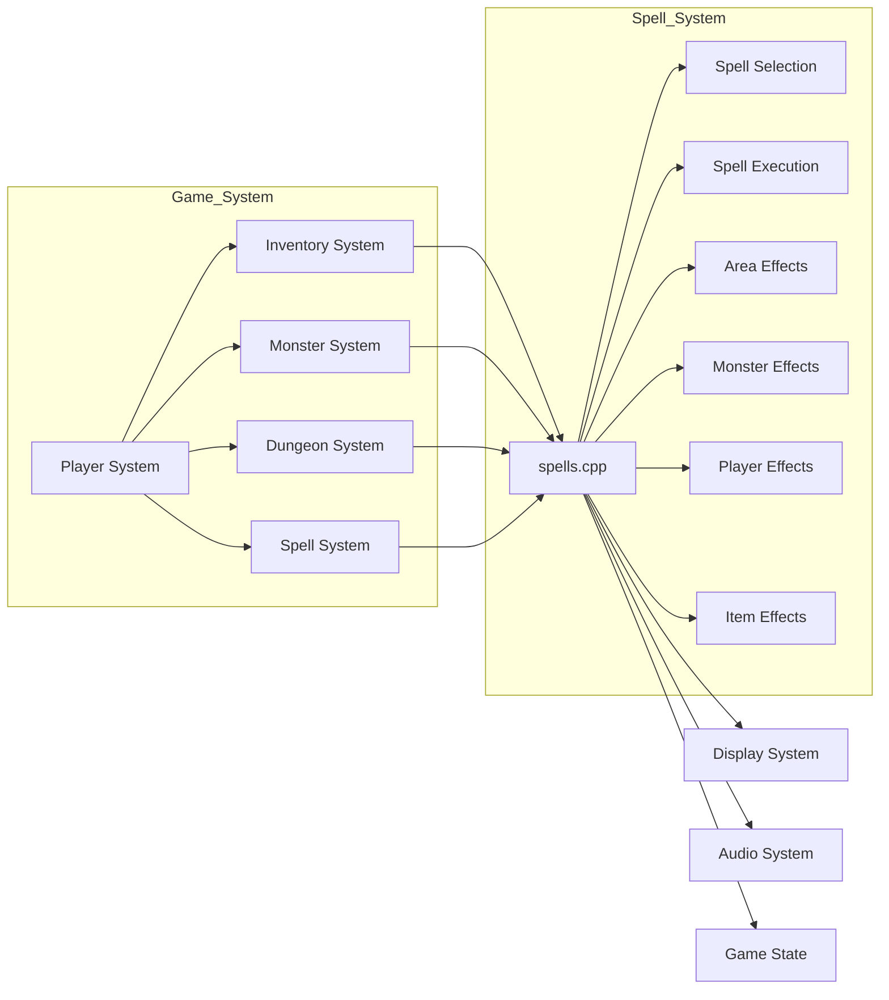

# spells_cpp Module Documentation

## Brief Introduction

The `spells_cpp` module provides the core implementation for spell casting mechanics within the Moria game system. This module handles spell selection, execution, and various magical effects including combat spells, utility spells, and area-of-effect abilities. It interfaces with the game's inventory system, monster management, and dungeon generation components to provide a comprehensive spellcasting experience.

## Module Architecture

```mermaid
graph TD
    A[spells.cpp] --> B[Spell Selection System]
    A --> C[Spell Execution Engine]
    A --> D[Area Effect Spells]
    A --> E[Monster Interaction Spells]
    A --> F[Player Status Effects]
    A --> G[Item Manipulation Spells]
    
    B --> B1[spellGetId]
    B --> B2[castSpellGetId]
    
    C --> C1[spellLightArea]
    C --> C2[spellDarkenArea]
    C --> C3[spellStarlite]
    C --> C4[spellLightLine]
    
    D --> D1[spellFireBall]
    D --> D2[spellBreath]
    D --> D3[spellDestroyArea]
    D --> D4[spellEarthquake]
    
    E --> E1[spellSleepMonster]
    E --> E2[spellConfuseMonster]
    E --> E3[spellSpeedMonster]
    E --> E4[spellDrainLifeFromMonster]
    
    F --> F1[spellChangePlayerHitPoints]
    F --> F2[spellLoseSTR]
    F --> F3[spellLoseINT]
    F --> F4[spellLoseWIS]
    F --> F5[spellLoseDEX]
    F --> F6[spellLoseCON]
    F --> F7[spellLoseCHR]
    F --> F8[spellLoseEXP]
    F --> F9[spellSlowPoison]
    
    G --> G1[spellRechargeItem]
    G --> G2[spellIdentifyItem]
    G --> G3[spellEnchantItem]
    G --> G4[spellRemoveCurseFromAllWornItems]
```

## Core Components and Functionality

### Spell Selection System

The spell selection system provides the user interface for choosing spells from available options:

- **spellGetId**: Handles the menu selection logic for spells, supporting both uppercase and lowercase input
- **castSpellGetId**: Main entry point for spell casting that validates spell availability and mana requirements

### Spell Execution Engine

Core spell execution functions that implement various magical effects:

- **spellLightArea**: Creates a light source around a coordinate
- **spellDarkenArea**: Darkens areas around a coordinate
- **spellStarlite**: Creates a starlight effect in all directions
- **spellLightLine**: Implements line-of-sight lighting effects

### Area Effect Spells

Functions that affect multiple targets or areas:

- **spellFireBall**: Implements fireball spell with area damage
- **spellBreath**: Breath weapon attacks affecting multiple creatures
- **spellDestroyArea**: Destroys an area around a point
- **spellEarthquake**: Causes ground shaking with destruction effects

### Monster Interaction Spells

Spells that directly interact with monsters:

- **spellSleepMonster**: Puts monsters to sleep
- **spellConfuseMonster**: Confuses monsters temporarily
- **spellSpeedMonster**: Alters monster movement speed
- **spellDrainLifeFromMonster**: Drains life from monsters

### Player Status Effects

Spells that modify player attributes and status:

- **spellChangePlayerHitPoints**: Heals or damages player
- **spellLoseSTR/WIS/INT/DEX/CON/CHR**: Randomly reduces player attributes
- **spellLoseEXP**: Reduces player experience points
- **spellSlowPoison**: Reduces poison duration

### Item Manipulation Spells

Spells that affect inventory items:

- **spellRechargeItem**: Recharges staves and wands
- **spellIdentifyItem**: Identifies items in inventory
- **spellEnchantItem**: Attempts to enchant items
- **spellRemoveCurseFromAllWornItems**: Removes curses from equipped items

## Data Flow and Dependencies

## Component Interactions

### Spell Selection Process

1. User initiates spell casting through inventory
2. `castSpellGetId` validates available spells based on character class and level
3. `spellGetId` presents spell menu with character-based selection
4. Input validation ensures proper spell choice and confirmation
5. Spell execution proceeds with appropriate parameters

### Spell Execution Flow

1. Spell parameters validated against player capabilities
2. Target coordinates determined through user input or automatic targeting
3. Spell effects applied to targeted areas or entities
4. Visual feedback provided through dungeon rendering
5. Game state updated with spell results

## Integration Points

This module integrates with several other core systems:

- **[inventory](inventory.md)**: For item identification and recharging
- **[monsters](monsters.md)**: For monster interaction spells and status effects
- **[dungeon](dungeon.md)**: For dungeon manipulation and lighting effects
- **[player](player.md)**: For player attribute modifications and status changes
- **[config](config.md)**: For spell configuration and constants

## Key Constants and Configuration

The module relies on several configuration values from the game system:

- `SPELL_TYPE_MAGE` and `SPELL_TYPE_PRIEST`: Determines spell classification
- `NAME_OFFSET_SPELLS` and `NAME_OFFSET_PRAYERS`: Spell naming conventions
- `OBJECT_BOLTS_MAX_RANGE`: Maximum range for bolt-type spells
- Various monster and item category IDs for spell targeting

## Error Handling and Validation

The module implements robust error handling through:

- Input validation for spell selection
- Mana requirement checks before spell casting
- Range and target validation for spell effects
- Safety checks for player attribute modifications
- Confirmation prompts for dangerous actions

## Performance Considerations

- Efficient coordinate iteration for area effects
- Early termination conditions for spell targeting
- Minimal memory allocation during spell execution
- Batch processing of similar operations where possible

## Security and Safety

The module includes safety measures such as:

- Spell level requirements validation
- Mana cost verification
- Target validity checking
- Attribute modification limits
- Confirmation dialogs for irreversible actions

This module forms a critical part of the game's magic system, providing players with diverse spellcasting options while maintaining game balance and performance standards.
