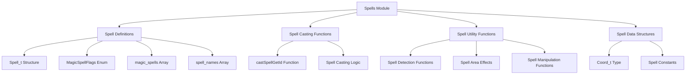
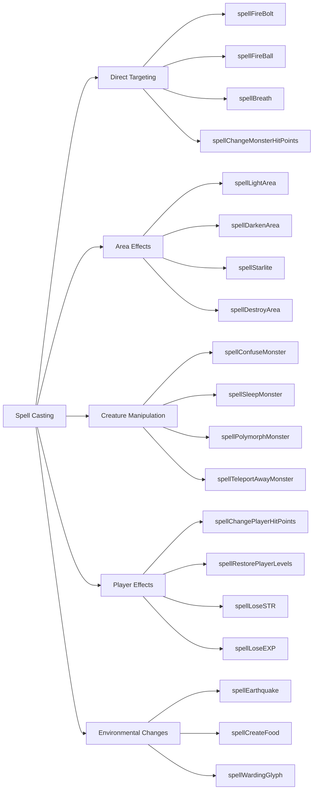
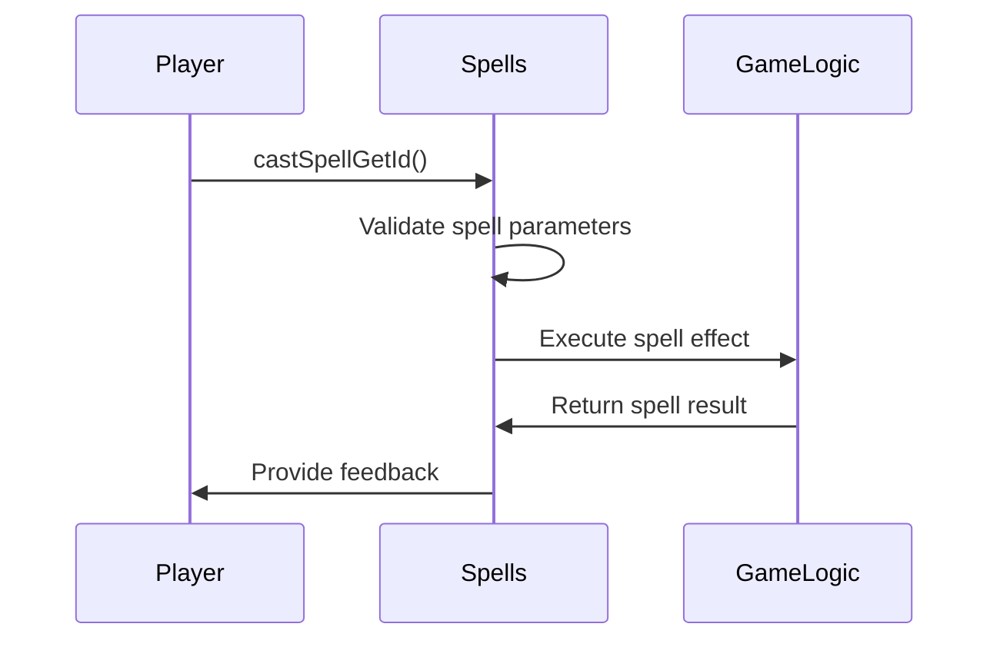
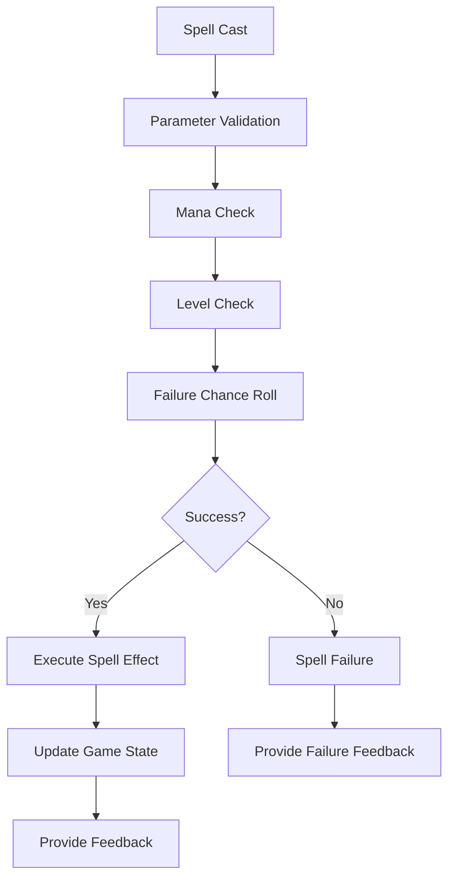

# Spells Module Documentation

## Introduction

The `spells_h` module defines the core spell system for the game, including spell definitions, spell casting functions, and related utilities. This module provides the foundation for magical abilities within the game world, handling everything from basic spell mechanics to complex area effects and creature manipulation.

## Architecture Overview



## Core Components

### Spell Data Structures

The module defines several key data structures:

**MagicSpellFlags Enum**
```c
enum MagicSpellFlags {
    MagicMissile,
    Lightning,
    PoisonGas,
    Acid,
    Frost,
    Fire,
    HolyOrb,
};
```
This enum defines the different types of spells available in the game system.

**Spell_t Structure**
```c
typedef struct {
    uint8_t level_required;
    uint8_t mana_required;
    uint8_t failure_chance;
    uint8_t exp_gain_for_learning;
} Spell_t;
```
Each spell has metadata including required level, mana cost, failure chance, and experience gained for learning.

### Spell Arrays

**magic_spells Array**
```c
extern Spell_t magic_spells[PLAYER_MAX_CLASSES - 1][31];
```
This two-dimensional array stores spell data organized by player class and spell index.

**spell_names Array**
```c
extern const char *spell_names[62];
```
Contains string names for all available spells.

## Spell Categories

### Spell Casting Functions

The module includes functions for casting various types of spells:



### Spell Utility Functions

Utility functions provide supporting capabilities for spell operations:

```mermaid
graph TD
    A[Spell Utilities] --> B[Detection Spells]
    A --> C[Mapping Functions]
    A --> D[Identification]
    A --> E[Area Manipulation]
    A --> F[Object Manipulation]
    A --> G[Status Effects]
    
    B --> B1[spellDetectTreasureWithinVicinity]
    B --> B2[spellDetectObjectsWithinVicinity]
    B --> B3[spellDetectTrapsWithinVicinity]
    B --> B4[spellDetectSecretDoorssWithinVicinity]
    
    C --> C1[spellMapCurrentArea]
    C --> C2[spellLightLine]
    
    D --> D1[spellIdentifyItem]
    D --> D2[spellDispelCreature]
    
    E --> E1[spellLightArea]
    E --> E2[spellDarkenArea]
    E --> E3[spellDestroyArea]
    
    F --> F1[spellRechargeItem]
    F --> F2[spellEnchantItem]
    F --> F3[spellRemoveCurseFromAllWornItems]
    
    G --> G1[spellSlowPoison]
    G --> G2[spellSleepAllMonsters]
    G --> G3[spellSpeedAllMonsters]
```



## Integration Points

This module integrates with several other core systems:

- **[player_h.md](player_h.md)**: Uses spell data for player character abilities
- **[monster_h.md](monster_h.md)**: Interacts with monster behavior through spell effects
- **[map_h.md](map_h.md)**: Works with coordinate systems for area effects
- **[item_h.md](item_h.md)**: Manages item enchantment and recharging spells
- **[game_logic_h.md](game_logic_h.md)**: Provides spell casting logic for game events

## Data Flow



## Process Flows

### Spell Casting Process

1. Player selects spell from menu
2. `castSpellGetId()` validates selection and parameters
3. Spell data retrieved from `magic_spells` array
4. Spell execution function called with appropriate parameters
5. Game state updated based on spell effects
6. Feedback provided to player

### Spell Effect Application



## Dependencies

This module depends on:
- **[coord_h.md](coord_h.md)**: For coordinate-based spell effects
- **[player_h.md](player_h.md)**: For player-specific spell data
- **[monster_h.md](monster_h.md)**: For monster manipulation spells
- **[item_h.md](item_h.md)**: For item-related spells

## Usage Examples

Basic spell casting would involve:
1. Calling `castSpellGetId()` to get spell parameters
2. Using the returned spell ID to call specific spell functions
3. Passing appropriate coordinates and parameters
4. Handling return values for success/failure states

## Notes

The spell system uses a fixed-size array structure for efficient access to spell data. The module assumes proper initialization of spell data arrays before use, and relies on external systems for validation of spell parameters and player state management.
